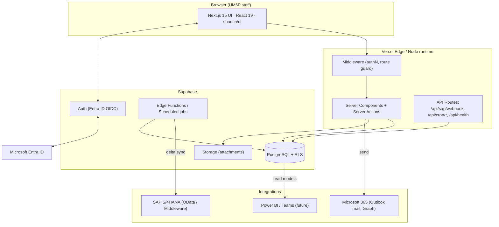
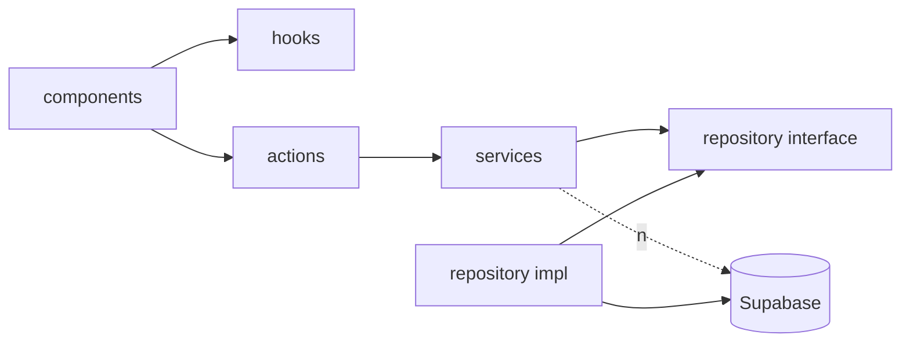
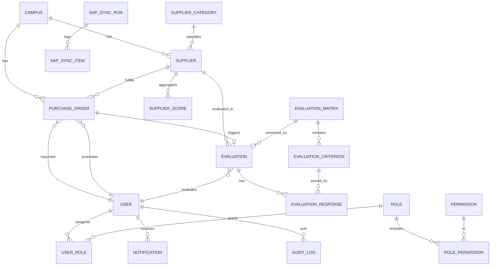
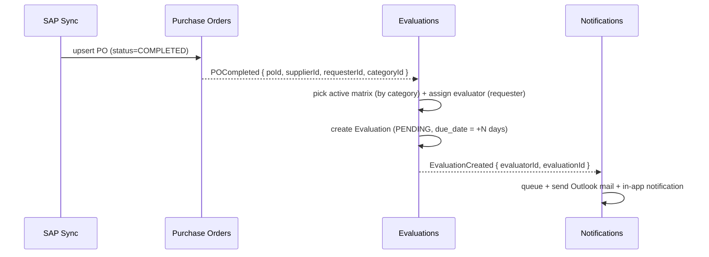
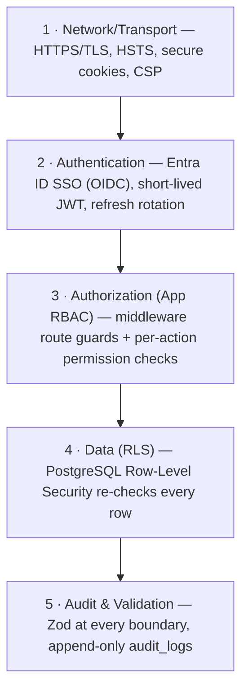
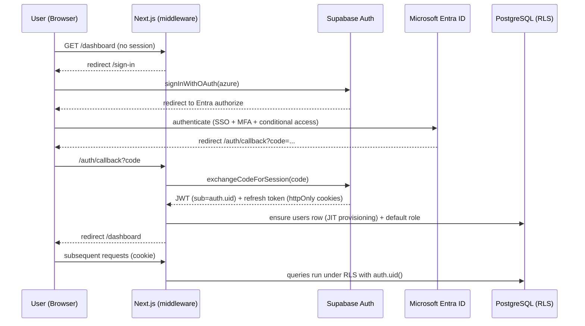
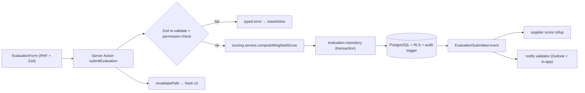

# UM6P — Supplier Performance Management Platform (SPM)
## Software Architecture Blueprint · v1.0

> **Status:** Phase 0 — Architecture & Design (no application code yet)
> **Owner:** Lead Architect, Procurement Digital Platforms
> **Audience:** Direction des Achats (Procurement), IT/DSI, Integration (SAP), Security, Vendors
> **Golden rule of this document:** every decision states *what*, then *why*. Where a fact depends on UM6P internal systems we do not yet control (SAP release, Entra tenancy policy, scoring policy), it is flagged **[UM6P INPUT REQUIRED]** and a safe default is proposed so engineering is never blocked.

---

## 0. Executive Summary

The Supplier Performance Management Platform (SPM) replaces the current manual, Excel-based, untraceable supplier-evaluation process with a governed enterprise system. After a Purchase Order (PO) completes in SAP, SPM automatically synchronizes the PO, its supplier, its requester (Chef de Projet / Demandeur) and purchaser (Acheteur), **auto-assigns the correct evaluator**, generates a structured evaluation from a **weighted, versioned evaluation matrix**, computes a performance score, and appends it to a permanent supplier performance history — all surfaced through Procurement dashboards.

**Architectural thesis:**
1. **Domain-Driven Design** with isolated bounded contexts, so Suppliers, Purchase Orders, Evaluations, Matrix, Dashboards, Admin, Notifications and Audit evolve independently.
2. **Anti-Corruption Layer for SAP** — SAP's data model never leaks into the domain; a dedicated integration service maps and reconciles it. This lets us build the entire product against a mock adapter *before* SAP connectivity exists.
3. **Security by construction** — Entra ID SSO, Role-Based Access Control enforced in the app *and* re-enforced by PostgreSQL Row-Level Security, append-only audit, validation at every boundary.
4. **Enterprise UX** — a Fiori/Dynamics-grade design system: minimal, fast, accessible, dark/light, dashboard-oriented.
5. **Multi-campus from day one** in the data model (campus as a first-class scoping dimension), activated later.

---

## Table of Contents
1. [Overall Architecture](#1-overall-architecture)
2. [Folder Structure](#2-folder-structure)
3. [Feature Organization](#3-feature-organization)
4. [Database Architecture](#4-database-architecture)
5. [Domain Boundaries](#5-domain-boundaries)
6. [Security Architecture](#6-security-architecture)
7. [Authentication Flow](#7-authentication-flow)
8. [Data Flow](#8-data-flow)
9. [SAP Integration Strategy](#9-sap-integration-strategy)
10. [User Roles](#10-user-roles)
11. [Permission Matrix](#11-permission-matrix)
12. [Naming Conventions](#12-naming-conventions)
13. [Coding Standards](#13-coding-standards)
14. [UI Design System](#14-ui-design-system)
15. [Development Roadmap (overview)](#15-development-roadmap-overview)
16. [Risks](#16-risks)
17. [Technical Decisions](#17-technical-decisions-adr-summary)
18. [Recommended Implementation Order](#18-recommended-implementation-order)
- [Appendix A — Assumptions & UM6P Inputs Required](#appendix-a--assumptions--um6p-inputs-required)
- [Appendix B — Glossary](#appendix-b--glossary)

---

## 1. Overall Architecture

### 1.1 Style
A **modular monolith** built on Next.js 15 (App Router) with **Domain-Driven Design** internal boundaries, deployed serverlessly, backed by Supabase (PostgreSQL + Auth + Storage + Edge Functions), integrated to SAP through an **Anti-Corruption Layer (ACL)**.

**Why a modular monolith and not microservices?**
- The team, traffic (hundreds of internal users, not millions), and transactional consistency needs (a PO → evaluation → score chain) all favor one deployable unit with strong internal modularity.
- Microservices would add network, deployment, and distributed-transaction complexity with zero business benefit at this scale. We keep *logical* domain isolation (so we could extract a service later) without paying the *physical* distribution tax now.
- DDD boundaries inside the monolith give us 90% of the modularity benefit at 10% of the operational cost.

### 1.2 Logical layers (per domain)
```
┌───────────────────────────────────────────────────────────────┐
│  Presentation      React Server/Client Components, shadcn/ui    │
│  Application        Server Actions + API Routes (use cases)     │
│  Domain             Entities, value objects, domain services,   │
│                     business rules (scoring, assignment, state) │
│  Infrastructure     Repositories (Supabase), SAP ACL, Mail,     │
│                     Storage, Notifications                      │
│  Data               PostgreSQL + RLS + Views + Functions        │
└───────────────────────────────────────────────────────────────┘
```
**Why layered inside each domain?** It enforces the Dependency Rule — presentation depends on application, application on domain, domain depends on *nothing* concrete (infrastructure implements domain-defined interfaces). This keeps business rules testable and framework-agnostic, and lets us swap SAP adapters or even the ORM without touching domain logic.

### 1.3 High-level component diagram


### 1.4 Runtime & hosting
- **Frontend + Server Actions + API:** Next.js 15 on Vercel (or Azure App Service / Azure Static Web Apps if UM6P mandates Azure — see [Risks](#16-risks)). **Why Vercel-class hosting:** first-class Next.js support, preview deployments per PR, zero-config edge/CDN. **Why the Azure fallback matters:** UM6P is a Microsoft-centric tenant; if data-residency or procurement policy forbids Vercel, the app is portable because we depend only on standard Node.js + a Postgres connection.
- **Scheduled SAP sync:** Supabase Edge Functions with cron, or Vercel Cron hitting `/api/cron/sap-sync`. **Why:** decouples long-running integration work from the request path.

---

## 2. Folder Structure

DDD-first. `app/` holds **only routing**; all business logic lives in `features/` (bounded contexts). Shared, non-domain code lives in `components/`, `lib/`, `services/`, `database/`.

```
um6p-spm-platform/
├─ app/                              # Next.js App Router — ROUTING ONLY
│  ├─ (auth)/                        # public route group
│  │  ├─ sign-in/page.tsx
│  │  └─ auth/callback/route.ts      # Entra OIDC callback
│  ├─ (app)/                         # protected route group (app shell)
│  │  ├─ layout.tsx                  # sidebar + topbar + guards
│  │  ├─ dashboard/                  # procurement dashboards
│  │  ├─ suppliers/
│  │  ├─ purchase-orders/
│  │  ├─ evaluations/
│  │  ├─ matrix/                     # evaluation matrix admin
│  │  ├─ administration/             # users, roles, settings
│  │  └─ audit/
│  ├─ api/
│  │  ├─ sap/webhook/route.ts        # optional SAP push endpoint
│  │  ├─ cron/sap-sync/route.ts      # scheduled delta sync
│  │  ├─ cron/evaluation-lifecycle/route.ts  # due/overdue sweep
│  │  └─ health/route.ts
│  ├─ layout.tsx                     # root layout (theme, providers)
│  ├─ globals.css
│  └─ not-found.tsx
│
├─ features/                         # BOUNDED CONTEXTS (the heart of the system)
│  ├─ authentication/
│  ├─ suppliers/
│  ├─ purchase-orders/
│  ├─ evaluations/
│  ├─ evaluation-matrix/
│  ├─ dashboards/
│  ├─ administration/
│  ├─ notifications/
│  └─ audit/
│     ├─ components/                 # domain-specific UI
│     ├─ actions/                    # Server Actions (application layer)
│     ├─ services/                   # domain services / use cases
│     ├─ repositories/               # data access (infrastructure)
│     ├─ schemas/                    # Zod validation schemas
│     ├─ types/                      # domain types & DTOs
│     ├─ hooks/                      # client hooks (TanStack Query)
│     ├─ constants/                  # enums, config
│     └─ index.ts                    # public API of the domain (barrel)
│
├─ components/                       # SHARED, non-domain UI
│  ├─ ui/                            # shadcn/ui primitives
│  ├─ layout/                        # AppShell, Sidebar, Topbar, PageHeader
│  ├─ data-table/                    # generic TanStack Table wrapper
│  ├─ charts/                        # Recharts wrappers (KPI, trend, radar)
│  └─ feedback/                      # Skeletons, EmptyState, ErrorState, Toaster
│
├─ lib/                              # cross-cutting utilities
│  ├─ supabase/                      # server/client/service-role clients
│  ├─ auth/                          # session, RBAC guards, permission checks
│  ├─ validation/                    # zod helpers, form resolver
│  ├─ errors/                        # AppError, Result<T>, error mapping
│  ├─ logger/                        # structured logging
│  └─ utils/                         # formatting, dates, currency, cn()
│
├─ services/                         # infrastructure integrations
│  ├─ sap/                           # ANTI-CORRUPTION LAYER
│  │  ├─ adapter.interface.ts        # SapAdapter contract
│  │  ├─ odata.adapter.ts            # real SAP OData implementation
│  │  ├─ mock.adapter.ts             # deterministic mock for dev/CI
│  │  ├─ mappers/                    # SAP DTO -> domain model
│  │  └─ sync/                       # orchestration, watermarking, reconcile
│  ├─ mail/                          # Outlook/Graph mail sender
│  └─ storage/                       # Supabase Storage wrappers
│
├─ database/                         # source of truth for schema
│  ├─ migrations/                    # SQL migrations (ordered, versioned)
│  ├─ policies/                      # RLS policies (one file per table)
│  ├─ functions/                     # SQL functions & triggers
│  ├─ views/                         # reporting views / materialized views
│  ├─ seed/                          # reference data + demo data
│  └─ types/database.types.ts        # generated Supabase types
│
├─ hooks/                            # truly global hooks (theme, media query)
├─ types/                            # global shared types (never domain rules)
├─ config/                           # app config, feature flags, nav config
├─ tests/                            # e2e (Playwright), integration
├─ .env.example
├─ CLAUDE.md / README.md
└─ package.json
```

**Why this shape**
- **`app/` is dumb on purpose.** Routing churns (URLs, layouts). Business logic must not. Keeping logic out of `app/` prevents route refactors from touching rules.
- **`features/` mirror the domains one-to-one.** A new engineer maps a business concept to exactly one folder. Cross-domain imports go only through each domain's `index.ts` barrel — this is our compile-time boundary enforcement (backed by an ESLint `no-restricted-imports` rule).
- **`services/` vs `features/`:** `services/` is *how we talk to the outside world* (SAP, mail, storage); `features/` is *our business*. SAP details never enter a feature except via mapped domain models.
- **`database/` is versioned SQL, not implicit ORM migrations.** For an enterprise system audited by IT, migrations, RLS policies, and functions must be reviewable artifacts in Git.

---

## 3. Feature Organization

Every domain follows the **same internal skeleton** (predictability = velocity):

```
features/evaluations/
├─ components/         EvaluationForm, EvaluationList, ScoreBadge, StatusStepper
├─ actions/            createEvaluation, submitEvaluation, validateEvaluation (Server Actions)
├─ services/           evaluation-assignment.service, scoring.service, lifecycle.service
├─ repositories/       evaluation.repository (Supabase queries only)
├─ schemas/            evaluation.schema.ts (Zod) — shared by client & server
├─ types/              evaluation.types.ts (Entity, DTO, ViewModel)
├─ hooks/              useEvaluations, useEvaluation (TanStack Query)
├─ constants/          evaluation-status.ts, evaluation-events.ts
└─ index.ts            explicit public surface
```

### 3.1 Responsibility per subfolder
| Subfolder | Layer | Rule |
|---|---|---|
| `components/` | Presentation | May call `hooks/` and `actions/`. No direct DB/SAP calls. |
| `actions/` | Application | Validates input (Zod) → checks permission → calls `services/`. Thin. |
| `services/` | Domain | Pure business rules. Depends on repository *interfaces*, not Supabase. |
| `repositories/` | Infrastructure | Only place raw Supabase queries live. Returns domain types. |
| `schemas/` | Cross-cutting | Single Zod schema reused for form + server action + API. One source of truth. |
| `types/` | Domain | Entity ≠ DTO ≠ ViewModel — explicitly separated. |
| `hooks/` | Presentation | Client-side data fetching/cache (TanStack Query). |

**Why one schema shared client+server?** Prevents the classic drift where the form allows what the server rejects (or worse, the reverse). Zod schema is imported by the React Hook Form resolver *and* re-run inside the Server Action — validation is never trusted from the client alone.

### 3.2 Dependency direction (enforced)

Domain services never import Supabase. **Why:** business rules stay unit-testable with in-memory fakes and survive an infrastructure change.

---

## 4. Database Architecture

### 4.1 Principles
- **UUID v4 primary keys** everywhere (`id uuid default gen_random_uuid()`). *Why:* safe to expose in URLs, no cross-campus collisions, no enumeration attacks, merge-friendly for multi-campus.
- **Audit columns on every table:** `created_at`, `updated_at`, `created_by`, `updated_by`. Maintained by triggers, not app trust.
- **Soft delete:** `deleted_at timestamptz null`. *Why:* procurement data is legally/contractually significant — never hard-delete evaluations or supplier history. RLS/views filter `deleted_at is null` by default.
- **Foreign keys + indexes** on every FK and every column used in a WHERE/ORDER hot path.
- **Campus scoping:** `campus_id` on all campus-owned tables from day one; a "Global" campus row lets single-campus launch work unchanged.
- **SAP-origin separation:** SAP-sourced tables carry `sap_ref`, `sap_synced_at`, `source` (`'SAP' | 'MANUAL'`) so we can reconcile and never overwrite manual corrections blindly.
- **Immutability where it matters:** an evaluation stores the `matrix_version` it was scored against, so changing the matrix later never rewrites history.

### 4.2 Core entities (ER overview)


### 4.3 Table catalog (essential columns)

**Reference / SAP-sourced**
- `campuses(id, code, name, is_active, audit…)`
- `supplier_categories(id, code, name, description, audit…)` — commodity family; can carry its own matrix.
- `suppliers(id, sap_ref, code, name, category_id→supplier_categories, campus_id→campuses, tax_id, country, city, email, phone, status, source, sap_synced_at, is_blocked, audit…, deleted_at)`
- `users(id [=auth.users.id], entra_object_id, email UNIQUE, display_name, job_title, department, is_active, last_login_at, audit…)`
- `purchase_orders(id, sap_ref UNIQUE, po_number, supplier_id→suppliers, requester_user_id→users NULL, requester_sap_ref, purchaser_user_id→users NULL, purchaser_sap_ref, category_id, campus_id, currency, total_amount numeric(18,2), status [OPEN|IN_PROGRESS|COMPLETED|CLOSED|CANCELLED], po_date, completed_at, source, sap_synced_at, is_evaluation_eligible bool, audit…)`
- `purchase_order_lines(id, po_id→purchase_orders, line_no, material_ref, description, quantity, unit_price, amount, audit…)` *(optional, Phase 2+)*

**Evaluation domain**
- `evaluation_matrices(id, name, version int, category_id→supplier_categories NULL, scale_min int, scale_max int, status [DRAFT|ACTIVE|ARCHIVED], effective_from, effective_to, is_default bool, audit…)`
  - Uniqueness: one ACTIVE default matrix per (category_id) at a time.
- `evaluation_criteria(id, matrix_id→evaluation_matrices, dimension [QUALITY|DELIVERY|COST|SERVICE|COMPLIANCE|…], label, description, weight numeric(5,2), display_order, is_active, audit…)`
  - Constraint: `SUM(weight) = 100` per matrix (enforced by a deferred trigger + validated at activation).
- `evaluations(id, po_id→purchase_orders UNIQUE, supplier_id→suppliers, evaluator_user_id→users, matrix_id, matrix_version int, status [PENDING|IN_PROGRESS|SUBMITTED|VALIDATED|REJECTED|CANCELLED|OVERDUE], weighted_score numeric(5,2) NULL, max_score numeric(5,2), due_date, submitted_at, validated_by→users NULL, validated_at, campus_id, comment, audit…, deleted_at)`
- `evaluation_responses(id, evaluation_id→evaluations, criterion_id→evaluation_criteria, score numeric(5,2), comment text, audit…)` — UNIQUE(evaluation_id, criterion_id).
- `supplier_scores(id, supplier_id→suppliers, period_month date, evaluations_count int, avg_weighted_score numeric(5,2), by_dimension jsonb, campus_id, computed_at)` — rollup table refreshed by job; complemented by a live `v_supplier_performance` view.

**RBAC & system**
- `roles(id, code UNIQUE, name, description, is_system bool, audit…)`
- `permissions(id, code UNIQUE, resource, action, description)`
- `role_permissions(role_id→roles, permission_id→permissions, PK(role_id, permission_id))`
- `user_roles(id, user_id→users, role_id→roles, campus_id→campuses NULL, audit…)` — NULL campus = all campuses.
- `notifications(id, user_id→users, type, channel [IN_APP|EMAIL], title, body, entity_type, entity_id, status [QUEUED|SENT|FAILED|READ], sent_at, read_at, created_at)`
- `audit_logs(id, actor_user_id→users NULL, action, entity_type, entity_id, changes jsonb, ip inet, user_agent, created_at)` — **append-only** (no UPDATE/DELETE grant; enforced by RLS + revoked privileges).
- `sap_sync_runs(id, entity_type, trigger [CRON|MANUAL|WEBHOOK], status [RUNNING|SUCCESS|PARTIAL|FAILED], started_at, finished_at, watermark timestamptz, processed int, created int, updated int, failed int, error text)`
- `sap_sync_items(id, run_id→sap_sync_runs, sap_ref, entity_type, outcome, message)` *(diagnostics)*
- `app_settings(id, key UNIQUE, value jsonb, description, updated_by, updated_at)` — feature flags, sync cadence, matrix defaults.

### 4.4 Keys, indexes, constraints (why)
- Composite indexes for dashboard queries: `evaluations(campus_id, status, due_date)`, `evaluations(supplier_id, validated_at)`, `purchase_orders(status, completed_at)`.
- Partial index for the work queue: `CREATE INDEX ON evaluations(evaluator_user_id) WHERE status IN ('PENDING','IN_PROGRESS','OVERDUE')`. *Why:* the "my pending evaluations" query is the hottest read; a partial index keeps it tiny.
- `CHECK (score BETWEEN matrix.scale_min AND matrix.scale_max)` enforced via trigger referencing the matrix scale.
- `ON DELETE RESTRICT` on supplier/PO FKs (soft-delete only), `ON DELETE CASCADE` only on child rows fully owned by a parent (e.g., `evaluation_responses`).

### 4.5 Triggers & functions
- `set_audit_fields()` BEFORE INSERT/UPDATE — stamps timestamps + `created_by/updated_by` from `auth.uid()`.
- `write_audit_log()` AFTER INSERT/UPDATE/DELETE on business tables — pushes a diff into `audit_logs`.
- `enforce_matrix_weights()` — blocks matrix activation unless criteria weights total 100.
- `compute_weighted_score(evaluation_id)` — `Σ(response.score × criterion.weight) / 100`, normalized to the matrix scale; called on submit and stored (denormalized for dashboard speed) while remaining reproducible from responses.

---

## 5. Domain Boundaries

Each bounded context owns its data, rules, and public contract. Contexts communicate through **explicit interfaces and domain events**, never by reaching into each other's tables.

| Domain (Context) | Owns | Publishes (events) | Consumes |
|---|---|---|---|
| **Authentication & Identity** | users, sessions, Entra mapping | `UserSignedIn`, `UserProvisioned` | — |
| **Access Control (RBAC)** | roles, permissions, user_roles | `RoleAssigned` | user identity |
| **Suppliers** | suppliers, categories, blocking | `SupplierSynced`, `SupplierBlocked` | SAP feed |
| **Purchase Orders** | purchase_orders, lines | `POCompleted`, `POSynced` | SAP feed, suppliers |
| **Evaluations** | evaluations, responses, lifecycle | `EvaluationCreated`, `EvaluationSubmitted`, `EvaluationValidated`, `EvaluationOverdue` | `POCompleted`, matrix, users |
| **Evaluation Matrix** | matrices, criteria, versions | `MatrixActivated` | supplier categories |
| **Scoring & History** | supplier_scores, views | `SupplierScoreUpdated` | `EvaluationValidated` |
| **Dashboards** | read models / views only | — | scores, evaluations, POs |
| **Notifications** | notifications, delivery | — | evaluation & lifecycle events |
| **Audit** | audit_logs | — | all write events |
| **Administration** | settings, sync config | `SettingChanged` | RBAC |

**The critical cross-domain contract — auto-generation:**

**Why event-style decoupling inside a monolith?** We don't need a message broker yet, but modeling these as explicit domain events (dispatched in-process, transactionally) means: (a) the Evaluations domain doesn't care *how* a PO completed, only that it did; (b) we can later move a domain to its own service or add a queue with minimal change; (c) it maps cleanly to audit — every event is a natural audit record.

---

## 6. Security Architecture

Defense in depth — **five independent layers**, each assuming the one above it failed.



### 6.1 Row-Level Security (the backstop)
Even if an application bug forgets a permission check, RLS denies the row. This is the single most important control for an audited procurement system.

- RLS **enabled on every business table**; default deny.
- Policies use `SECURITY DEFINER` helper functions:
  - `auth.user_id()` → `auth.uid()`
  - `auth.has_permission(code text)` → checks role_permissions for the current user
  - `auth.campus_ids()` → set of campuses the user is scoped to (NULL row = all)
- Example (evaluations SELECT):
  ```
  USING (
    deleted_at IS NULL AND (
      evaluator_user_id = auth.user_id()                       -- my own
      OR (auth.has_permission('evaluations.read.all')
          AND (campus_id = ANY(auth.campus_ids()) OR auth.is_global()))
    )
  )
  ```
- Writes to `audit_logs`: `INSERT` allowed to authenticated; `UPDATE`/`DELETE` granted to **no role** → immutable.

**Why RLS on top of app RBAC (belt and suspenders)?** App checks live in code paths that can be missed (a new endpoint, a raw query). RLS is enforced by the database for *every* connection, including future Power BI/analytics readers. The `service_role` key (which bypasses RLS) is used **only** server-side in the SAP sync/admin jobs and never shipped to the browser.

### 6.2 Secrets & keys
- Browser sees only the Supabase **anon** key (RLS-gated). The **service_role** key lives in server env vars only, used by cron/sync/admin actions.
- SAP credentials, Graph mail credentials, and Entra secrets live in the hosting platform's secret store; rotated; never in Git. `.env.example` documents names only.

### 6.3 Input validation & output encoding
- **Zod** schemas validate every Server Action, API Route, and SAP payload at the boundary. Nothing enters a service unvalidated.
- Parameterized queries only (Supabase client / SQL functions) → no SQL injection.
- React auto-escapes output; CSP restricts script origins; file uploads to Storage are content-type + size validated and scanned by policy.

### 6.4 Audit
- Every create/update/soft-delete on business entities writes a structured diff to `audit_logs` (actor, action, entity, before/after, IP, UA, timestamp).
- Auth events (sign-in, role change, matrix activation, evaluation validation, reassignment, sync runs) are first-class audit records.
- **Why append-only + DB-enforced:** auditors must trust that history cannot be quietly rewritten.

---

## 7. Authentication Flow

**Decision:** **Microsoft Entra ID** as the identity provider, integrated through **Supabase Auth (Azure/Entra OIDC provider)**. **[UM6P INPUT REQUIRED]** on tenant ID, allowed domains, and whether app roles come from Entra group claims or are managed in-app.

**Why Supabase Auth as the broker (not raw Auth.js)?** Because our authorization backstop is Postgres RLS, and RLS keys off `auth.uid()` from a Supabase-issued JWT. Letting Supabase Auth own the session means the same identity that the app trusts is the identity the *database* trusts — one subject, end to end. Entra remains the source of truth for *who the person is* (SSO, MFA, conditional access); Supabase issues the app/database session.



**Session handling**
- Tokens stored in **httpOnly, Secure, SameSite=Lax cookies**; never in localStorage. *Why:* mitigates XSS token theft.
- Next.js **middleware** validates/refreshes the session on every protected request and redirects unauthenticated users.
- **JIT provisioning:** on first successful login, create the `users` row from Entra claims (object id, email, name, department) and assign a safe default role (e.g., `EVALUATOR`), pending admin elevation. *Why:* no manual pre-registration for hundreds of staff.
- **Role source [UM6P INPUT REQUIRED]:** preferred — map Entra security groups (e.g., `SPM-Procurement-Managers`) to app roles on login; fallback — in-app assignment by an admin. We build the in-app path first (no Entra dependency) and layer group-mapping when the tenant is ready.
- Sign-out clears cookies and revokes the Supabase session; Entra single-logout optional.

---

## 8. Data Flow

### 8.1 Read path (dashboard / list)
```
Browser → middleware (authN) → Server Component
        → repository (Supabase, RLS-scoped) → PostgreSQL
        ↺ typed domain models → ViewModel → HTML (streamed)
Client interactivity → TanStack Query hook → Server Action / Route (cached)
```
**Why Server Components for reads:** data is fetched on the server close to the DB, RLS-scoped, and streamed as HTML — fast first paint, no over-fetching to the client, secrets never exposed. TanStack Query handles client-side refetch/caching for interactive tables and charts.

### 8.2 Write path (submit an evaluation)


### 8.3 Integration path (SAP → domain) — see §9.

### 8.4 Consistency
- Business writes that span tables (evaluation + responses + score + audit + notification) run in a **single DB transaction** where possible; cross-boundary side effects (email) run *after* commit so a failed email never rolls back a valid evaluation (email is retried from the `notifications` queue instead).

---

## 9. SAP Integration Strategy

The riskiest external dependency. Strategy = **isolate, mock, reconcile, observe.**

### 9.1 Anti-Corruption Layer (ACL)
All SAP access goes through one contract:
```
interface SapAdapter {
  fetchSuppliers(since?: Date): Promise<SapSupplierDTO[]>
  fetchPurchaseOrders(since?: Date): Promise<SapPurchaseOrderDTO[]>
  fetchPersonnel(since?: Date): Promise<SapPersonDTO[]>   // requesters & purchasers
}
```
- `mock.adapter.ts` — deterministic fixtures; the **entire product is built and demoed against this** before SAP is available.
- `odata.adapter.ts` — real implementation.
- **Mappers** convert SAP DTOs → domain models. SAP field names/quirks (LIFNR, EBELN, WERKS…) never appear outside `services/sap/`.

**Why an ACL:** SAP schemas are large, cryptic, and outside our control. The ACL means SAP changes touch *one* folder, dev is unblocked from day one, and CI runs without SAP connectivity.

### 9.2 Connectivity options (recommendation)
| Option | Mechanism | Verdict |
|---|---|---|
| **A. SAP OData / Gateway (REST/JSON)** | Pull via HTTPS, delta by `lastChanged` | **Recommended primary** — modern, firewall-friendly, easy to mock. |
| B. Middleware (SAP PI/PO or **Azure Integration Services / Logic Apps**) | SAP → middleware → our webhook/DB | **Recommended if UM6P already runs middleware** — offloads mapping, gives retry/monitoring. Fits the Microsoft estate. |
| C. IDoc / BAPI / RFC direct | Low-level SAP protocols | Avoid unless mandated — brittle, needs SAP connector infra. |
| D. Scheduled flat-file / CSV extract | SAP job drops files to SFTP/Storage | **Recommended fallback / Phase-1 bridge** — trivial to stand up, decoupled, good for a slow SAP team. |

**[UM6P INPUT REQUIRED]:** SAP release (ECC vs S/4HANA), whether OData services can be exposed, existing middleware, network path (VPN/private link), and auth (OAuth client-credentials vs technical user + basic).

### 9.3 Sync pattern
- **Direction:** primarily **pull** on a schedule (cron every 15–60 min, configurable in `app_settings`), with an optional **push webhook** (`/api/sap/webhook`) if SAP/middleware can notify us. *Why pull-first:* we control cadence, retries, and back-pressure; no inbound firewall exception needed initially.
- **Delta sync with watermark:** each `sap_sync_runs` row stores the high-water mark (`lastChanged`) so the next run fetches only changes. *Why:* full loads don't scale and hammer SAP.
- **Idempotent upsert** keyed by `sap_ref`. Re-processing the same record is safe.
- **Ordering:** suppliers & personnel first, then POs (so FKs resolve), then completed-PO detection, then evaluation generation.
- **Completed-PO detection:** a PO transitioning to `COMPLETED` (and `is_evaluation_eligible`) emits `POCompleted`, which the Evaluations domain turns into an evaluation. Eligibility rules (min amount, category exclusions) are configurable.
- **Evaluator resolution:** map SAP requester → `users` by email/object id. If the person hasn't logged in yet, store `requester_sap_ref` and resolve lazily on their first login (JIT). The evaluation is created and waits; assignment self-heals.

### 9.4 Observability & reconciliation
- Every run recorded in `sap_sync_runs` (+ per-item diagnostics in `sap_sync_items`): counts, watermark, errors.
- Admin screen shows sync health, last run, failures, and a **manual "Run sync now"** button.
- Nightly reconciliation report: counts SAP vs SPM per entity; flags drift.
- Alerting on `FAILED`/`PARTIAL` runs (email to admins).

### 9.5 Failure handling
- Transient errors → exponential backoff retry within a run.
- Partial failure → run marked `PARTIAL`, good records committed, bad ones logged for replay.
- SAP down → last good data remains; the app degrades to read-only for SAP-sourced entities; no data loss.

---

## 10. User Roles

**[UM6P INPUT REQUIRED]** to confirm exact org titles; below is the recommended model mapped to Procurement reality.

| Code | Role (FR) | Description | Primary jobs |
|---|---|---|---|
| `SUPER_ADMIN` | Administrateur plateforme | IT owner of the system | Full config, roles, settings, sync, break-glass |
| `PROCUREMENT_DIRECTOR` | Directeur des Achats | Head of Procurement | See everything, manage matrix, validate, executive dashboards |
| `PROCUREMENT_MANAGER` | Responsable Achats | Procurement supervisor | Monitor & reassign evaluations, reports, validate |
| `PURCHASER` | Acheteur | Buyer owning POs | View own POs/suppliers, follow evaluations, optionally validate |
| `EVALUATOR` | Chef de Projet / Demandeur | Internal requester | **Complete assigned evaluations**, view own history |
| `VIEWER` | Consultation / Direction | Executives, stakeholders | Read-only dashboards & reports |
| `AUDITOR` | Auditeur | Internal audit/compliance | Read data + full audit log, no writes |

**Why this set:** it mirrors the actual PO lifecycle (buyer creates → requester receives/evaluates → manager/director governs) and cleanly separates *doing* (evaluator), *governing* (manager/director), *tooling* (admin), and *oversight* (auditor). Roles are **campus-scoped** via `user_roles.campus_id` so the same title can be limited to one campus.

---

## 11. Permission Matrix

Permissions are fine-grained `resource.action` codes; roles are bundles. Navigation renders **only** what the user's permissions allow (permission-based nav), and every Server Action re-checks.

| Permission | SUPER_ADMIN | DIRECTOR | MANAGER | PURCHASER | EVALUATOR | VIEWER | AUDITOR |
|---|:--:|:--:|:--:|:--:|:--:|:--:|:--:|
| `dashboards.view` | ✅ | ✅ | ✅ | ✅ | ✅(own) | ✅ | ✅ |
| `dashboards.view.executive` | ✅ | ✅ | ✅ | – | – | ✅ | – |
| `suppliers.read` | ✅ | ✅ | ✅ | ✅ | ✅ | ✅ | ✅ |
| `suppliers.read.all` | ✅ | ✅ | ✅ | scope | – | ✅ | ✅ |
| `suppliers.manage` (block/edit meta) | ✅ | ✅ | ✅ | – | – | – | – |
| `purchase_orders.read` | ✅ | ✅ | ✅ | ✅(own) | ✅(own) | ✅ | ✅ |
| `purchase_orders.read.all` | ✅ | ✅ | ✅ | – | – | ✅ | ✅ |
| `purchase_orders.sync` (manual) | ✅ | ✅ | ✅ | – | – | – | – |
| `evaluations.read.own` | ✅ | ✅ | ✅ | ✅ | ✅ | – | ✅ |
| `evaluations.read.all` | ✅ | ✅ | ✅ | scope | – | ✅ | ✅ |
| `evaluations.create` (auto/manual) | ✅ | ✅ | ✅ | – | – | – | – |
| `evaluations.fill` (submit own) | ✅ | – | – | – | ✅ | – | – |
| `evaluations.validate` | ✅ | ✅ | ✅ | opt | – | – | – |
| `evaluations.reassign` | ✅ | ✅ | ✅ | – | – | – | – |
| `evaluations.reopen` | ✅ | ✅ | ✅ | – | – | – | – |
| `matrix.read` | ✅ | ✅ | ✅ | ✅ | ✅ | ✅ | ✅ |
| `matrix.manage` (create/version/activate) | ✅ | ✅ | – | – | – | – | – |
| `admin.users.manage` | ✅ | opt | – | – | – | – | – |
| `admin.roles.manage` | ✅ | – | – | – | – | – | – |
| `admin.settings.manage` | ✅ | opt | – | – | – | – | – |
| `audit.read` | ✅ | ✅ | opt | – | – | – | ✅ |

Legend: ✅ granted · `scope` = limited to owned/assigned records · `opt` = configurable per UM6P policy · `–` denied.

**Why data-scoped permissions (`.own` / `.all` / `scope`) instead of just role checks?** The same action ("read evaluation") must behave differently by relationship: an evaluator sees theirs, a manager sees the campus's, a director sees all. Encoding scope in permissions (and mirroring it in RLS) keeps this consistent across UI, API, and DB. The permission catalog is stored in the DB (`permissions`), so new capabilities are added by data + policy, not by scattering role string literals through code.

---

## 12. Naming Conventions

| Artifact | Convention | Example |
|---|---|---|
| Folders | kebab-case | `purchase-orders/` |
| React components | PascalCase, `.tsx` | `EvaluationForm.tsx` |
| Hooks | camelCase, `use` prefix | `useEvaluations.ts` |
| Server Actions | camelCase verb, `.action.ts` optional | `submitEvaluation` |
| Services | `*.service.ts`, verb-noun methods | `scoring.service.ts` → `computeWeightedScore()` |
| Repositories | `*.repository.ts` | `evaluation.repository.ts` |
| Zod schemas | `*.schema.ts`, `XSchema` export | `createEvaluationSchema` |
| Types | `*.types.ts`; `Entity`, `Dto`, `ViewModel` suffix where useful | `EvaluationEntity`, `SupplierDto` |
| Enums / unions | UPPER_SNAKE members | `EvaluationStatus.IN_PROGRESS` |
| DB tables | snake_case, **plural** | `evaluation_responses` |
| DB columns | snake_case | `weighted_score` |
| FK columns | `<entity>_id` | `supplier_id` |
| DB functions | snake_case verb | `compute_weighted_score()` |
| RLS policies | `<table>_<action>_<audience>` | `evaluations_select_owner` |
| Permission codes | `resource.action[.scope]` | `evaluations.read.all` |
| Events | PascalCase past tense | `EvaluationValidated` |
| Env vars | UPPER_SNAKE, prefixed | `SAP_ODATA_BASE_URL`, `SUPABASE_SERVICE_ROLE_KEY` |
| Branches | `type/scope-short-desc` | `feat/evaluations-scoring` |
| Commits | Conventional Commits | `feat(evaluations): weighted scoring` |

**Why strict conventions:** with hundreds of files across ten domains, predictability *is* documentation. A reader infers a file's layer and domain from its name and path alone.

---

## 13. Coding Standards

**TypeScript**
- `strict: true`, `noUncheckedIndexedAccess`, `exactOptionalPropertyTypes`. **`any` is banned** (ESLint error); use `unknown` + narrowing. *Why:* the compiler is our cheapest test.
- Domain types are explicit; infer DTOs from Zod (`z.infer`) so runtime and compile-time validation share one definition.

**React / Next.js**
- **Server Components by default.** Add `"use client"` only for interactivity (forms, charts, tables with client state). *Why:* less JS shipped, faster, secure by default.
- No data fetching in client components except via TanStack Query hooks hitting Server Actions/Routes.
- Colocate loading (`loading.tsx` / Suspense + skeleton) and error (`error.tsx`) states with every route.

**Architecture rules (SOLID, enforced by lint)**
- Components never import repositories or Supabase directly (`no-restricted-imports`).
- Services depend on repository *interfaces*, not implementations (DIP).
- One reason to change per module (SRP): a service does business rules, a repository does persistence, an action orchestrates.
- DRY: shared UI in `components/`, shared logic in `lib/`; a rule of three before abstracting.

**Error handling & UX states**
- Return typed results (`Result<T, AppError>`) from services; Server Actions map errors to user-safe messages. Never leak stack traces or SAP errors to the UI.
- **Every list/query surface implements four states:** loading (skeleton), empty (guided EmptyState), error (retry), and success. This is a review checklist item, not optional.

**Accessibility**
- WCAG 2.1 AA: keyboard navigable, focus-visible, semantic landmarks, `aria-*`, ≥4.5:1 contrast (both themes), form labels + error association. shadcn/ui (Radix) gives us accessible primitives; we don't regress them.

**Testing**
- Unit: domain services (Vitest) — scoring, assignment, matrix weights, lifecycle transitions.
- Integration: repositories + RLS policies against a test DB (a user *cannot* read another's evaluation).
- E2E: Playwright for the golden path (login → assigned evaluation → submit → validated → dashboard).
- **Why weight testing toward services + RLS:** those encode the money-and-trust logic (scores, access). UI is comparatively cheap to fix.

**Quality gates (CI)** — typecheck, lint, unit/integration, build, and a migration dry-run must pass before merge.

---

## 14. UI Design System

Target feel: **SAP Fiori / Microsoft Dynamics discipline with Linear/Vercel polish** — minimal, dense-where-needed, fast, calm.

### 14.1 Design tokens (CSS variables, light/dark)
- **Color:** neutral slate/zinc surfaces; a single **UM6P brand primary** (green — confirm hex) for primary actions & active nav; semantic tokens `--success` (green), `--warning` (amber), `--danger` (red), `--info` (blue). All tokens defined for `.light` and `.dark`. **[UM6P INPUT REQUIRED]:** official brand palette & logo.
- **Score semantics:** score ≥ 80 green, 60–79 amber, < 60 red — one shared scale across badges, charts, tables.
- **Typography:** Inter (or system UI stack) — sizes 12/14/16/20/24/30; line-height 1.5 body; tabular numerals for figures.
- **Spacing:** 4px base scale (4/8/12/16/24/32/48). **Radius:** `sm 6 / md 8 / lg 12`. **Shadow:** subtle, elevation-based. **Motion:** 150–200ms ease; respects `prefers-reduced-motion`.

### 14.2 Layout
- Persistent **left sidebar** (permission-filtered nav) + **topbar** (search, campus switcher, notifications bell, theme toggle, user menu).
- Content = `PageHeader` (title, breadcrumb, primary action) + body. Max content width for readability; tables/dashboards go full-width.
- Fully responsive; sidebar collapses to icons then to a sheet on mobile.

### 14.3 Component library (shadcn/ui + wrappers)
- Primitives: Button, Input, Select, Combobox, Dialog, Sheet, Tabs, Card, Badge, Tooltip, DropdownMenu, Toast, Skeleton, Breadcrumb.
- **DataTable** (TanStack Table wrapper): server-side sort/filter/paginate, column visibility, row actions, CSV export, sticky header, saved views — the workhorse for suppliers/POs/evaluations.
- **Charts** (Recharts wrappers): `KpiCard`, `TrendLine`, `ScoreDistribution`, `SupplierRadar` (per-dimension), `RankingBar`. Consistent axes, tokenized colors, accessible legends/tooltips. *(See the `dataviz` guidance before building any chart.)*
- **Domain components:** `ScoreBadge`, `StatusStepper` (evaluation lifecycle), `WeightSlider` (matrix), `AssigneeCell`, `DueDatePill`, `EmptyState`, `ErrorState`.
- **Forms:** React Hook Form + Zod resolver; inline validation; disabled+spinner on submit; optimistic UI where safe.

### 14.4 Enterprise UX rules
- Every screen has explicit loading / empty / error / success states.
- Destructive actions confirm; long lists paginate; heavy pages stream with Suspense.
- Consistent iconography (Lucide); consistent date/number/currency formatting via `lib/utils` (MAD default, i18n-ready).
- **Bilingual-ready (FR/EN):** UI copy externalized from day one; **French is the primary language** for Procurement users.

---

## 15. Development Roadmap (overview)

Ten phases; detailed sprint breakdown lives in **[ROADMAP.md](./ROADMAP.md)**. Each phase ends with a demoable, deployed increment.

| Phase | Theme | Outcome |
|---|---|---|
| **0** | Foundations | Repo, CI/CD, Supabase, Entra app registration, design system, DDD skeleton, mock SAP adapter |
| **1** | Auth + RBAC + Shell | SSO login, roles/permissions, RLS baseline, app shell & nav, audit skeleton |
| **2** | Master data via SAP (mock) | Suppliers, POs, users synced; sync observability; list/detail screens |
| **3** | Evaluation Matrix | Versioned weighted matrix admin, criteria, activation rules |
| **4** | Evaluation Workflow | Auto-detect completed POs → auto-assign → generate → fill → submit → validate; notifications |
| **5** | Scoring & History | Weighted scoring engine, supplier performance history, rollups |
| **6** | Dashboards & Analytics | Procurement + executive dashboards, supplier scorecards, exports |
| **7** | Admin, Audit, Hardening | Full admin, audit UI, RLS/security review, performance, a11y |
| **8** | Real SAP + UAT + Go-Live | Swap mock→OData adapter, reconciliation, UAT, training, production launch |
| **9** | Future | Power BI embed, Teams notifications, multi-campus activation, supplier self-service portal |

**Why phase in this order:** each phase depends only on prior ones. Auth/RBAC underpins everything; master data must exist before evaluations; the matrix must exist before evaluations can be scored; scoring must exist before dashboards mean anything; real SAP is deliberately *last* because the mock ACL lets everything above be built and validated first — de-risking the one dependency we don't control.

---

## 16. Risks

| # | Risk | Impact | Likelihood | Mitigation |
|---|---|---|---|---|
| R1 | **SAP access delayed / restricted** | High | High | Mock ACL — build 100% of product first; flat-file fallback (option D); swap adapter at Phase 8. |
| R2 | **SAP data quality** (missing requester email, inconsistent PO status) | High | Med-High | Reconciliation reports; lazy JIT evaluator resolution; configurable eligibility; manual reassignment. |
| R3 | **Entra tenant policy** (group claims, consent, guest accounts) | Med | Med | In-app role management first; Entra group-mapping layered later; IT/DSI early engagement. |
| R4 | **Hosting policy** (Vercel vs mandated Azure/on-prem) | Med | Med | Portable stack (standard Node + Postgres); no Vercel-only APIs; Azure fallback documented. |
| R5 | **Scope creep** (supplier portal, contracts, sourcing) | Med | High | Locked phase scope; backlog for Phase 9+; change-control. |
| R6 | **Low evaluator adoption / overdue evaluations** | High | Med | Auto-assignment + reminders + overdue escalation + simple mobile-friendly form + manager visibility. |
| R7 | **Weighting/scoring disputes** | Med | Med | Versioned matrix + immutable per-evaluation snapshot + audit + director-owned governance. |
| R8 | **Security misconfiguration (RLS gap, service-role leak)** | High | Low-Med | RLS default-deny + integration tests proving isolation; service_role server-only; security review gate (Phase 7). |
| R9 | **Performance at scale** (dashboards over years of history) | Med | Med | Rollup tables + materialized views + composite/partial indexes; pagination; read models. |
| R10 | **Notification deliverability** (Outlook/Graph throttling) | Low-Med | Med | Queue + retry + status tracking; in-app notifications as fallback channel. |
| R11 | **Key-person / knowledge silo** | Med | Med | This blueprint + ADRs + conventions + tests; nothing tribal. |

---

## 17. Technical Decisions (ADR summary)

| # | Decision | Alternatives | Why chosen |
|---|---|---|---|
| ADR-01 | Modular monolith (Next.js) | Microservices | Right scale; strong internal DDD boundaries without distributed complexity. |
| ADR-02 | Next.js 15 App Router + RSC | SPA + separate API | Server-first = fast, secure, less client JS; Server Actions remove API boilerplate. |
| ADR-03 | Supabase (Postgres + Auth + Storage) | Bare Postgres + custom auth | RLS + Auth + Storage integrated; `auth.uid()` unifies app & DB identity; fast delivery. |
| ADR-04 | **RLS as authorization backstop** | App-only checks | Database-enforced least privilege survives app bugs & future readers (Power BI). |
| ADR-05 | Entra ID via Supabase OIDC | Auth.js standalone | One identity for app *and* RLS; UM6P's IdP owns SSO/MFA. |
| ADR-06 | **Anti-Corruption Layer + mock adapter for SAP** | Direct SAP coupling | Unblocks dev before SAP; isolates change; testable. |
| ADR-07 | Pull-based delta sync + watermark | Full loads / push-only | Scales, controllable, no inbound firewall dependency; push optional later. |
| ADR-08 | Versioned matrix + per-evaluation snapshot | Single mutable matrix | Protects historical scores from later re-weighting. |
| ADR-09 | Zod schema shared client+server | Separate validators | Single source of truth; server never trusts client. |
| ADR-10 | Denormalized `weighted_score` (reproducible from responses) | Compute on read every time | Dashboard speed without losing auditability. |
| ADR-11 | Domain events dispatched in-process/transactionally | Message broker now | Decoupling without infra; broker can be added later. |
| ADR-12 | shadcn/ui + Tailwind + Radix | Component vendor lib (MUI) | Own the code, accessible primitives, Fiori-grade custom design system. |
| ADR-13 | Rollup tables + views for analytics | Ad-hoc heavy queries | Predictable dashboard performance over growing history. |
| ADR-14 | Soft delete + append-only audit | Hard delete | Legal/traceability requirements of procurement. |

---

## 18. Recommended Implementation Order

Build strictly bottom-up so every layer stands on a finished one:

1. **Foundations** — tooling, CI, Supabase project, Entra registration, `.env` contract, design tokens, DDD skeleton, mock SAP adapter, `database/` migration harness.
2. **Identity & Access** — Entra SSO login, `users` JIT provisioning, `roles/permissions/user_roles`, RLS helper functions, **prove isolation with tests before building on it.**
3. **App Shell** — layout, permission-filtered nav, theme, notifications bell, DataTable + chart wrappers, the four UX states.
4. **Master Data (mock SAP)** — sync suppliers → POs → personnel; sync observability; supplier & PO list/detail.
5. **Evaluation Matrix** — versioned criteria + weights + activation guardrails (weights = 100).
6. **Evaluation Lifecycle** — `POCompleted` → auto-assign → generate → fill (form) → submit → validate; overdue sweep; notifications.
7. **Scoring & History** — weighted scoring service, supplier score rollups, performance history & scorecard.
8. **Dashboards** — procurement KPIs, trends, rankings, per-supplier radar; exports.
9. **Administration & Audit** — user/role admin, settings, sync control, audit explorer.
10. **Hardening** — security review (RLS, secrets), performance (indexes/views), accessibility, load test.
11. **Real SAP integration** — implement OData adapter behind the *same* ACL interface; reconcile; parallel-run vs mock.
12. **UAT → Training → Go-Live** — pilot campus/category, feedback, production cutover.
13. **Future (Phase 9)** — Power BI, Teams, multi-campus activation, supplier portal.

**Why this exact sequence:** it front-loads the two hardest-to-retrofit concerns (security model and SAP isolation), keeps every increment demoable to Procurement stakeholders, and pushes the only uncontrollable dependency (live SAP) to the end where the rest of the system already proves the concept.

---

## Appendix A — Assumptions & UM6P Inputs Required

**Working assumptions (safe defaults, adjustable):**
- Primary language **French**; MAD currency; UM6P single-tenant, ~hundreds of internal users.
- Scoring scale **0–100** normalized; dimensions Quality/Delivery/Cost/Service/Compliance; default weights configurable by Procurement.
- Evaluation due window default **10 business days**; overdue escalation after due date.
- Evaluation **eligibility** = PO status COMPLETED and above a configurable minimum amount.
- Optional manager/director **validation** step is enabled (can be disabled per policy).

**[UM6P INPUT REQUIRED]:**
1. SAP release & integration path (OData / middleware / file), network & auth model.
2. Entra tenant ID, allowed domains, role source (group claims vs in-app), guest-account policy.
3. Hosting mandate (Vercel vs Azure vs on-prem) & data-residency constraints.
4. Official brand palette, logo, typography license.
5. Definitive role titles & the evaluation matrix (criteria + weights) signed off by the Direction des Achats.
6. Whether the validation step and reassignment are policy-enabled.
7. Notification transport: Microsoft Graph app permissions vs SMTP relay.
8. Data retention / audit retention requirements.

---

## Appendix B — Glossary

| Term | Meaning |
|---|---|
| PO | Purchase Order (bon de commande) |
| Requester / Demandeur / Chef de Projet | Internal person who requested the purchase and **evaluates** the supplier |
| Purchaser / Acheteur | Buyer who owns the PO in Procurement |
| Evaluation Matrix | Versioned set of weighted criteria used to score suppliers |
| Weighted score | Σ(criterion score × weight) normalized to the matrix scale |
| ACL | Anti-Corruption Layer — isolation boundary around SAP |
| RLS | Row-Level Security (PostgreSQL) |
| RSC | React Server Component |
| Entra ID | Microsoft's identity provider (formerly Azure AD) |
| Campus | UM6P site; first-class scoping dimension for multi-campus |

---
*End of Architecture Blueprint v1.0. This document is the contract for Phase 0 and the reference for all subsequent phases. Changes go through ADR + version bump.*
