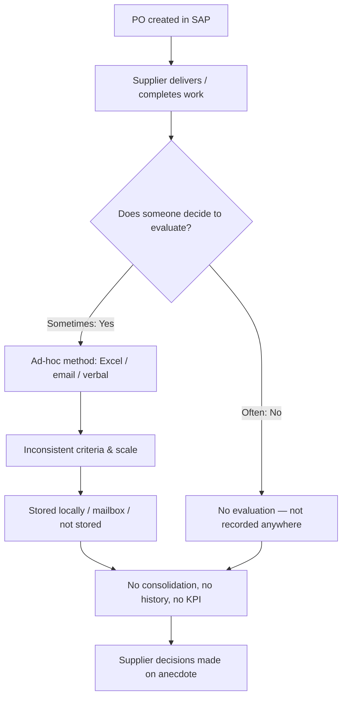
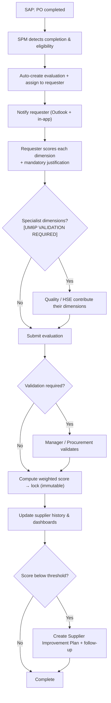
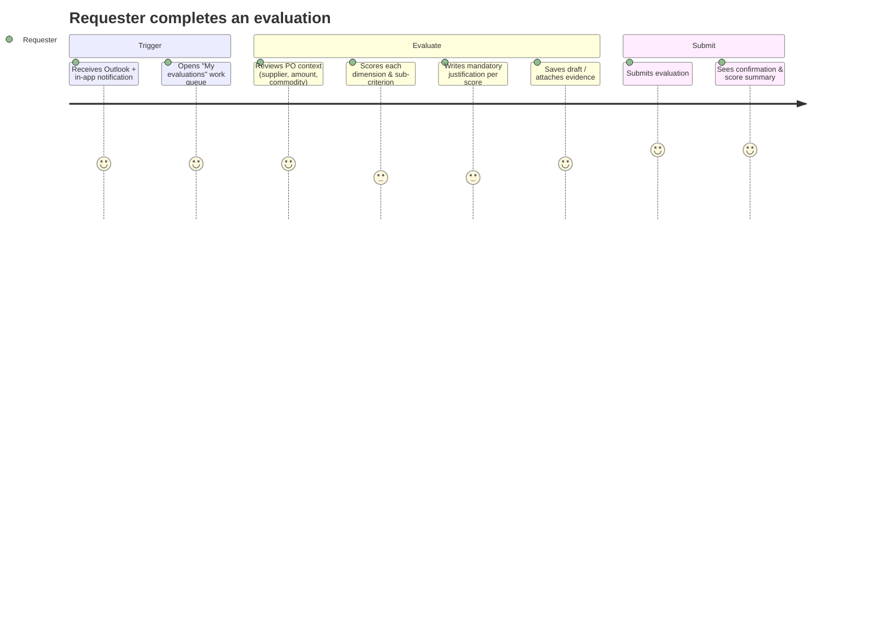
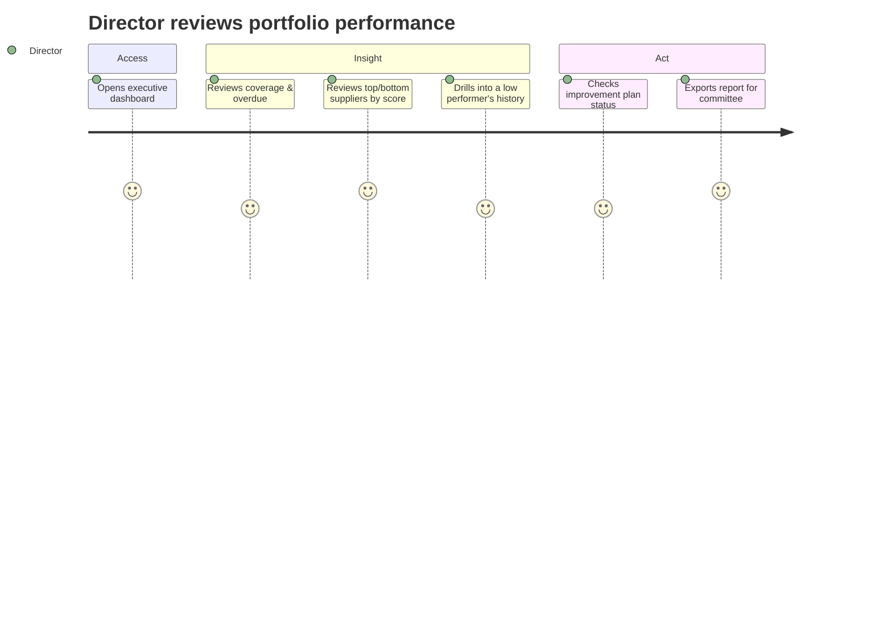
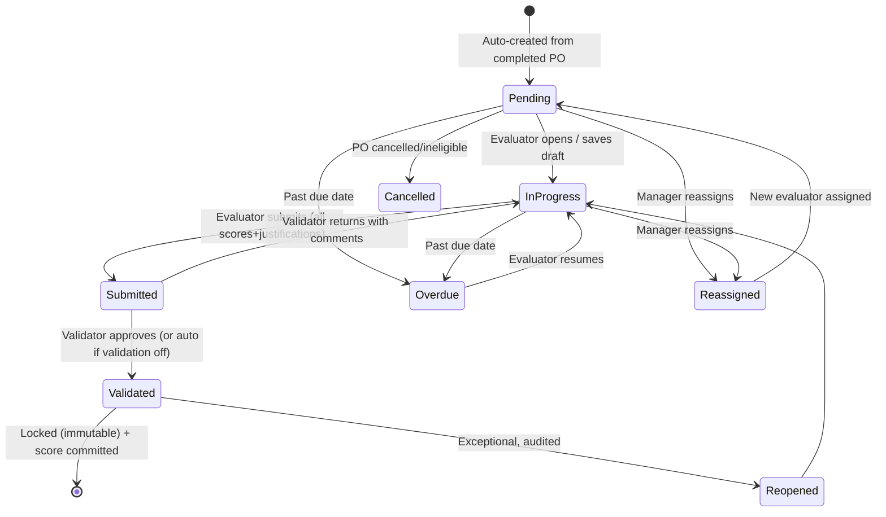
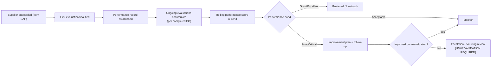
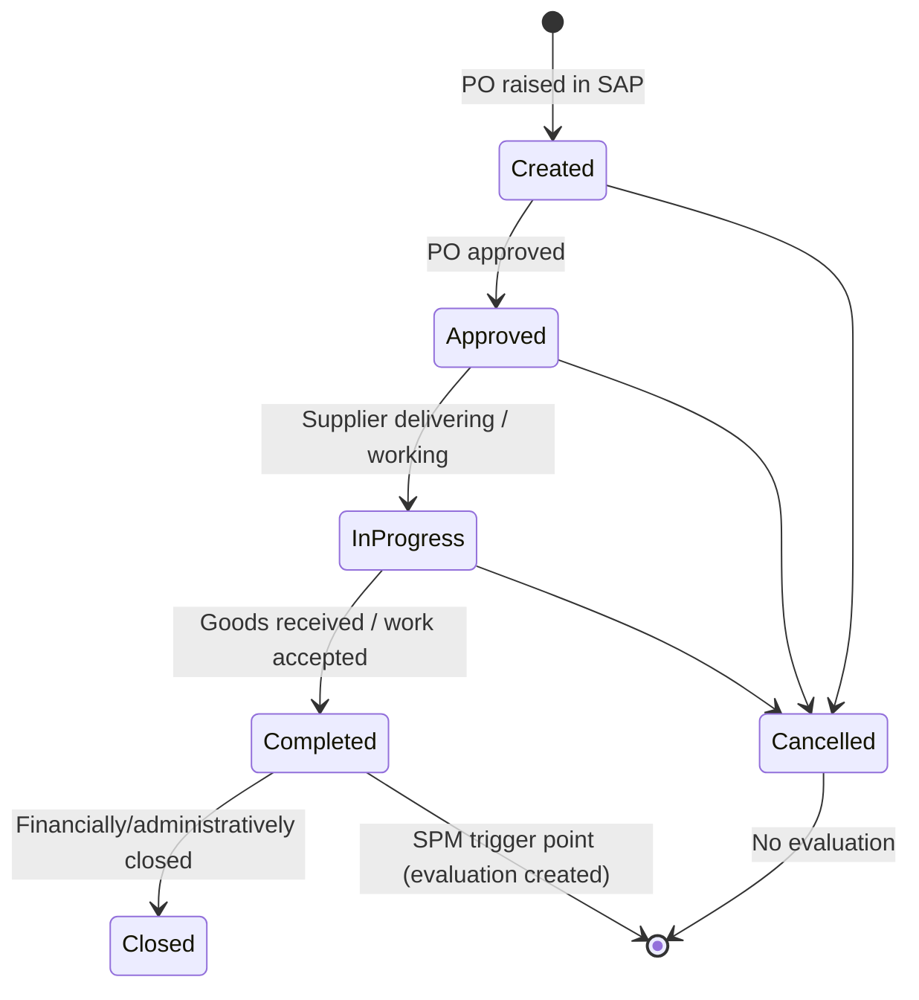
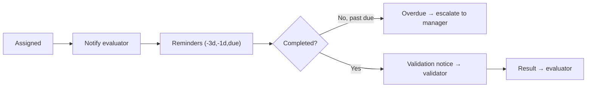

# UM6P — Supplier Performance Management Platform (SPM)
## Business Analysis Document (Functional Reference) · v1.0

> **Document type:** Business Requirements / Functional Reference
> **Prepared by:** Business Analysis & Procurement Digital Transformation
> **Prepared for approval by:** Director of Procurement (Directeur des Achats), UM6P
> **Status:** Draft for review & sign-off — Discovery phase (pre-development)
> **Scope of this document:** Business analysis only. No SQL, no code, no technical design. This is the source of truth that all subsequent design and development phases must trace back to.
>
> **Validation convention:** any statement that assumes a UM6P organizational policy, threshold, ownership, or approval rule we have not yet confirmed is marked **[UM6P VALIDATION REQUIRED]** with a proposed default. Nothing organizational is invented silently.

---

## Table of Contents
1. [Executive Summary](#1-executive-summary)
2. [Business Context](#2-business-context)
3. [Problem Statement](#3-problem-statement)
4. [Business Objectives](#4-business-objectives)
5. [Vision Statement](#5-vision-statement)
6. [Stakeholder Analysis](#6-stakeholder-analysis)
7. [Current (As-Is) Business Process](#7-current-as-is-business-process)
8. [Future (To-Be) Business Process](#8-future-to-be-business-process)
9. [Scope Definition](#9-scope-definition)
10. [Assumptions](#10-assumptions)
11. [Constraints](#11-constraints)
12. [Business Requirements](#12-business-requirements-br)
13. [Functional Requirements](#13-functional-requirements-fr)
14. [Non-Functional Requirements](#14-non-functional-requirements-nfr)
15. [Business Rules](#15-business-rules-rule)
16. [User Roles](#16-user-roles)
17. [Personas](#17-personas)
18. [User Journeys](#18-user-journeys)
19. [Detailed Use Cases](#19-detailed-use-cases-uc)
20. [Evaluation Workflow](#20-evaluation-workflow)
21. [Supplier Evaluation Lifecycle](#21-supplier-evaluation-lifecycle)
22. [Purchase Order Lifecycle](#22-purchase-order-lifecycle)
23. [Evaluation Matrix Model](#23-evaluation-matrix-model)
24. [Configurable Business Rules](#24-configurable-business-rules)
25. [Notification Workflow](#25-notification-workflow)
26. [Dashboard Requirements](#26-dashboard-requirements)
27. [Reporting Requirements](#27-reporting-requirements)
28. [SAP Integration Requirements (Business)](#28-sap-integration-requirements-business-level)
29. [Data Ownership Matrix](#29-data-ownership-matrix)
30. [Risks](#30-risks)
31. [Success KPIs](#31-success-kpis)
32. [Acceptance Criteria](#32-acceptance-criteria)
33. [Product Backlog](#33-product-backlog) → see **[PRODUCT_BACKLOG.md](./PRODUCT_BACKLOG.md)**

---

## 1. Executive Summary

The Procurement Department (Direction des Achats) of UM6P manages hundreds of suppliers across multiple departments and commodities. After a supplier delivers goods or completes work against a Purchase Order (PO), the internal requester (Chef de Projet / Demandeur) is best positioned to judge how well the supplier performed. Today this judgement is captured — if at all — through Excel files, emails, and inconsistent personal methods. There is no standard, no traceability, no consolidated history, and no way to steer supplier relationships with data.

The **Supplier Performance Management Platform (SPM)** will change this. Connected to SAP, it will automatically synchronize Purchase Orders, suppliers, requesters and purchasers; detect when a PO is completed; automatically create a structured supplier evaluation and assign it to the correct requester; enforce a **configurable, weighted, multi-dimensional evaluation matrix** where every score is justified with a mandatory comment; calculate a weighted supplier performance score; preserve an immutable evaluation history; surface performance through dashboards; and support **supplier improvement plans** where performance is weak.

The outcome is a single, governed, auditable system of record for supplier performance that turns a manual, opinion-based ritual into a repeatable, evidence-based management discipline. This document defines *what* the business needs and *why*; the technical design phase defines *how*.

**Primary business value:** standardization, traceability, objectivity, supplier accountability, and data-driven procurement decisions (renewal, sourcing, risk, negotiation).

---

## 2. Business Context

UM6P is a research-intensive university with significant and growing procurement activity spanning research equipment, IT, works, professional services, laboratory consumables, facilities and general goods, across multiple campuses and entities.

Key contextual facts:
- **SAP is the transactional backbone** for procurement: POs, suppliers, requesters, purchasers, departments and commodities all originate there. SAP is — and remains — the source of truth for transactional and master data.
- **The internal requester (Chef de Projet / Demandeur)** is the business owner of the need and the person with first-hand knowledge of how the supplier actually performed.
- **The purchaser (Acheteur)** owns the commercial relationship and the PO within Procurement.
- Specialist functions — **Quality** and **HSE** — hold authoritative views on specific performance dimensions (conformity, safety compliance).
- Supplier performance information, when it exists, is **fragmented and non-comparable** across departments.
- UM6P operates within a **Microsoft 365 environment** (Outlook, Teams) used for day-to-day communication and, in the future, notifications and analytics (Power BI).

The platform must fit this reality: SAP-driven, requester-centered, Microsoft-integrated, multi-department and multi-campus ready.

---

## 3. Problem Statement

> Today, UM6P Procurement cannot answer a simple question with confidence: *"How well is this supplier actually performing, across all our purchases, over time?"*

Root problems:

| # | Problem | Consequence |
|---|---|---|
| P1 | **No standardized evaluation method** | Scores are not comparable across requesters, departments, or commodities. |
| P2 | **Manual, Excel/email-based process** | Effort-heavy, error-prone, easily forgotten, not enforceable. |
| P3 | **No automatic triggering** | Many completed POs are never evaluated; coverage is unknown. |
| P4 | **No traceability or audit trail** | Cannot prove who evaluated what, when, and on what basis. |
| P5 | **No centralized supplier history** | Each purchase is judged in isolation; no trend, no memory. |
| P6 | **No justification discipline** | Scores without evidence are subjective and contestable. |
| P7 | **No dashboards or KPIs** | Procurement leadership manages suppliers without data. |
| P8 | **No improvement mechanism** | Poor performance is noted (if at all) but not acted upon or followed up. |
| P9 | **No link between evaluation and the PO that justifies it** | Evaluations float free of the transaction that grounds them. |

The cost is measured in unmanaged supplier risk, missed leverage in negotiations and renewals, wasted staff time, and decisions made on anecdote rather than evidence.

---

## 4. Business Objectives

The platform shall enable UM6P Procurement to:

| # | Objective |
|---|---|
| BO-1 | **Synchronize** Purchase Orders, Suppliers, Internal Requesters and Purchasers from SAP. |
| BO-2 | **Detect completed Purchase Orders** automatically and reliably. |
| BO-3 | **Automatically create and assign** the supplier evaluation to the correct internal requester. |
| BO-4 | Provide a **structured, standardized, multi-dimensional evaluation** for every eligible completed PO. |
| BO-5 | Use **configurable weighted evaluation matrices**, adaptable by commodity/category. |
| BO-6 | **Require a justification comment for every score** given. |
| BO-7 | **Calculate a weighted supplier performance score** consistently and transparently. |
| BO-8 | Maintain a **complete, immutable supplier performance history**. |
| BO-9 | Provide **dashboards** for Procurement leadership, purchasers, and requesters. |
| BO-10 | Support **supplier improvement plans** triggered by weak performance. |
| BO-11 | Guarantee **full traceability and auditability** of every evaluation and decision. |
| BO-12 | Reduce manual effort and increase **evaluation coverage** of completed POs. |

Each objective is traceable to requirements in §12–15 and to backlog epics in [PRODUCT_BACKLOG.md](./PRODUCT_BACKLOG.md).

---

## 5. Vision Statement

> **For** UM6P Procurement and its internal requesters,
> **who** need to evaluate and manage supplier performance consistently,
> **the** Supplier Performance Management Platform **is** an enterprise system connected to SAP
> **that** automatically turns every completed Purchase Order into a structured, justified, weighted supplier evaluation, and consolidates results into a living supplier performance record.
> **Unlike** today's manual, Excel-and-email approach,
> **our platform** guarantees standardization, automatic assignment, mandatory justification, immutable history, actionable dashboards, and supplier improvement follow-through — making supplier performance a measurable, managed asset of the University.

---

## 6. Stakeholder Analysis

| Stakeholder | Interest / stake | Influence | Engagement need |
|---|---|---|---|
| **Director of Procurement** | Governance, KPIs, supplier strategy, decision-making | High (sponsor/approver) | Approves this document, matrix, thresholds; consumes executive dashboards. |
| **Procurement Administrator** | Configures & operates the platform | High | Owns matrix config, reference data mapping, monitoring, support. |
| **Purchaser (Acheteur)** | Supplier relationship & PO ownership | Medium-High | Monitors evaluations of their suppliers; uses results in sourcing/negotiation. |
| **Internal Requester (Chef de Projet / Demandeur)** | Actually completes evaluations | High (primary user) | Must find the process fast, fair, and low-friction; drives adoption. |
| **Quality Department** | Conformity/quality dimension authority | Medium | May contribute/own quality dimension; consumes quality trends. |
| **HSE** | Health, Safety, Environment compliance authority | Medium | May contribute/own HSE dimension; consumes HSE compliance data. |
| **Department Manager** | Departmental accountability, validation | Medium | May validate evaluations; consumes departmental performance. |
| **IT / DSI** | SAP integration, security, hosting, Entra/M365 | High (enabler) | Provides SAP access, identity, environment; constrains architecture. |
| **Internal Audit / Compliance** | Traceability, control, defensibility | Medium | Consumes audit trail; validates controls. |
| **Supplier** *(future phase)* | Visibility of their scores & improvement actions | Low (now) / Medium (later) | Future self-service portal; out of current scope. |

**Stakeholder power/interest posture:** Director of Procurement and IT/DSI must be *managed closely* (decision-makers/enablers); requesters must be *kept satisfied* (adoption risk); Quality/HSE/Department Managers *kept informed and consulted*.

---

## 7. Current (As-Is) Business Process

**Narrative:** A PO is raised in SAP and fulfilled by the supplier. When the goods arrive or the work finishes, *sometimes* the requester or purchaser decides to record an opinion — usually only for large or problematic purchases. The method varies by person: an Excel template, an email, or nothing. There is no central place, no standard criteria, no mandatory justification, no consolidation, and no follow-up.



**Pain points (As-Is):**
- Coverage unknown and likely low (P3).
- No comparability (P1); no justification (P6); no history (P5).
- No traceability/audit (P4); no dashboards (P7); no improvement loop (P8).
- Heavy, forgettable manual effort (P2).

---

## 8. Future (To-Be) Business Process

**Narrative:** SAP data flows into SPM. When a PO becomes *completed*, SPM automatically creates a structured evaluation and assigns it to the responsible requester, who is notified. The requester scores each dimension against a standardized, weighted matrix, justifying every score. Specialist dimensions (Quality, HSE) may be routed to their owners **[UM6P VALIDATION REQUIRED]**. The evaluation is validated (if the policy requires it), a weighted score is computed and locked into the supplier's immutable history, dashboards update, and weak performance triggers an improvement plan with follow-up.



**Benefits (To-Be):** standardized & comparable, near-100% coverage of eligible POs, mandatory evidence, immutable auditable history, live dashboards, and a closed improvement loop — directly resolving P1–P9.

---

## 9. Scope Definition

### 9.1 In Scope
- SAP synchronization of POs, suppliers, internal requesters, purchasers, departments, commodities (inbound, read-only from SAP).
- Automatic detection of completed POs and automatic evaluation creation & assignment.
- Configurable weighted, multi-dimensional evaluation matrices with sub-criteria, per-commodity variants, and versioning.
- Structured evaluation capture with mandatory per-score justification.
- Optional validation/governance workflow.
- Weighted score calculation and immutable supplier performance history.
- Supplier improvement plans and follow-up.
- Notifications (assignment, reminders, overdue, escalation, validation, improvement plan).
- Dashboards and reporting for defined roles.
- Role-based access, full audit trail.
- Multi-department and multi-campus readiness.

### 9.2 Out of Scope (this release)
- Writing data back to SAP (SPM does not modify SAP).
- Supplier-facing self-service portal (future phase).
- Sourcing, RFQ/tendering, contract lifecycle management, e-invoicing.
- Payment/financial reconciliation.
- Automated supplier scoring from external data (news, ESG feeds).
- Procurement of the SAP integration middleware itself (IT/DSI responsibility).

### 9.3 Future Phases (roadmap, not committed here)
- Supplier self-service portal (view scores, acknowledge, respond to improvement plans).
- Power BI advanced analytics and Teams notifications.
- Predictive supplier risk scoring and benchmarking.
- Multi-entity / multi-campus governance activation.

**[UM6P VALIDATION REQUIRED]:** confirm the in/out-of-scope boundary, especially the multi-contributor (Quality/HSE) model and whether validation is mandatory.

---

## 10. Assumptions

| # | Assumption | Flag |
|---|---|---|
| AS-1 | SAP can expose POs, suppliers, requesters, purchasers, departments and commodities to SPM (read access). | [UM6P VALIDATION REQUIRED] |
| AS-2 | A "completed" PO is identifiable in SAP via a status/goods-receipt/final-delivery indicator. | [UM6P VALIDATION REQUIRED] |
| AS-3 | Each PO carries an identifiable internal requester who can be matched to a UM6P user (email/identity). | [UM6P VALIDATION REQUIRED] |
| AS-4 | Users authenticate with their UM6P Microsoft accounts (Entra ID SSO). | [UM6P VALIDATION REQUIRED] |
| AS-5 | Not every completed PO must be evaluated; eligibility rules (e.g., minimum amount, commodity exclusions) apply. | [UM6P VALIDATION REQUIRED] |
| AS-6 | The evaluation scale is **1–5 per sub-criterion**, rolled up to a **0–100 weighted score** with performance bands. | [UM6P VALIDATION REQUIRED] |
| AS-7 | The default evaluation due window is **10 business days** from assignment. | [UM6P VALIDATION REQUIRED] |
| AS-8 | A validation step exists and is performed by the Department Manager or Procurement (configurable on/off). | [UM6P VALIDATION REQUIRED] |
| AS-9 | Notifications are delivered via Outlook/Microsoft 365 plus in-app. | [UM6P VALIDATION REQUIRED] |
| AS-10 | French is the primary language; English is secondary. | [UM6P VALIDATION REQUIRED] |
| AS-11 | The improvement-plan threshold is a weighted score below a configurable value (proposed 55/100). | [UM6P VALIDATION REQUIRED] |
| AS-12 | Historical evaluations are legally/organizationally significant and must never be altered or deleted. | Assumed firm requirement |

---

## 11. Constraints

| # | Constraint | Type |
|---|---|---|
| C-1 | SAP is the sole source of truth for POs and master data; SPM is read-only toward SAP. | Integration |
| C-2 | Identity is governed by UM6P Microsoft Entra ID; no separate credentials. | Security/Identity |
| C-3 | Must operate within UM6P's Microsoft 365 ecosystem (Outlook, Teams, Power BI future). | Technology policy |
| C-4 | Must respect UM6P data protection, retention and internal audit requirements. | Compliance [UM6P VALIDATION REQUIRED] |
| C-5 | Evaluation criteria, weights and thresholds must be owned/approved by the Director of Procurement. | Governance |
| C-6 | Availability of SAP integration depends on IT/DSI timelines. | Delivery dependency |
| C-7 | Historical evaluations are immutable once validated. | Business rule / compliance |
| C-8 | The solution must be usable in French and accessible to non-technical staff. | Usability |
| C-9 | Multi-campus/multi-entity segregation of data and access must be supported. | Organizational |

---

## 12. Business Requirements (BR)

High-level statements of business need (the "what the organization needs").

| ID | Business Requirement | Traces to |
|---|---|---|
| BR-1 | The organization must be able to evaluate every eligible supplier delivery/performance in a standardized way. | BO-4, P1 |
| BR-2 | Evaluations must be automatically generated from completed POs and assigned to the responsible person. | BO-2, BO-3, P3 |
| BR-3 | Every evaluation must be justified and defensible. | BO-6, P6 |
| BR-4 | Supplier performance must be measurable, comparable, and consolidated over time. | BO-7, BO-8, P5 |
| BR-5 | Procurement leadership must be able to make supplier decisions from reliable data. | BO-9, P7 |
| BR-6 | Weak supplier performance must trigger a managed improvement action. | BO-10, P8 |
| BR-7 | The whole process must be fully traceable and auditable. | BO-11, P4 |
| BR-8 | The evaluation model must be configurable to fit different commodities and evolving needs. | BO-5 |
| BR-9 | Access must be governed by role, department and campus. | C-2, C-9 |
| BR-10 | The organization must reduce manual effort and increase evaluation coverage. | BO-12, P2 |

---

## 13. Functional Requirements (FR)

Grouped by capability. Priority uses **MoSCoW** (M=Must, S=Should, C=Could, W=Won't-now).

### 13.1 Data Synchronization
| ID | Requirement | Priority |
|---|---|---|
| FR-1 | The system shall synchronize suppliers from SAP (create/update). | M |
| FR-2 | The system shall synchronize purchase orders from SAP, including supplier, purchaser, requester, department, commodity, amount, status, dates. | M |
| FR-3 | The system shall synchronize internal requesters and purchasers as identifiable users. | M |
| FR-4 | The system shall synchronize departments and commodities as reference data. | M |
| FR-5 | The system shall record every synchronization run with counts, outcome and errors. | M |
| FR-6 | The system shall allow an administrator to trigger a synchronization manually. | S |
| FR-7 | The system shall reconcile SPM data against SAP and report discrepancies. | S |

### 13.2 Evaluation Generation & Assignment
| ID | Requirement | Priority |
|---|---|---|
| FR-8 | The system shall detect POs that have become "completed" per configured criteria. | M |
| FR-9 | The system shall apply eligibility rules to decide whether a completed PO requires an evaluation. | M |
| FR-10 | The system shall automatically create an evaluation for each eligible completed PO. | M |
| FR-11 | The system shall automatically assign the evaluation to the PO's internal requester. | M |
| FR-12 | The system shall set a due date on each evaluation based on the configured window. | M |
| FR-13 | The system shall allow an administrator/manager to reassign an evaluation with a reason. | S |
| FR-14 | The system shall hold and later resolve assignment when the requester is not yet a registered user. | S |
| FR-15 | The system shall allow manual creation of an evaluation for an eligible PO where auto-creation failed. | C |

### 13.3 Evaluation Matrix Configuration
| ID | Requirement | Priority |
|---|---|---|
| FR-16 | The system shall let authorized users define evaluation dimensions and sub-criteria. | M |
| FR-17 | The system shall let authorized users configure weights at dimension and sub-criterion level. | M |
| FR-18 | The system shall enforce that weights total 100% at each level before activation. | M |
| FR-19 | The system shall support different matrices per commodity/category. | S |
| FR-20 | The system shall version matrices and keep prior versions for historical evaluations. | M |
| FR-21 | The system shall allow marking a criterion as "Not Applicable" and re-normalize weights accordingly. | S |
| FR-22 | The system shall optionally route specific dimensions to specialist contributors (Quality, HSE). | C [UM6P VALIDATION REQUIRED] |

### 13.4 Evaluation Execution
| ID | Requirement | Priority |
|---|---|---|
| FR-23 | The system shall present the assigned evaluator with the structured matrix for the PO. | M |
| FR-24 | The system shall require a score for every applicable sub-criterion. | M |
| FR-25 | The system shall require a justification comment for every score. | M |
| FR-26 | The system shall allow saving an evaluation as draft. | M |
| FR-27 | The system shall allow attaching supporting evidence (documents/images) to an evaluation. | S |
| FR-28 | The system shall allow submitting a completed evaluation. | M |
| FR-29 | The system shall prevent submission until all required scores and justifications are present. | M |

### 13.5 Validation & Governance
| ID | Requirement | Priority |
|---|---|---|
| FR-30 | The system shall support an optional validation step by a designated validator. | S |
| FR-31 | The system shall allow a validator to approve or return an evaluation with comments. | S |
| FR-32 | The system shall lock an evaluation as immutable once validated/finalized. | M |
| FR-33 | The system shall allow an authorized reopening with full audit justification (exceptional). | C |

### 13.6 Scoring & History
| ID | Requirement | Priority |
|---|---|---|
| FR-34 | The system shall compute a weighted score from sub-criteria, criteria and their weights. | M |
| FR-35 | The system shall classify each evaluation into a performance band. | M |
| FR-36 | The system shall append every finalized evaluation to the supplier's permanent history. | M |
| FR-37 | The system shall compute supplier aggregate performance over time and by dimension. | M |
| FR-38 | The system shall never alter a finalized historical evaluation. | M |

### 13.7 Improvement Plans
| ID | Requirement | Priority |
|---|---|---|
| FR-39 | The system shall create an improvement plan when a supplier score is below the configured threshold. | S |
| FR-40 | The system shall let authorized users define improvement actions, owners and due dates. | S |
| FR-41 | The system shall track improvement plan status and follow-up outcomes. | S |
| FR-42 | The system shall link improvement plans to the triggering evaluation(s) and supplier history. | S |

### 13.8 Notifications
| ID | Requirement | Priority |
|---|---|---|
| FR-43 | The system shall notify the evaluator when an evaluation is assigned. | M |
| FR-44 | The system shall send reminders before the due date. | M |
| FR-45 | The system shall flag and notify overdue evaluations and escalate them. | M |
| FR-46 | The system shall notify validators when validation is required and notify results. | S |
| FR-47 | The system shall notify relevant roles when an improvement plan is created/updated. | S |
| FR-48 | The system shall provide periodic digests to managers/directors. | C |

### 13.9 Dashboards & Reporting
| ID | Requirement | Priority |
|---|---|---|
| FR-49 | The system shall provide dashboards tailored per role (director, admin, purchaser, requester, quality/HSE). | M |
| FR-50 | The system shall provide supplier scorecards and performance trends. | M |
| FR-51 | The system shall report evaluation coverage, completion and overdue rates. | M |
| FR-52 | The system shall support filtering by period, department, campus, commodity and supplier. | M |
| FR-53 | The system shall export reports (Excel/PDF) and support future Power BI consumption. | S |

### 13.10 Administration, Access & Audit
| ID | Requirement | Priority |
|---|---|---|
| FR-54 | The system shall enforce role-based access with department/campus scoping. | M |
| FR-55 | The system shall allow administrators to manage configuration (matrix, rules, thresholds, windows). | M |
| FR-56 | The system shall record an immutable audit trail of all significant actions. | M |
| FR-57 | The system shall provide an audit/traceability view to authorized roles. | M |

---

## 14. Non-Functional Requirements (NFR)

| ID | Category | Requirement |
|---|---|---|
| NFR-1 | **Usability** | Non-technical staff complete a typical evaluation in ≤ 10 minutes with no training; French-first UI. |
| NFR-2 | **Accessibility** | Meets WCAG 2.1 AA (keyboard, contrast, screen-reader). |
| NFR-3 | **Performance** | Key screens load in < 2s under normal load; dashboards remain responsive over multi-year history. |
| NFR-4 | **Availability** | Business-hours availability target ≥ 99.5%; graceful degradation if SAP is unavailable. [UM6P VALIDATION REQUIRED] |
| NFR-5 | **Security** | SSO via Entra ID; least-privilege access; encryption in transit and at rest. |
| NFR-6 | **Auditability** | Every create/update/finalize/assignment is traceable to actor, time and reason; audit is tamper-evident. |
| NFR-7 | **Data integrity** | Finalized evaluations are immutable; scores are reproducible from stored inputs. |
| NFR-8 | **Scalability** | Supports multi-campus/multi-department growth without redesign. |
| NFR-9 | **Reliability** | Synchronization is idempotent and recoverable; no duplicate evaluations per PO. |
| NFR-10 | **Maintainability** | Business configuration (matrix, rules) changeable without software releases. |
| NFR-11 | **Compliance** | Data retention and privacy per UM6P policy. [UM6P VALIDATION REQUIRED] |
| NFR-12 | **Localization** | Bilingual FR/EN; MAD currency; local date/number formats. |
| NFR-13 | **Traceability** | Every requirement traces to a backlog item and every evaluation to its PO. |

---

## 15. Business Rules (RULE)

| ID | Rule |
|---|---|
| RULE-1 | An evaluation can exist only if it is linked to exactly one completed, eligible PO. |
| RULE-2 | Only one evaluation is generated per PO (no duplicates). |
| RULE-3 | The default evaluator is the internal requester recorded on the PO. |
| RULE-4 | Every score must have a non-empty justification comment. |
| RULE-5 | An evaluation cannot be submitted unless all applicable sub-criteria are scored and justified. |
| RULE-6 | Matrix weights must total 100% at each level before the matrix can be activated. |
| RULE-7 | An evaluation is scored against the matrix version active at the time of its creation; later matrix changes do not affect it. |
| RULE-8 | A finalized/validated evaluation is immutable; it cannot be edited or deleted. |
| RULE-9 | A criterion may be marked "Not Applicable"; its weight is redistributed proportionally among applicable criteria. |
| RULE-10 | A supplier score below the improvement threshold triggers an improvement plan. [UM6P VALIDATION REQUIRED: threshold] |
| RULE-11 | Reassignment and (exceptional) reopening require a recorded reason and are audited. |
| RULE-12 | A user may only see evaluations, POs and suppliers within their role's department/campus scope. |
| RULE-13 | An evaluation not completed by its due date becomes "Overdue" and is escalated. |
| RULE-14 | SAP is authoritative for PO/master data; SPM never writes back to SAP. |
| RULE-15 | Specialist dimensions (Quality/HSE), if enabled, must be completed by the designated function before consolidation. [UM6P VALIDATION REQUIRED] |
| RULE-16 | Supplier history reflects only finalized evaluations. |

---

## 16. User Roles

| Role | Description | Core rights (business) |
|---|---|---|
| **Procurement Administrator** | Operates & configures the platform | Configure matrix/rules/thresholds; manage users/roles; run/monitor sync; full visibility. |
| **Procurement Director** | Governance & strategy owner | Full visibility; approve matrix; validate (optional); executive dashboards & reports. |
| **Purchaser (Acheteur)** | Owns POs & supplier relationship | View suppliers/POs/evaluations in scope; monitor; use results; optionally validate. |
| **Internal Requester (Chef de Projet)** | Primary evaluator | Complete & submit assigned evaluations; view own history & the supplier's shared performance. |
| **Quality Department** | Quality/conformity authority | Contribute/own quality dimension (if enabled); view quality trends. |
| **HSE** | Safety/environment authority | Contribute/own HSE dimension (if enabled); view HSE compliance trends. |
| **Department Manager** | Departmental accountability | Validate evaluations (if enabled); view departmental performance & overdue. |
| **Supplier** *(future)* | External performance subject | (Future) view own scores, acknowledge, respond to improvement plans. |

Access is **role + department + campus** scoped (RULE-12). Detailed permission mapping is defined in the technical blueprint's permission matrix and traces to these business roles.

---

## 17. Personas

### Persona A — "Yassine", Internal Requester / Chef de Projet
- **Role:** Project lead in a research/works department who requests purchases.
- **Goals:** Get his equipment/works delivered well; spend minimal time on admin.
- **Frustrations:** Being chased by email; unclear expectations; forms that feel bureaucratic.
- **Needs from SPM:** A clear notification, a fast fair form, obvious criteria, ability to justify quickly, mobile-friendly.
- **Success looks like:** "I got a reminder, opened the evaluation, scored 8 sub-criteria with short comments, submitted — 7 minutes, done."

### Persona B — "Salma", Purchaser / Acheteur
- **Role:** Buyer owning supplier relationships within Procurement.
- **Goals:** Know which suppliers are reliable; have evidence for negotiations and renewals.
- **Frustrations:** No consolidated view; requesters not evaluating; disputes without data.
- **Needs from SPM:** Supplier scorecards, trend, coverage of her suppliers, ability to nudge/reassign.
- **Success looks like:** "Before renewing a contract, I pull the supplier's 12-month scorecard with evidence."

### Persona C — "Mr. El Amrani", Director of Procurement
- **Role:** Head of Procurement; accountable for supplier strategy and performance.
- **Goals:** Manage supplier portfolio risk; standardize; demonstrate governance.
- **Frustrations:** Managing suppliers on anecdote; no KPIs; audit exposure.
- **Needs from SPM:** Executive dashboards, portfolio health, low performers, improvement-plan status, defensible audit trail.
- **Success looks like:** "I open one dashboard and see coverage, top/bottom suppliers, and which improvement plans are on track."

### Persona D — "Nadia", Procurement Administrator
- **Role:** Platform owner/operator.
- **Goals:** Keep data flowing, configuration correct, users unblocked.
- **Frustrations:** Master data gaps from SAP; unmapped requesters; config errors.
- **Needs from SPM:** Sync monitoring, easy matrix configuration, user/role management, reassignment tools.
- **Success looks like:** "Sync ran clean; I adjusted the IT-commodity matrix weights without calling IT."

### Persona E — "Karim", Quality / HSE Officer *(if specialist model enabled)*
- **Role:** Authority on conformity / safety compliance.
- **Goals:** Ensure his dimension reflects real compliance, not guesswork.
- **Needs from SPM:** Targeted queue of his dimension across relevant POs; trend reporting.
- **Success looks like:** "I complete the HSE dimension for site-works suppliers from one focused list."

---

## 18. User Journeys

### 18.1 Requester — complete an assigned evaluation


### 18.2 Director — govern supplier performance


### 18.3 Administrator — configure a commodity matrix
`Login → Matrix admin → Duplicate base matrix for "IT Equipment" → Adjust dimension/sub-criterion weights → System validates weights = 100% → Activate new version → Existing evaluations keep old version → New IT evaluations use the new one.`

---

## 19. Detailed Use Cases (UC)

> Format: Actor · Preconditions · Trigger · Main flow · Alternate/Exception flows · Postconditions.

### UC-1 — Automatically create and assign an evaluation
- **Actor:** System (initiated by SAP data)
- **Preconditions:** PO synced; PO status = completed; PO passes eligibility rules; requester resolvable.
- **Trigger:** PO transitions to "completed".
- **Main flow:** 1) System detects completion. 2) Checks eligibility. 3) Selects active matrix by commodity. 4) Creates evaluation (status Pending) with matrix version snapshot. 5) Assigns to requester. 6) Sets due date. 7) Notifies requester.
- **Alternates:** 3a) No commodity-specific matrix → use default. 5a) Requester not a registered user → hold assignment, resolve on first login.
- **Exceptions:** 2a) Not eligible → no evaluation, log reason. 4a) No active matrix → flag to administrator, do not create.
- **Postconditions:** One pending evaluation exists for the PO; requester notified; action audited.

### UC-2 — Complete and submit an evaluation
- **Actor:** Internal Requester
- **Preconditions:** An evaluation is assigned to the requester.
- **Main flow:** 1) Opens evaluation. 2) Reviews PO context. 3) Scores each applicable sub-criterion. 4) Enters justification per score. 5) (Optional) attaches evidence. 6) Saves draft as needed. 7) Submits.
- **Alternates:** 3a) Marks a criterion "Not Applicable" → weight redistributed.
- **Exceptions:** 7a) Missing score/justification → submission blocked with guidance.
- **Postconditions:** Evaluation moves to Submitted (or Validated if no validation step); score computed on finalization; audited.

### UC-3 — Validate an evaluation
- **Actor:** Department Manager / Procurement (validator) — *if validation enabled*
- **Preconditions:** Evaluation submitted; validation enabled.
- **Main flow:** 1) Validator reviews scores & justifications. 2) Approves.
- **Alternates:** 2a) Returns with comments → evaluation goes back to evaluator (In Progress).
- **Postconditions:** On approval, evaluation is finalized, locked (immutable), score committed to supplier history; all outcomes audited & notified.

### UC-4 — Configure an evaluation matrix
- **Actor:** Procurement Administrator (approved by Director)
- **Preconditions:** Authorized; dimensions/sub-criteria defined.
- **Main flow:** 1) Create/duplicate matrix. 2) Set dimensions, sub-criteria, weights, scale. 3) System validates weights = 100% at each level. 4) Activate (new version).
- **Exceptions:** 3a) Weights ≠ 100% → activation blocked.
- **Postconditions:** New matrix version active; prior version retained for existing evaluations.

### UC-5 — Handle an overdue evaluation
- **Actor:** System + Manager
- **Preconditions:** Evaluation past due date, not finalized.
- **Main flow:** 1) System marks Overdue. 2) Sends reminder/escalation to requester and manager.
- **Alternates:** Manager reassigns (UC-6) or grants extension.
- **Postconditions:** Overdue status visible on dashboards; escalation audited.

### UC-6 — Reassign an evaluation
- **Actor:** Administrator / Manager
- **Preconditions:** Evaluation not finalized.
- **Main flow:** 1) Selects new evaluator. 2) Enters reason. 3) Confirms.
- **Postconditions:** New assignee notified; reassignment audited with reason.

### UC-7 — Create and track a supplier improvement plan
- **Actor:** Purchaser / Procurement
- **Preconditions:** Supplier score below threshold (auto-flag) or manual decision.
- **Main flow:** 1) System flags / user opens supplier. 2) Creates improvement plan with actions, owners, due dates. 3) Tracks progress. 4) Records outcome / re-evaluation.
- **Postconditions:** Plan linked to supplier history & triggering evaluation; status visible on dashboards.

### UC-8 — Consult supplier performance history / scorecard
- **Actor:** Purchaser / Director / Manager
- **Preconditions:** Supplier has finalized evaluations.
- **Main flow:** 1) Opens supplier scorecard. 2) Views overall score, per-dimension breakdown, trend, evaluation list, improvement plans.
- **Alternates:** Filters by period/commodity/department; exports.
- **Postconditions:** Read-only consultation; access audited if configured.

### UC-9 — Synchronize data from SAP
- **Actor:** System (scheduled) / Administrator (manual)
- **Preconditions:** SAP connectivity available.
- **Main flow:** 1) Fetch changes (suppliers, POs, users, reference data). 2) Update SPM. 3) Detect completed POs → UC-1. 4) Record run outcome.
- **Exceptions:** SAP unavailable → retain last data, mark run failed, alert admin.
- **Postconditions:** SPM data current; sync run logged; discrepancies reportable.

### UC-10 — Review audit trail
- **Actor:** Auditor / Administrator / Director
- **Preconditions:** Authorized.
- **Main flow:** 1) Opens audit view. 2) Filters by actor/entity/action/date. 3) Reviews immutable records. 4) Exports.
- **Postconditions:** Traceability evidence produced.

---

## 20. Evaluation Workflow

**States and transitions of a single evaluation:**



**Key controls:** mandatory justification (RULE-4), submission completeness (RULE-5), matrix version snapshot (RULE-7), immutability on finalization (RULE-8), full audit on reassign/reopen (RULE-11).

---

## 21. Supplier Evaluation Lifecycle

The lifecycle from the **supplier's performance-record** perspective (aggregating many evaluations over time):



**Business meaning of bands** *(proposed — [UM6P VALIDATION REQUIRED])*:
| Band | Score (0–100) | Management posture |
|---|---|---|
| Excellent | ≥ 85 | Strategic / preferred supplier |
| Good | 70–84 | Approved, standard relationship |
| Acceptable | 55–69 | Monitor, address specific weaknesses |
| Poor | 40–54 | Improvement plan required |
| Critical | < 40 | Risk review / possible suspension |

---

## 22. Purchase Order Lifecycle (business view)

SPM observes (does not control) the PO lifecycle in SAP and reacts at completion.



- **Trigger point for SPM:** transition to **Completed** (and/or Closed) per SAP indicator — **[UM6P VALIDATION REQUIRED]** on the exact SAP status/flag that defines "completed".
- **Eligibility** applied at trigger: minimum amount, commodity inclusion/exclusion, one-evaluation-per-PO (RULE-2).
- Cancelled POs never generate evaluations; if a PO is cancelled after an evaluation is created but before finalization, the evaluation is cancelled (UC, audited).

---

## 23. Evaluation Matrix Model

### 23.1 Structure
```
Matrix (per commodity/category, versioned)
 └─ Dimension (weighted)                     ← the 8 dimensions below
     └─ Sub-criterion (weighted)             ← configurable
         └─ Score (1–5) + mandatory justification
```

### 23.2 The eight dimensions (with example sub-criteria — configurable)
| # | Dimension | Example sub-criteria | Typical owner |
|---|---|---|---|
| D1 | **Quality / Conformity** | Conformity to specification; defect rate; documentation quality; consistency | Requester / Quality |
| D2 | **Delivery Performance** | On-time delivery; completeness; lead-time respect; packaging | Requester |
| D3 | **Communication & Relationship** | Responsiveness; proactivity; issue handling; single point of contact | Requester |
| D4 | **Technical Performance** | Technical competence; solution fit; problem-solving; after-sales/technical support | Requester |
| D5 | **Commercial Performance** | Price competitiveness; respect of agreed terms; invoicing accuracy; value for money | Requester / Purchaser |
| D6 | **Flexibility** | Adaptability to changes; handling of urgent requests; scalability | Requester |
| D7 | **Administrative Compliance** | Documentation completeness; contractual compliance; certificates/insurance validity | Purchaser / Admin |
| D8 | **HSE Compliance** | Safety rules adherence; environmental compliance; incident record; permits/PPE | HSE |

> Sub-criteria are illustrative and **configurable** (FR-16). Final list per commodity is **[UM6P VALIDATION REQUIRED]** and owned by the Director of Procurement.

### 23.3 Scoring & weighting (proposed — [UM6P VALIDATION REQUIRED])
- **Scale:** 1 = Very Poor · 2 = Poor · 3 = Acceptable · 4 = Good · 5 = Excellent · plus **N/A**.
- **Sub-criterion score** justified by a mandatory comment (RULE-4).
- **Dimension score** = Σ(sub-criterion weight × sub-criterion score) over applicable sub-criteria (weights re-normalized if N/A used).
- **Overall weighted score** = Σ(dimension weight × dimension score), converted to a **0–100** scale and mapped to a band (§21).
- **Weights** configurable and must total 100% at each level (RULE-6).
- **Immutability:** an evaluation is bound to the matrix version at creation (RULE-7); historical evaluations never change (RULE-8, FR-38).

### 23.4 Worked example (illustrative)
> Matrix "General Goods": D1 30%, D2 25%, D5 20%, D3 10%, D6 5%, D4 5%, D7 3%, D8 2%.
> A supplier scores 4/5 on quality-weighted dimensions and 3/5 elsewhere → dimension scores roll up → overall ≈ 74/100 → band **Good**. (Real numbers depend on approved weights.)

---

## 24. Configurable Business Rules

Everything below must be changeable by an administrator **without a software release** (NFR-10). Defaults are proposals — **[UM6P VALIDATION REQUIRED]**.

| Config item | Description | Proposed default |
|---|---|---|
| Evaluation eligibility | Which completed POs require evaluation | Amount ≥ threshold; selected commodities |
| Minimum PO amount | Threshold below which no evaluation | e.g., 10,000 MAD |
| Commodity inclusions/exclusions | Which commodities are evaluated | All except low-value/consumables |
| Matrix per commodity | Which matrix applies | Default matrix + commodity variants |
| Scoring scale | Range and labels | 1–5 with N/A |
| Weights | Dimension & sub-criterion weights | Per approved matrix |
| Due window | Days to complete after assignment | 10 business days |
| Reminder cadence | When reminders fire | −3 days, −1 day, due date |
| Overdue escalation | When/whom to escalate | +1 day to manager |
| Validation step | On/off + who validates | On; Department Manager |
| Improvement threshold | Score triggering a plan | < 55/100 |
| Re-evaluation rule | Follow-up after improvement plan | Next completed PO or scheduled |
| Specialist routing | Route Quality/HSE dimensions | Off by default (single evaluator) |
| Language | Default UI language | French |
| Access scope | Department/campus visibility rules | By assignment & role |

---

## 25. Notification Workflow

| Event | Recipient(s) | Channel | Timing |
|---|---|---|---|
| Evaluation assigned | Evaluator (requester) | Outlook + in-app | Immediately on creation |
| Reminder | Evaluator | Outlook + in-app | −3d, −1d, due date (configurable) |
| Overdue | Evaluator + Manager | Outlook + in-app | Day after due date |
| Escalation | Manager / Director | Outlook + in-app | On sustained overdue |
| Validation required | Validator | Outlook + in-app | On submission |
| Validation result (approved/returned) | Evaluator | Outlook + in-app | On decision |
| Reassignment | New evaluator (+ old) | Outlook + in-app | On reassignment |
| Improvement plan created/updated | Purchaser, Supplier owner, Manager | Outlook + in-app | On event |
| Periodic performance digest | Managers / Director | Outlook | Weekly/Monthly (configurable) |



**[UM6P VALIDATION REQUIRED]:** notification cadence, escalation targets, and whether Teams is used in addition to Outlook.

---

## 26. Dashboard Requirements

Dashboards are role-tailored (FR-49) and scope-filtered (RULE-12).

| Dashboard | Audience | Key content |
|---|---|---|
| **Executive** | Director | Coverage %, avg supplier score, band distribution, top/bottom suppliers, overdue rate, improvement-plan status, trend vs prior period, by department/campus/commodity. |
| **Procurement operations** | Administrator | Sync health, evaluation pipeline (pending/in-progress/overdue/validated), reassignments, config status. |
| **Buyer** | Purchaser | Performance of *my* suppliers, their scorecards & trends, coverage of my POs, open improvement plans. |
| **My work** | Requester | My pending/overdue/completed evaluations; quick access to open an evaluation; my past submissions. |
| **Quality / HSE** | Quality/HSE | Dimension-specific scores & trends across relevant suppliers/commodities; compliance hotspots. |
| **Department** | Department Manager | Departmental completion & overdue; supplier performance affecting the department. |

**Common capabilities:** filters (period, department, campus, commodity, supplier, band), drill-down to supplier scorecard and to individual evaluations, export, and clear empty/overdue indicators.

---

## 27. Reporting Requirements

| Report | Purpose | Audience |
|---|---|---|
| **Supplier Scorecard** | Overall & per-dimension performance, trend, evaluation list, improvement plans for one supplier | Purchaser, Director, Manager |
| **Supplier Performance History** | Full chronological, immutable evaluation record for a supplier | Purchaser, Auditor |
| **Evaluation Coverage & Completion** | Eligible vs evaluated vs overdue, by period/department/commodity | Director, Admin |
| **Low-Performer Report** | Suppliers below thresholds, with bands and plans | Director, Purchaser |
| **Improvement Plan Tracking** | Status, owners, due dates, outcomes | Purchaser, Director |
| **Audit / Traceability Report** | Who did what, when, why (immutable) | Auditor, Director |
| **Period Comparison** | Performance change across periods | Director |
| **Dimension Analysis** | Cross-supplier performance per dimension (e.g., HSE across works suppliers) | Quality/HSE, Director |

**Formats:** on-screen, Excel and PDF export (FR-53); future Power BI datasets. **Retention & confidentiality [UM6P VALIDATION REQUIRED].**

---

## 28. SAP Integration Requirements (business-level)

*(Business requirements only — technical integration design is out of scope for this document.)*

| ID | Requirement |
|---|---|
| SAP-1 | SAP shall provide supplier master data (identifier, name, category/commodity, status, contact where available). |
| SAP-2 | SAP shall provide purchase orders with: PO identifier, supplier, purchaser, internal requester, department, commodity, amount, currency, status, and relevant dates. |
| SAP-3 | SAP shall provide a reliable indicator of PO completion. **[UM6P VALIDATION REQUIRED: exact status/flag]** |
| SAP-4 | SAP shall provide internal requesters and purchasers in a way that can be matched to UM6P user identities (e.g., email). **[UM6P VALIDATION REQUIRED]** |
| SAP-5 | SAP shall provide department and commodity reference data. |
| SAP-6 | Synchronization frequency shall meet business timeliness needs (proposed: intra-day). **[UM6P VALIDATION REQUIRED]** |
| SAP-7 | SPM shall be **read-only** toward SAP; no data is written back. |
| SAP-8 | Synchronization must be traceable (run history, counts, errors) and reconcilable against SAP. |
| SAP-9 | Business continuity: if SAP is temporarily unavailable, SPM continues to operate on last-synced data without data loss. |
| SAP-10 | Data ownership and mapping responsibilities between SAP and SPM must be agreed (see §29). |

**Dependencies:** SAP access, mapping rules, and completion semantics are **critical predecessors** provided by IT/DSI and Procurement.

---

## 29. Data Ownership Matrix

Legend: **O** = Owner/System of record · **C** = Consumer · **M** = Maintains/derives · **—** = n/a

| Data entity | SAP | SPM | Procurement Admin | Director | Purchaser | Requester | Quality/HSE | IT/DSI |
|---|:--:|:--:|:--:|:--:|:--:|:--:|:--:|:--:|
| Supplier master data | **O** | C | C | C | C | C | C | M(integration) |
| Purchase Orders | **O** | C | C | C | C | C | — | M(integration) |
| Requesters / Purchasers (identity) | **O** (HR/SAP) | C | C | — | — | — | — | M(Entra mapping) |
| Departments / Commodities | **O** | C | M(mapping) | C | C | — | — | M |
| Evaluation matrix & weights | — | **O** | M | **Approves** | C | C | C | — |
| Evaluations (scores, justifications) | — | **O** | M | C | C | **Author** | Contributor* | — |
| Weighted scores & bands | — | **O**(derived) | M | C | C | C | C | — |
| Supplier performance history | — | **O** | M | C | C | C | C | — |
| Improvement plans | — | **O** | M | C | **Author** | C | C | — |
| Notifications | — | **O** | M | C | C | C | C | M(M365) |
| Audit trail | — | **O** | C | C | — | — | — | C |
| Access roles & scope | — | **O** | **M** | C | — | — | — | C(Entra) |

\*If specialist-routing is enabled. **[UM6P VALIDATION REQUIRED]** for ownership rows involving Quality/HSE contribution and Director approval authority.

---

## 30. Risks

| # | Risk | Impact | Likelihood | Mitigation |
|---|---|---|---|---|
| BR-R1 | **Low requester adoption** (evaluations ignored) | High | Med-High | Auto-assignment, reminders, escalation, ≤10-min form, manager visibility, leadership mandate. |
| BR-R2 | **Poor/incomplete SAP master data** (missing requester email, unclear completion) | High | Med-High | Reconciliation reports, lazy identity resolution, configurable eligibility, admin overrides. |
| BR-R3 | **SAP integration delayed** | High | Med | Business process defined independently; phased rollout; interim manual creation possible. |
| BR-R4 | **Subjectivity / evaluator bias** | Med | Med | Mandatory justification, standardized matrix, validation step, audit, dimension trends. |
| BR-R5 | **Over-complex matrix** (too many criteria) | Med | Med | Start lean, per-commodity tailoring, iterate; usability testing with requesters. |
| BR-R6 | **Supplier disputes over scores** | Med | Med | Evidence-based scoring, immutable trail, governance ownership; supplier portal deferred. |
| BR-R7 | **Change management / process resistance** | High | Med | Stakeholder workshops, training, quick wins, executive sponsorship. |
| BR-R8 | **Scope creep** (sourcing, contracts, portal) | Med | High | Clear scope (§9), change control, future-phase backlog. |
| BR-R9 | **Data confidentiality / access leakage** | High | Low-Med | Role/department/campus scoping, audit, least privilege. |
| BR-R10 | **Governance gaps** (weights/thresholds not owned) | Med | Med | Director sign-off on matrix, thresholds, bands; version control. |

---

## 31. Success KPIs

| KPI | Definition | Target (proposed — [UM6P VALIDATION REQUIRED]) |
|---|---|---|
| **Evaluation coverage** | % of eligible completed POs with a finalized evaluation | ≥ 90% within 3 months of go-live |
| **On-time completion** | % of evaluations completed by due date | ≥ 80% |
| **Cycle time** | Avg days from assignment to finalization | ≤ 7 days |
| **Adoption** | % of active requesters completing ≥1 evaluation/quarter | ≥ 85% |
| **Justification quality** | % of scores with meaningful (non-empty, min-length) justification | 100% mandatory; qualitative review |
| **Supplier coverage** | % of active suppliers with a current performance record | ≥ 80% |
| **Improvement closure** | % of improvement plans closed on time | ≥ 70% |
| **Manual effort reduction** | Reduction in time spent per evaluation vs Excel baseline | ≥ 50% |
| **Data reliability** | SAP↔SPM reconciliation discrepancy rate | < 2% |
| **Decision usage** | # of supplier decisions (renewal/sourcing) citing SPM data | Trending up |

---

## 32. Acceptance Criteria

The platform is accepted for go-live when, validated with real (or realistic) data:

| # | Acceptance criterion |
|---|---|
| AC-1 | Suppliers, POs, requesters, purchasers, departments and commodities synchronize from SAP and reconcile within tolerance. |
| AC-2 | A completed, eligible PO automatically produces exactly one evaluation assigned to the correct requester, who is notified. |
| AC-3 | The evaluator can score every applicable sub-criterion, and the system **blocks submission** without a justification for each score. |
| AC-4 | Weighted scores compute correctly per the approved matrix and map to the correct band; results are reproducible. |
| AC-5 | Matrices are configurable and versioned; weight totals are enforced at 100%; existing evaluations retain their version. |
| AC-6 | Finalized evaluations are immutable; any reopen/reassignment is recorded with a reason in the audit trail. |
| AC-7 | Overdue evaluations are detected, reminded, and escalated per configuration. |
| AC-8 | Supplier history and scorecards reflect all finalized evaluations with per-dimension breakdown and trend. |
| AC-9 | Low performance below the threshold triggers an improvement plan that can be tracked to closure. |
| AC-10 | Role/department/campus access scoping is enforced; users see only what they are entitled to. |
| AC-11 | Dashboards and reports (coverage, scorecards, low performers, audit) are available and exportable. |
| AC-12 | A complete audit trail exists for assignment, scoring, validation, reassignment, and configuration changes. |
| AC-13 | The solution is usable in French, meets accessibility AA, and a requester completes a typical evaluation in ≤ 10 minutes. |
| AC-14 | The Director of Procurement has approved the matrix, weights, thresholds and bands. |

---

## 33. Product Backlog

The full **Epics → Features → User Stories** backlog — with description, business value, priority and acceptance criteria for every story — is maintained in the companion document:

➡️ **[PRODUCT_BACKLOG.md](./PRODUCT_BACKLOG.md)**

It is kept as a separate living artifact so it can be groomed each sprint without re-issuing this reference document.

---

## Document Control

| Field | Value |
|---|---|
| Version | 1.0 (Draft for approval) |
| Author | Business Analysis / Procurement Digital Transformation |
| Reviewers | Procurement Administrator, IT/DSI, Quality, HSE |
| Approver | **Director of Procurement (Directeur des Achats)** |
| Related docs | [ARCHITECTURE_BLUEPRINT.md](./ARCHITECTURE_BLUEPRINT.md), [ROADMAP.md](./ROADMAP.md), [PRODUCT_BACKLOG.md](./PRODUCT_BACKLOG.md) |
| Open items | All **[UM6P VALIDATION REQUIRED]** flags must be resolved before/at design phase. |

**Next step:** review workshop with Procurement stakeholders → resolve validation flags → Director sign-off → this becomes the frozen functional baseline for design & development.

---
*End of Business Analysis Document v1.0.*
