# UM6P — Supplier Performance Management Platform (SPM)
## Domain Model & Information Architecture — The Canonical Business Model · v1.0

> **Document class:** Canonical Domain Model (business language, implementation-independent).
> **Authority:** This is the single source of truth for business objects, their meaning, relationships, invariants, events and lifecycles. Every developer, database designer and solution architect **traces back to this document**. Where this document and any other disagree on *what a business concept means*, this document wins.
> **Extends (does not repeat):** [ARCHITECTURE_BLUEPRINT.md](./ARCHITECTURE_BLUEPRINT.md), [BUSINESS_ANALYSIS.md](./BUSINESS_ANALYSIS.md), [FUNCTIONAL_DESIGN.md](./FUNCTIONAL_DESIGN.md), [PRODUCT_BACKLOG.md](./PRODUCT_BACKLOG.md), [UX & Functional Specs](./ux/README.md).
> **Constraints honored:** No SQL, no REST/GraphQL, no code. All attributes are expressed as *business* attributes, not storage types. DDD terminology used precisely.
> **Validation convention:** unconfirmed UM6P policy is flagged **[UM6P VALIDATION REQUIRED]** with a default.

---

## Contents
1. [Business Domain Overview](#1-business-domain-overview)
2. [Bounded Contexts](#2-bounded-contexts)
3. [Business Entities (catalog)](#3-business-entities-catalog)
4. [Relationship Model](#4-relationship-model)
5. [Aggregate Roots](#5-aggregate-roots)
6. [Value Objects](#6-value-objects)
7. [Domain Events](#7-domain-events)
8. [State Machines](#8-state-machines)
9. [Business Rules Engine](#9-business-rules-engine)
10. [Canonical Business Flows](#10-canonical-business-flows)
11. [Information Lifecycle](#11-information-lifecycle)
12. [Business Glossary](#12-business-glossary)
13. [Domain Principles](#13-domain-principles)
14. [Future Extensibility](#14-future-extensibility)

---

## 1. Business Domain Overview

The platform exists to let UM6P Procurement **manage suppliers as strategic assets** using evidence produced by the transactional flow of Purchase Orders. The business ecosystem is a value chain of domains, each existing for a distinct reason and connected by business events.

**The golden causal chain (the reason the whole system exists):**

> **Purchase Order (completed) → Supplier Evaluation → Supplier Performance → Supplier Standing → Supplier Governance → Procurement Decisions.**

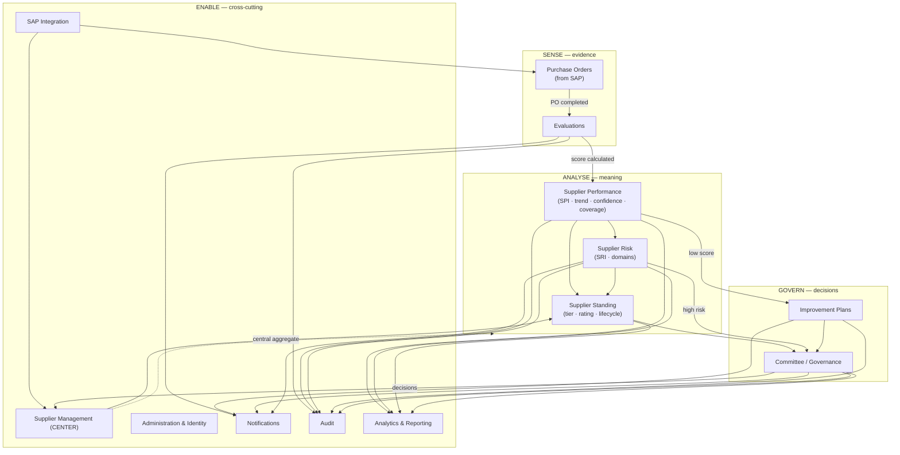

**Why each domain exists:**

| Domain | Reason for existence (business purpose) |
|---|---|
| **Supplier Management** | The *center of gravity*. Procurement manages suppliers, not forms. Owns identity, classification, lifecycle and standing — everything else contributes to it. |
| **Purchase Orders** | The transactional evidence base. A completed PO is the trigger and justification for every evaluation; grounds performance in real spend. |
| **Evaluations** | Converts a completed transaction into structured, justified, weighted performance evidence — the sensor of the whole system. |
| **Performance** | Turns many evaluations into a trustworthy, time-weighted signal (SPI) with confidence and coverage — meaning, not raw scores. |
| **Risk** | Answers "how might this supplier fail?" — complements performance; a great score at extreme risk is not a green light. |
| **Improvement Plans** | Closes the loop: weak performance becomes a managed, verified recovery instead of a noted complaint. |
| **Committee / Governance** | The authority that turns standing into decisions (promote, block, exit) on a cadence — an SPM *program*, not a tool. |
| **Analytics & Reporting** | Makes the portfolio legible for decisions and defensible for audit. |
| **Administration & Identity** | Governs who may do and see what; holds configurable business rules and reference data. |
| **Notifications** | Drives timely human action (assignment, reminders, escalation, governance). |
| **Audit** | Guarantees traceability — the non-negotiable that justifies the platform's existence. |
| **SAP Integration** | Brings authoritative master/transaction data in, isolated so SAP's model never contaminates the domain. |

---

## 2. Bounded Contexts

Strategic DDD design. Each **bounded context** owns a consistent model with one meaning per term inside its boundary, a clear owner, and explicit relationships to neighbors. Contexts are classified as **Core** (competitive value — invest most), **Supporting** (necessary, specific), or **Generic** (commodity capability).

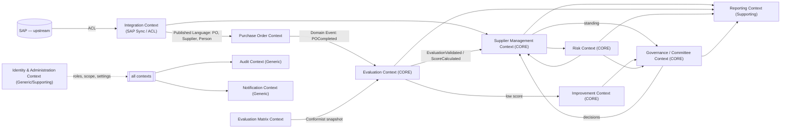

### 2.1 Context catalog

| # | Bounded Context | Type | Responsibility | Boundary (owns) | Owner (business) |
|---|---|---|---|---|---|
| C1 | **Supplier Management** | Core | Supplier identity, classification, lifecycle, standing (composite), contacts, documents, contracts (ref), timeline projection | Supplier aggregate & its meaning of "standing" | Procurement (Category Managers) |
| C2 | **Purchase Order** | Supporting | Represent SAP purchase orders & items, detect completion & eligibility | PurchaseOrder aggregate | Procurement / Integration |
| C3 | **Evaluation** | Core | Capture structured, justified, weighted evaluations against a matrix snapshot | Evaluation aggregate (scores, comments, attachments) | Procurement (Requesters/Managers) |
| C4 | **Evaluation Matrix** | Supporting | Define, weight, version and activate scoring models | EvaluationMatrix aggregate (versions, criteria, sub-criteria, questions) | Procurement (Director-approved) |
| C5 | **Risk** | Core | Assess supplier risk across domains, compute SRI, track risk events & mitigations | SupplierRisk aggregate | Procurement / Risk & Compliance |
| C6 | **Improvement** | Core | Manage corrective-action lifecycle to verified closure | ImprovementPlan aggregate (actions) | Procurement (Managers/Buyers) |
| C7 | **Governance / Committee** | Core | Run supplier review governance, record authoritative decisions, track actions | Committee & CommitteeMeeting aggregates (decisions) | Director of Procurement |
| C8 | **Reporting & Analytics** | Supporting | Read models, dashboards, reports over other contexts | Read projections (no source-of-truth data) | Procurement leadership |
| C9 | **Identity & Administration** | Generic/Supporting | Users, roles, permissions, scope, reference data, configurable rules | User, Role aggregates; reference data; settings | Administrator / IT |
| C10 | **Notification** | Generic | Generate & deliver notifications, hold preferences | Notification aggregate; preferences | Platform |
| C11 | **Audit** | Generic | Immutable record of every significant action | AuditRecord (append-only) | Audit / Compliance |
| C12 | **Integration (SAP / ACL)** | Supporting | Anti-corruption layer mapping SAP → domain; synchronization runs | Sync runs; mapping | IT / Integration |

### 2.2 Context mapping (relationship patterns)

| Relationship | Pattern | Meaning |
|---|---|---|
| SAP → Integration | **Anti-Corruption Layer** | SAP's model is translated; its terms never leak inward. |
| Integration → PO / Supplier | **Published Language** | Clean domain-shaped PO/Supplier/Person facts published inward. |
| Matrix → Evaluation | **Conformist (via immutable snapshot)** | Evaluation conforms to the matrix version it snapshots; later matrix change never affects it. |
| PO → Evaluation | **Customer–Supplier + Domain Events** | `POCompleted` drives evaluation creation. |
| Evaluation → Supplier (Performance) | **Domain Events** | `EvaluationValidated`/`ScoreCalculated` update performance/standing. |
| Supplier ↔ Risk | **Partnership** | Standing and risk co-evolve; risk can cap standing. |
| Supplier/Risk/Improvement → Governance | **Customer–Supplier** | Governance consumes standing to decide; decisions flow back. |
| All → Audit | **Open Host / event sink** | Every context emits events; Audit consumes all. |
| All → Notification | **Event sink** | Events fan out to notifications. |
| Other contexts → Reporting | **Open Host Service (read models)** | Reporting reads projections; owns no source data. |
| Identity → All | **Shared Kernel (identity & scope)** | Common notion of user, role, campus/entity scope. |

---

## 3. Business Entities (catalog)

**DDD classification first (important — corrects common misclassification):** the requested list mixes true Entities, Value Objects and Read Models. Correct classification drives correct transaction boundaries.

| Business object | Classification | Home context | Notes |
|---|---|---|---|
| Supplier | **Aggregate Root** | C1 | The center. |
| Supplier Classification | Value Object (on Supplier) | C1 | Tier + overlays. |
| Supplier Status | Value Object (lifecycle state on Supplier) | C1 | |
| Purchase Order | **Aggregate Root** | C2 | |
| Purchase Order Item | Entity (in PO) | C2 | Local identity within PO. |
| Evaluation | **Aggregate Root** | C3 | |
| Evaluation Score | Entity (in Evaluation) | C3 | One per applicable sub-criterion/question. |
| Evaluation Comment | Value Object / Entity (in Evaluation) | C3 | Justification. |
| Attachment | Entity (in Evaluation / Plan / Supplier) | C3/C6/C1 | Evidence/document. |
| Evaluation Matrix | **Aggregate Root** | C4 | |
| Evaluation Version (Matrix Version) | Entity (in Matrix) | C4 | Immutable once active. |
| Criterion | Entity (in Matrix Version) | C4 | = Dimension. |
| Sub Criterion | Entity (in Criterion) | C4 | |
| Question | Entity (in Sub Criterion) | C4 | Optional finest grain. |
| Improvement Plan | **Aggregate Root** | C6 | |
| Improvement Action | Entity (in Plan) | C6 | |
| Committee | **Aggregate Root** | C7 | Governance body/charter. |
| Committee Meeting | **Aggregate Root** | C7 | Transactional per meeting. |
| Committee Decision | Entity (in Meeting) | C7 | |
| Supplier Risk | **Aggregate Root** | C5 | Risk profile per supplier. |
| Risk Event | Entity (in Supplier Risk) | C5 | |
| Notification | **Aggregate Root** | C10 | |
| Audit Record | Entity (immutable, append-only) | C11 | Write-once. |
| User | **Aggregate Root** | C9 | Identity + role assignments. |
| Role | **Aggregate Root** | C9 | Owns permissions. |
| Department | Reference Entity | C9 | From SAP/HR. |
| Commodity (Category) | Reference Entity | C9/C2 | From SAP. |
| Project | Reference Entity | C2/C1 | PO context; future own context. |
| Contract | Entity (ref on Supplier) | C1 | Future Contract context. |
| Dashboard | Read Model | C8 | Not source data. |
| Report | Read Model | C8 | Not source data. |
| SAP Synchronization (Run) | Entity | C12 | Operational record. |

**Entity template used below:** *Purpose · Description · Business Owner · Lifecycle · Attributes (business) · Relationships · Business Rules · States · Business Events.*

---

### 3.1 Supplier — *Aggregate Root (C1)*
- **Purpose.** Represent an organization UM6P buys from and manage the relationship over its lifecycle.
- **Description.** The central business object; everything contributes to it. Sourced from SAP; enriched with SPM-owned standing, classification, risk linkage and history.
- **Business Owner.** Procurement (relationship owner = a Purchaser/Category Manager).
- **Lifecycle.** Prospect → Approved → Preferred → Strategic → (Under Observation / Critical) → Blocked → Archived (see §8).
- **Attributes.** SAP reference & code; legal name; commodity/category; campus/entity footprint; **classification (tier + overlays)**; **lifecycle status**; **standing** (SPI, SRI, confidence, rating — computed value objects); relationship owner; primary contacts; compliance-document validity; source (SAP/manual); onboarding/qualification status.
- **Relationships.** 1 Supplier → many Purchase Orders; → many Evaluations (via POs); → 1 Supplier Risk profile; → many Improvement Plans; → many Contracts; → many Committee Decisions; → 1 Timeline (projection).
- **Business Rules.** SAP is source of truth for identity (RULE-14); standing is computed, never manually typed; blocked suppliers cannot receive new business; lifecycle transitions follow §8 conditions; risk can cap rating.
- **States.** = lifecycle (§8.1).
- **Business Events.** SupplierCreated, SupplierApproved, SupplierPromoted, SupplierDemoted, SupplierUnderObservation, SupplierMarkedCritical, SupplierBlocked, SupplierArchived, SupplierReactivated, SupplierRatingUpdated.

### 3.2 Supplier Classification — *Value Object (on Supplier)*
- **Purpose.** Express how much management attention & what sourcing posture a supplier warrants.
- **Description.** Composite: tier (Strategic/Preferred/Approved/Transactional) + overlays (Under Observation, High Risk).
- **Owner.** Procurement / Committee (tier changes are committee-governed).
- **Lifecycle.** Changes only via governance decision or rule-driven overlay.
- **Attributes.** Tier; overlays; effective date; deciding authority reference.
- **Relationships.** Part of Supplier aggregate.
- **Rules.** Tier promotion/demotion is a Committee decision; overlays are rule-driven (§9). Immutable snapshot per change (history via events).
- **States.** n/a (VO — replaced, not mutated).
- **Events.** Carried by SupplierPromoted/Demoted.

### 3.3 Supplier Status — *Value Object (lifecycle state on Supplier)*
- **Purpose.** The current lifecycle position.
- **Attributes.** State; since-date; reason (for interventions).
- **Rules.** One current state; transitions per §8.1; every change audited & emits an event.

### 3.4 Purchase Order — *Aggregate Root (C2)*
- **Purpose.** Represent a completed (or in-progress) purchase transaction that grounds an evaluation.
- **Description.** Mirror of a SAP PO; read-only toward SAP. Trigger for evaluation on completion + eligibility.
- **Owner.** Procurement (Purchaser owns; Requester is evaluator).
- **Lifecycle.** Open → In Progress → Completed → Closed; or Cancelled (§8.2).
- **Attributes.** SAP reference & PO number; supplier; requester; purchaser; department; commodity; project (ref); currency & total amount; status; PO date & completion date; eligibility flag (+ reason); evaluated flag.
- **Relationships.** Many POs → 1 Supplier; 1 PO → many PO Items; 1 PO → **at most one** Evaluation (RULE-2); → 1 Requester, 1 Purchaser (Users).
- **Rules.** Read-only from SAP (RULE-14); one evaluation per PO; eligibility engine decides evaluation need; completion detection per configured indicator.
- **States.** §8.2.
- **Events.** POImported, POUpdated, POCompleted, POClosed, POCancelled.

### 3.5 Purchase Order Item — *Entity (in PO)*
- **Purpose.** Line-level detail of a PO.
- **Attributes.** Line number; material/service reference; description; quantity; unit price; line amount.
- **Relationships.** Many Items → 1 PO (owned).
- **Rules.** Read-only from SAP; sum reconciles to PO total (within tolerance).
- **States.** Follows PO. **Events.** Carried by PO events.

### 3.6 Evaluation — *Aggregate Root (C3)*
- **Purpose.** The structured, justified, weighted assessment of a supplier for one completed PO.
- **Description.** Created automatically from `POCompleted`; scored against a matrix version snapshot; immutable once finalized.
- **Owner.** Evaluator (Requester) authors; Manager/Director governs.
- **Lifecycle.** Pending → In Progress → Submitted → Validated / Rejected; Overdue; Reassigned; Reopened; Cancelled (§8.3).
- **Attributes.** Linked PO & Supplier; evaluator; **matrix version snapshot**; due date; status; overall weighted score (computed, on finalize); performance band; submitted/validated timestamps; validator; overall comment; evaluation type (transactional/periodic).
- **Relationships.** 1 Evaluation → 1 PO; → 1 Supplier; → many Evaluation Scores; → many Comments; → many Attachments; → 1 Matrix Version (referenced snapshot).
- **Rules.** Mandatory justification per score (RULE-4); cannot submit incomplete (RULE-5); matrix version fixed at creation (RULE-7); immutable once finalized (RULE-8); one per PO (RULE-2); score computed server-side (authoritative).
- **States.** §8.3.
- **Events.** EvaluationCreated, EvaluationAssigned, EvaluationStarted, EvaluationSubmitted, EvaluationValidated, EvaluationRejected, EvaluationOverdue, EvaluationReassigned, EvaluationReopened, EvaluationCancelled, ScoreCalculated.

### 3.7 Evaluation Score — *Entity (in Evaluation)*
- **Purpose.** The score & justification for one sub-criterion/question.
- **Attributes.** Sub-criterion/question reference; score value (1–5 or N/A — a **Score** value object); justification (Comment); applicable flag.
- **Relationships.** Many Scores → 1 Evaluation (owned); → 1 Sub-criterion/Question (referenced snapshot).
- **Rules.** Justification mandatory when scored (RULE-4); N/A excludes from weighting & re-normalizes (RULE-9); value within matrix scale.
- **States.** Draft (within evaluation) → frozen on finalize. **Events.** Carried by Evaluation events.

### 3.8 Evaluation Comment — *Value Object / Entity (in Evaluation)*
- **Purpose.** Justification or overall note.
- **Attributes.** Text; author; timestamp; scope (per-score or overall).
- **Rules.** Minimum length (config); immutable once finalized.

### 3.9 Attachment — *Entity (in Evaluation / Improvement Plan / Supplier)*
- **Purpose.** Supporting evidence/document.
- **Attributes.** File reference; type; size; uploaded-by; timestamp; linked object.
- **Rules.** Allowed types/sizes; retained with parent; immutable once parent finalized.

### 3.10 Evaluation Matrix — *Aggregate Root (C4)*
- **Purpose.** Define the configurable, weighted, versioned scoring model.
- **Owner.** Procurement Administrator (Director-approved for activation).
- **Lifecycle.** Draft → Active → Archived (per version).
- **Attributes.** Name; category/commodity (or default); scale; current active version; default flag; effective dates.
- **Relationships.** 1 Matrix → many Versions; a Version → many Criteria → Sub-criteria → Questions.
- **Rules.** Weights total 100% at each level before activation (RULE-6); active matrix immutable in place (duplicate to change); one active default per category.
- **States.** §8 (matrix version). **Events.** MatrixCreated, MatrixVersionActivated, MatrixArchived.

### 3.11 Evaluation Version (Matrix Version) — *Entity (in Matrix)*
- **Purpose.** An immutable, versioned definition of the scoring model at a point in time.
- **Attributes.** Version number; status; effective-from; criteria tree; scale.
- **Rules.** Immutable once activated (protects RULE-7); superseding archives prior.

### 3.12 Criterion (Dimension) — *Entity (in Matrix Version)*
- **Purpose.** A performance dimension (e.g., Quality, Delivery).
- **Attributes.** Label; description; weight (%); display order.
- **Rules.** Weight part of 100% sum at dimension level.

### 3.13 Sub Criterion — *Entity (in Criterion)*
- **Purpose.** A specific measurable aspect of a dimension.
- **Attributes.** Label; description; weight (%); allow-N/A; scale (inherited).
- **Rules.** Weights total 100% within the dimension.

### 3.14 Question — *Entity (in Sub Criterion, optional)*
- **Purpose.** Finest-grain prompt guiding the evaluator (optional layer).
- **Attributes.** Text; guidance; optional weight.
- **Rules.** If used, weights consistent within sub-criterion. **[UM6P VALIDATION REQUIRED: whether Question layer is used]**

### 3.15 Improvement Plan — *Aggregate Root (C6)*
- **Purpose.** Manage corrective action from trigger to verified closure.
- **Owner.** Procurement Manager (accountable); Buyer (responsible).
- **Lifecycle.** Open → In Progress → Supplier Response → Verification → Closed (Effective/Ineffective) / Escalated (§8.4).
- **Attributes.** Supplier; trigger (source evaluation/event); root cause; owner; opened/due dates; status; supplier response; verification result; closure decision & reason; target re-evaluation.
- **Relationships.** Many Plans → 1 Supplier; 1 Plan → many Actions; → 1 triggering Evaluation (ref); → re-evaluation (ref).
- **Rules.** Triggered on SPI < threshold (RULE-10) or manual; no self-closure (verification + re-evaluation mandatory); closure updates supplier lifecycle.
- **States.** §8.4. **Events.** ImprovementPlanCreated, ImprovementActionAdded, SupplierResponseRecorded, VerificationCompleted, ImprovementPlanClosed, ImprovementPlanEscalated.

### 3.16 Improvement Action — *Entity (in Plan)*
- **Purpose.** A concrete corrective task.
- **Attributes.** Title; owner (UM6P user or Supplier); due date; status; evidence.
- **Rules.** Due ≥ today; evidence required to mark done where configured.

### 3.17 Committee — *Aggregate Root (C7)*
- **Purpose.** The governance body/charter that reviews suppliers and decides.
- **Owner.** Director of Procurement (chair).
- **Lifecycle.** Standing body (configured), not transactional.
- **Attributes.** Charter; membership; cadence; scope.
- **Relationships.** 1 Committee → many Meetings.
- **Rules.** Cadence quarterly (+ ad-hoc); chair required.
- **Events.** CommitteeConfigured.

### 3.18 Committee Meeting — *Aggregate Root (C7)*
- **Purpose.** A single governance session with its agenda, decisions and actions (transaction boundary).
- **Lifecycle.** Scheduled → In Progress → Closed (§8.5).
- **Attributes.** Title; date; participants; agenda items; status; minutes; action register.
- **Relationships.** Many Meetings → 1 Committee; 1 Meeting → many Decisions; → many Action items.
- **Rules.** Decisions require rationale; closing locks immutable minutes; open items surfaced before close.
- **States.** §8.5. **Events.** CommitteeScheduled, AgendaPublished, CommitteeDecisionRecorded, CommitteeActionAssigned, CommitteeMeetingClosed.

### 3.19 Committee Decision — *Entity (in Meeting)*
- **Purpose.** An authoritative governance decision about a supplier.
- **Attributes.** Supplier; decision type (promote/demote/observe/critical/block/exit/plan/dual-source/contest); rationale; decided-by; timestamp.
- **Rules.** Rationale mandatory; applies tier/lifecycle change; emits supplier event + audit + timeline event; authoritative source of tier changes.

### 3.20 Supplier Risk — *Aggregate Root (C5)*
- **Purpose.** The risk profile of a supplier across domains; produces SRI.
- **Owner.** Procurement / Risk & Compliance.
- **Lifecycle.** Continuous; re-scored on signals.
- **Attributes.** Per-domain assessments (likelihood × impact, inherent/residual); SRI; heat level; single-source & critical flags; early-warning indicators; review dates.
- **Relationships.** 1 Supplier → 1 Risk profile; 1 profile → many Risk Events; → mitigations.
- **Rules.** Residual ≤ inherent; high SRI caps rating & can force Under Observation; performance decline auto-raises matching domain.
- **States.** Reflected by risk level (Low/Medium/High/Critical). **Events.** RiskAssessed, RiskIncreased, RiskDecreased, RiskMitigated, SingleSourceFlagged, CriticalSupplierFlagged.

### 3.21 Risk Event — *Entity (in Supplier Risk)*
- **Purpose.** A discrete occurrence affecting risk (incident, breach, external signal, performance-linked signal).
- **Attributes.** Domain; source (performance/event/external); severity; date; description; linked object; resulting risk change.
- **Rules.** Every event recorded on timeline; drives re-scoring.

### 3.22 Notification — *Aggregate Root (C10)*
- **Purpose.** Inform a user of a business event needing attention/awareness.
- **Owner.** Recipient (personal).
- **Lifecycle.** Queued → Sent → Read; or Failed (§8.6).
- **Attributes.** Recipient; type; channel(s); title; body; linked entity; status; timestamps.
- **Relationships.** Many Notifications → 1 User; generated by domain events.
- **Rules.** Strictly per-user; respects preferences; in-app + email (Teams future); reminders/escalations per cadence.
- **States.** §8.6. **Events.** NotificationQueued, NotificationSent, NotificationFailed, NotificationRead.

### 3.23 Audit Record — *Entity (immutable, append-only, C11)*
- **Purpose.** Immutable proof of a significant action.
- **Owner.** Audit / Compliance.
- **Lifecycle.** Write-once (created, never changed/deleted).
- **Attributes.** Actor (or System); action; entity type & id; before/after; reason (where applicable); IP; timestamp.
- **Relationships.** References any entity; belongs to no aggregate (a log).
- **Rules.** Append-only; never edited/deleted; every significant action produces one; viewing audit is itself audited.
- **States.** n/a. **Events.** AuditRecorded.

### 3.24 User — *Aggregate Root (C9)*
- **Purpose.** A person who authenticates and acts.
- **Owner.** Administrator / IT.
- **Lifecycle.** Provisioned (JIT from Entra) → Active → Inactive.
- **Attributes.** Identity reference; email; display name; job title; department; role assignments (with campus/department scope); active flag; last login.
- **Relationships.** Many Users → many Roles (scoped); a User may be Requester/Purchaser on POs; evaluator on Evaluations.
- **Rules.** Identity from Entra (JIT); ≥1 role when active; last admin cannot be removed; default role Evaluator.
- **States.** Active / Inactive. **Events.** UserProvisioned, UserRoleAssigned, UserDeactivated.

### 3.25 Role — *Aggregate Root (C9)*
- **Purpose.** A named bundle of permissions.
- **Attributes.** Code; name; permissions; system-flag.
- **Rules.** System roles locked; permission changes audited; UI + RLS honor them.
- **Events.** RoleCreated, RolePermissionsChanged.

### 3.26 Department — *Reference Entity (C9)*
- **Purpose.** Organizational unit for scoping & reporting.
- **Attributes.** Code; name; campus/entity; (source SAP/HR).
- **Rules.** Used for access scope and department satisfaction metrics.

### 3.27 Commodity (Category) — *Reference Entity (C9/C2)*
- **Purpose.** Classify what is purchased; drives matrix selection & category analytics.
- **Attributes.** Code; name; (optional Kraljic quadrant).
- **Rules.** May carry its own matrix (FR-19).

### 3.28 Project — *Reference Entity (C2/C1)*
- **Purpose.** The initiative a PO/requester belongs to (research project, works, etc.).
- **Attributes.** Code; name; owner (requester); department.
- **Rules.** Referenced by POs; future dedicated context. **[UM6P VALIDATION REQUIRED: project source & granularity]**

### 3.29 Contract — *Entity (ref on Supplier, C1)*
- **Purpose.** A formal agreement linking supplier commitments to performance.
- **Attributes.** Reference; type; validity period (Date Range); renewal date; linked supplier.
- **Rules.** Performance informs renewal decisions; deepened in future Contract Management context.
- **Events.** ContractLinked, ContractRenewalDue (future).

### 3.30 Supplier Risk (see 3.20), Risk Event (see 3.21).

### 3.31 Dashboard — *Read Model (C8)*
- **Purpose.** A role-tailored, interactive view over read projections.
- **Attributes.** Audience; widgets; filters; scope.
- **Rules.** Owns no source data; scope-aware; shows confidence/coverage with scores.

### 3.32 Report — *Read Model (C8)*
- **Purpose.** A parameterized, exportable document for decisions & audit.
- **Attributes.** Type; parameters; scope; format; generated-by/timestamp.
- **Rules.** Read model over finalized data; stamped for defensibility; reconciles to source.

### 3.33 SAP Synchronization (Run) — *Entity (C12)*
- **Purpose.** An operational record of a data synchronization run.
- **Owner.** IT / Integration.
- **Lifecycle.** Running → Success / Partial / Failed (§8.7).
- **Attributes.** Trigger; entity types; watermark; counts (processed/created/updated/failed); errors; per-item outcomes; timestamps.
- **Relationships.** Produces/updates Suppliers, POs, Users (via ACL); emits completion events.
- **Rules.** Idempotent, delta-based; read-only toward SAP; ordering suppliers→personnel→POs; no duplicate evaluations.
- **States.** §8.7. **Events.** SapSyncStarted, SapSyncCompleted, SapSyncFailed, POImported, POCompleted (downstream).

---

## 4. Relationship Model

Business-language relationship map (cardinality · ownership). "Owns" = part of the same aggregate (deleted/immutable together); "References" = association across aggregates by identity.

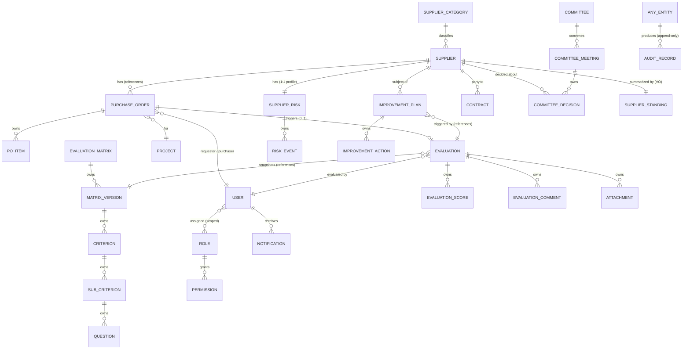

**Canonical cardinalities (the ones teams must not get wrong):**

| Relationship | Cardinality | Ownership |
|---|---|---|
| Supplier → Purchase Orders | 1 → many | reference |
| Purchase Order → Evaluation | 1 → **0..1** | trigger (reference); **exactly one at most** (RULE-2) |
| Evaluation → Evaluation Scores | 1 → many | **owned** |
| Evaluation → Matrix Version | many → 1 | **snapshot reference (immutable)** |
| Matrix → Versions → Criteria → Sub-criteria → Questions | 1 → many (nested) | **owned** |
| Supplier → Supplier Risk | 1 → 1 | separate aggregate, referenced |
| Supplier Risk → Risk Events | 1 → many | **owned** |
| Supplier → Improvement Plans | 1 → many | reference |
| Improvement Plan → Actions | 1 → many | **owned** |
| Committee → Meetings → Decisions | 1 → many → many | Meeting owns Decisions |
| Supplier → Contracts | 1 → many | reference |
| User → Roles | many ↔ many (scoped) | reference |
| Any entity → Audit Records | 1 → many | append-only log (no ownership) |

---

## 5. Aggregate Roots

An **aggregate** is a consistency boundary: one root guards invariants and is the only entry point; everything inside commits in one transaction; references *across* aggregates are by identity and reconciled by **domain events** (eventual consistency), never by reaching into another aggregate's internals.

| Aggregate Root | Owned entities / VOs | Invariants (always true) | Transaction boundary |
|---|---|---|---|
| **Supplier** | Classification (VO), Status (VO), Standing (VO), Contacts, Documents/Attachments, Contract refs | Standing is computed, never typed; blocked ⇒ no new business; lifecycle transitions valid; one current tier & state | A supplier + its classification/status change atomically; POs/evals updated via events |
| **Purchase Order** | PO Items | Item amounts reconcile to total; read-only from SAP; ≤1 evaluation | PO + items imported/updated atomically |
| **Evaluation** | Evaluation Scores, Comments, Attachments | Every scored sub-criterion justified; complete before submit; matrix version fixed; immutable once finalized; score reproducible from scores | Fill/submit/finalize commit the whole evaluation atomically |
| **Evaluation Matrix** | Versions → Criteria → Sub-criteria → Questions (+ weights) | Weights = 100% at each level to activate; active version immutable; one active default per category | Editing a draft version is atomic; activation supersedes prior atomically |
| **Improvement Plan** | Improvement Actions, Attachments | No effective closure without passed verification + linked re-evaluation; linked to a trigger | Plan + actions + stage transition atomic |
| **Committee Meeting** | Committee Decisions, agenda items, action items | Decisions require rationale; closed ⇒ minutes immutable; decisions apply supplier changes via events | A meeting's decisions/actions commit atomically; supplier updates via events |
| **Supplier Risk** | Risk Events, domain assessments | Residual ≤ inherent; SRI derived from domains; high SRI caps rating (enforced via event to Supplier) | Risk re-scoring atomic per profile |
| **Notification** | — | Belongs to exactly one recipient | Create/deliver/read atomic |
| **User** | Role assignments (scoped) | ≥1 role when active; last admin preserved | Assignment change atomic |
| **Role** | Permission grants | System roles locked | Permission change atomic |

**Cross-aggregate rule (non-negotiable):** e.g., finalizing an **Evaluation** must NOT directly mutate the **Supplier**. It emits `EvaluationValidated`/`ScoreCalculated`; the Supplier aggregate reacts (updates Performance/Standing) in its own transaction. This keeps boundaries clean and makes the system extensible and auditable (every change = an event).

---

## 6. Value Objects

**Value Objects** have no identity, are **immutable** (replaced, never mutated), are compared by value, and encapsulate meaning + rules. Immutability matters because these represent *facts at a moment* — changing one must create a new value and (usually) a domain event, preserving history.

| Value Object | Meaning | Composition | Immutability rationale |
|---|---|---|---|
| **Money** | An amount in a currency | amount + currency | A past PO amount must never silently change. |
| **Percentage** | A ratio 0–100 | value + unit | Weights/coverage are fixed facts per context. |
| **Weight** | A criterion/sub-criterion weight | percentage | Belongs to an immutable matrix version. |
| **Score** | A single sub-criterion rating | value (1–5 or N/A) + scale | A given evaluation's score is frozen once finalized. |
| **Date Range** | A period | start + end | Contract validity / reporting period as a fact. |
| **Address** | A location | lines, city, country | Point-in-time supplier fact. |
| **Performance Index (SPI)** | Time-weighted overall performance | value 0–100 + band + as-of | A recomputed *fact*; historical SPIs are snapshots, never edited. |
| **Performance Band** | Interpretation of SPI | Excellent/Good/Acceptable/Poor/Critical | Derived from thresholds; consistent everywhere. |
| **Risk Score (SRI)** | Aggregated risk | value 0–100 + level + as-of | Snapshot fact per assessment. |
| **Confidence Level** | Trust in SPI | Low/Med/High + drivers | Derived from coverage/volume/recency. |
| **Coverage** | Evaluated ÷ eligible | percentage | Fact per period/scope. |
| **Supplier Rating** | Communicated verdict | letter/band + as-of | Derived from SPI+trend+risk+confidence. |
| **Supplier Standing** | Composite executive summary | tier + SPI + SRI + confidence + lifecycle | The 360° header fact; recomputed, snapshotted. |
| **Evaluation Result** | Finalized outcome of an evaluation | overall score + band + finalized-at | Immutable by definition (RULE-8). |

---

## 7. Domain Events

Events are **immutable business facts, named in the past tense**. Every significant business action emits one (Principle P8). Consumers react asynchronously; Audit and Notification consume broadly.

| Event | Trigger | Source context | Primary consumers | Business impact |
|---|---|---|---|---|
| **SupplierCreated** | Supplier appears from SAP/manual | C1/C12 | Audit, Reporting | Supplier enters as Prospect/Approved |
| **SupplierApproved** | Qualification/compliance gate passed | C1 | Notification, Audit | Usable for business |
| **SupplierPromoted** | Committee decision | C7→C1 | Supplier, Reporting, Audit, Timeline | Tier ↑ (Preferred/Strategic) |
| **SupplierDemoted** | Committee decision | C7→C1 | same | Tier ↓ |
| **SupplierBlocked** | Governance decision / severe breach | C7→C1 | Sourcing, Notification, Audit, Timeline | Excluded from new business |
| **SupplierArchived** | Dormancy/deactivation | C1 | Reporting, Audit | Retained, inactive |
| **PurchaseOrderImported** | Sync creates/updates PO | C12→C2 | Evaluation (watch), Reporting, Audit | Transaction available |
| **POCompleted** | PO reaches completion + eligibility | C2 | **Evaluation**, Supplier, Notification, Audit | **Triggers evaluation creation** |
| **EvaluationCreated** | Eligible PO completed | C3 | Notification, Timeline, Audit | Pending evaluation exists |
| **EvaluationAssigned** | Evaluator resolved | C3 | Notification (evaluator), Audit | Accountability set |
| **EvaluationSubmitted** | Evaluator submits complete evaluation | C3 | Governance (validator), Notification, Audit | Awaits validation/finalization |
| **EvaluationValidated** | Approved / auto-finalized | C3 | **Performance**, Supplier, Timeline, Notification, Audit | Becomes official evidence |
| **EvaluationRejected** | Validator returns | C3 | Notification (evaluator), Audit | Back to In Progress |
| **ScoreCalculated** | On finalize | C3 | Supplier (Performance), Reporting, Audit | Weighted score committed |
| **SupplierRatingUpdated** | Performance/standing recomputed | C1 | Reporting, Governance, Timeline, Audit | Standing changes |
| **RiskIncreased** | Signal raises a risk domain | C5 | Supplier (cap), Governance, Notification, Timeline, Audit | Watch-list / mitigation |
| **RiskMitigated** | Mitigation reduces residual | C5 | Supplier, Reporting, Audit | Exposure reduced |
| **SingleSourceFlagged** | Sole-source detected | C5 | Governance, Reporting, Audit | Continuity risk raised |
| **ImprovementPlanCreated** | Low SPI / manual | C6 | Notification, Supplier (Under Observation), Timeline, Audit | Recovery begins |
| **ImprovementPlanClosed** | Verified effective/ineffective | C6 | Supplier (lifecycle), Notification, Reporting, Audit | Recovery outcome |
| **CommitteeScheduled** | Meeting planned | C7 | Notification (participants), Audit | Governance cadence |
| **CommitteeDecisionRecorded** | Decision made | C7 | Supplier, Timeline, Notification, Audit | Authoritative change |
| **NotificationSent** | Delivery attempt succeeds | C10 | Audit | User informed |
| **SapSyncCompleted** | Sync run ends | C12 | Reporting, Audit, (POCompleted downstream) | Data current |
| **AuditRecorded** | Any significant action | C11 | (terminal) | Traceability preserved |

**Event choreography (illustrative — the spine):**
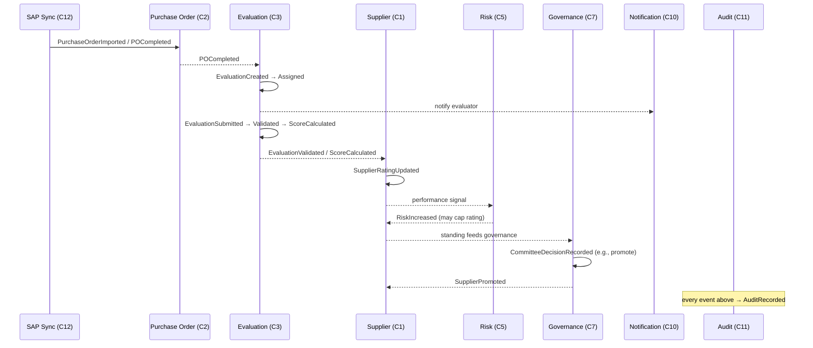

---

## 8. State Machines

### 8.1 Supplier lifecycle
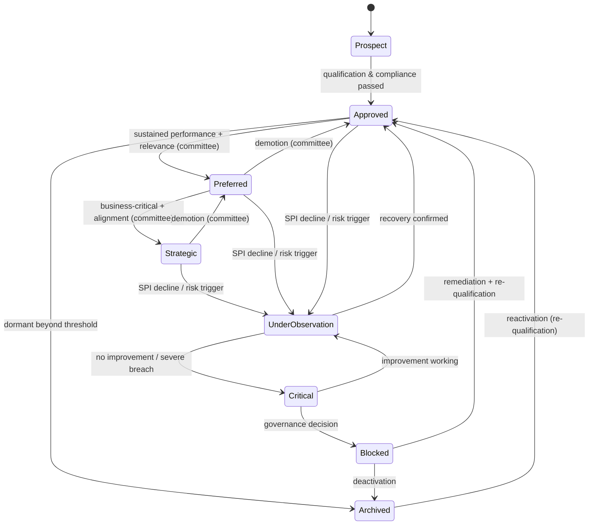

### 8.2 Purchase Order
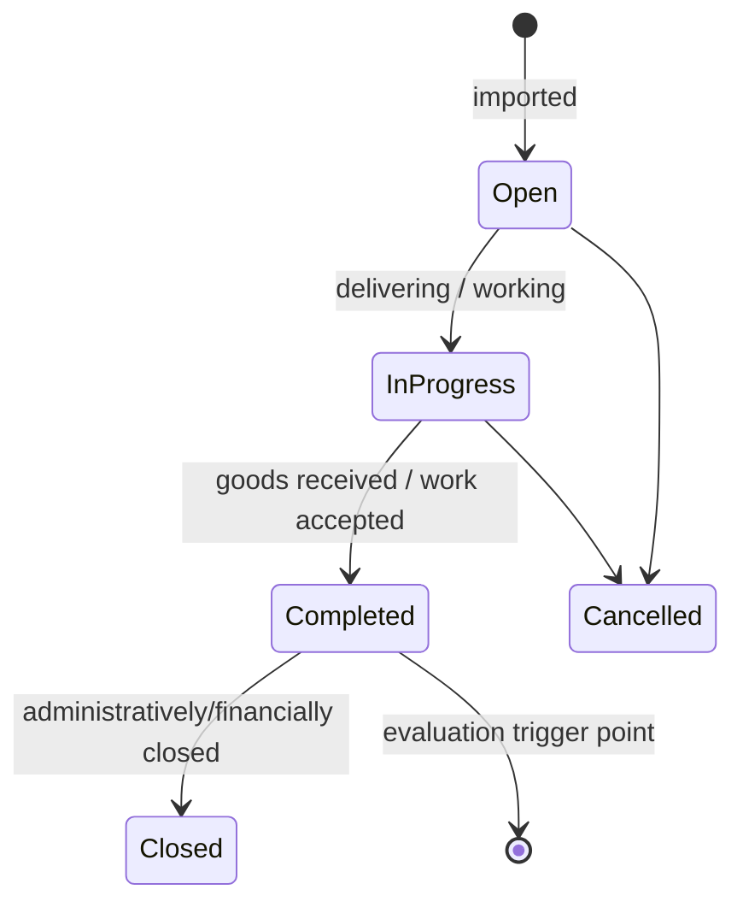

### 8.3 Evaluation
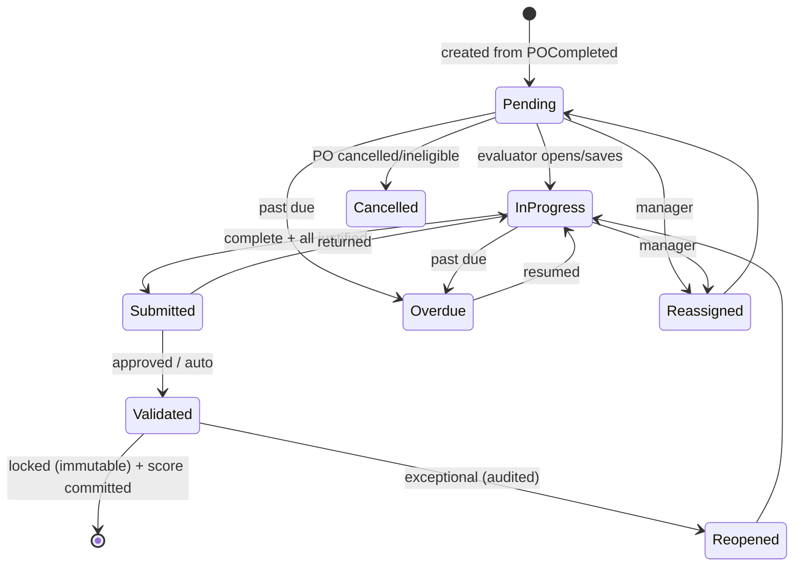

### 8.4 Improvement Plan
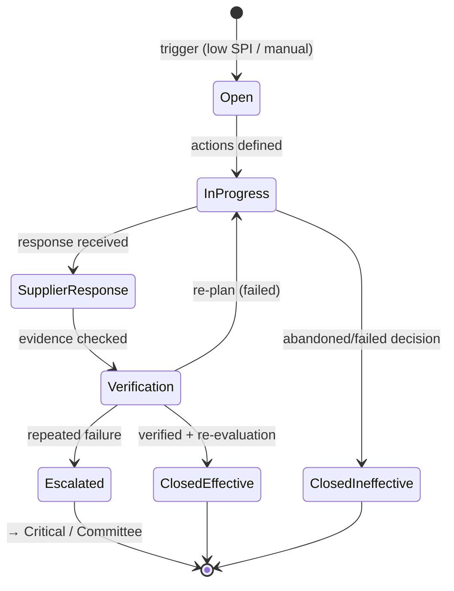

### 8.5 Committee Meeting
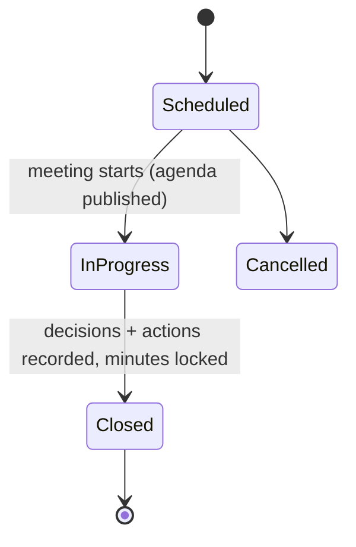

### 8.6 Notification
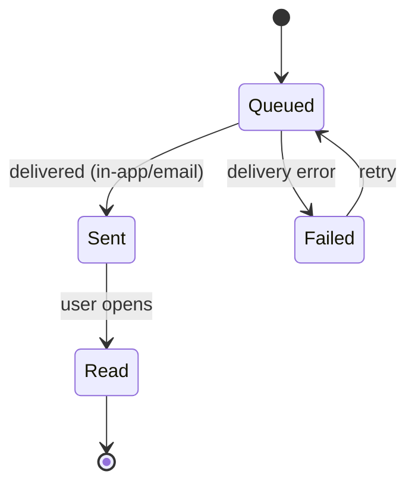

### 8.7 SAP Synchronization
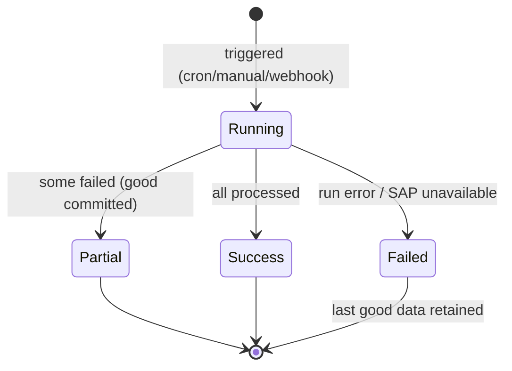

---

## 9. Business Rules Engine

Rules are grouped, each with a **precedence** so conflicts resolve deterministically. Higher precedence wins.

**Global precedence (highest → lowest):** 1) Compliance & Blocking guardrails → 2) Validation & Integrity → 3) Assignment → 4) Scoring → 5) Risk → 6) Promotion/Lifecycle → 7) Committee → 8) Notification. *Rationale: safety/integrity before optimization; a blocked/failed-compliance supplier cannot be promoted regardless of score.*

| Category | Representative rules | Priority |
|---|---|---|
| **Validation Rules** | Every score justified (RULE-4); no submit unless complete (RULE-5); weights = 100% to activate (RULE-6); residual ≤ inherent risk; decision needs rationale. | High (integrity) |
| **Assignment Rules** | Evaluator = PO requester (RULE-3); unresolved requester ⇒ hold & resolve on login; reassignment needs reason; SoD: author ≠ validator (if enabled). | High |
| **Scoring Rules** | Weighted SPI from sub-criteria/criteria weights (FR-34); N/A re-normalizes (RULE-9); matrix version fixed at creation (RULE-7); time-weighting favors recency; confidence from coverage/volume/recency; compliance/HSE guardrail may cap band. | High |
| **Risk Rules** | Performance decline auto-raises matching risk domain; SRI aggregates weighted domains; high SRI caps rating & can force Under Observation; single-source/critical flagged explicitly. | Medium-High |
| **Promotion Rules** | Preferred requires sustained SPI ≥ Good + relevance + committee; Strategic requires criticality + alignment + committee; demotion mirrors; **blocked/failed-compliance cannot be promoted**. | Medium |
| **Blocking Rules** | Repeated ineffective improvement, severe breach, or unacceptable risk ⇒ eligible for block; block excludes from sourcing; block is a governance decision, audited with reason. | **Overrides promotion** |
| **Committee Rules** | Cadence quarterly (+ ad-hoc); decisions authoritative for tier/lifecycle; rationale mandatory; actions tracked to closure; minutes immutable once closed. | Medium |
| **Notification Rules** | Assignment immediately; reminders per cadence; overdue escalation; validation & decision notices; improvement/committee/risk notices; respects per-user preferences. | Low (non-blocking) |

**Configurability (per BA §24 / Settings):** thresholds, weights, due windows, cadence, eligibility, validation on/off, bands, improvement threshold, SoD — all changeable without code (NFR-10). The *rules* are fixed; their *parameters* are configurable.

---

## 10. Canonical Business Flows

At least 15 enterprise flows. Each is implementation-independent; steps map to events (§7) and states (§8).

**Flow 1 — PO to Supplier Promotion (the spine).**
POCompleted → EvaluationCreated → EvaluationAssigned → EvaluationSubmitted → (Validated) → ScoreCalculated → Supplier Performance Updated → SupplierRatingUpdated → Timeline Updated → Dashboard Updated → Risk Updated → Committee Review → SupplierPromoted.

**Flow 2 — Automatic evaluation generation.**
Sync detects PO completion → eligibility check → select active matrix by commodity → create Evaluation (Pending, matrix snapshot, due date) → resolve evaluator → assign → notify. *(No eligible/active matrix ⇒ no evaluation; log/alert.)*

**Flow 3 — Evaluation completion & scoring.**
Evaluator opens → scores each sub-criterion + justification → autosave draft → submit (completeness enforced) → (validation if on) → finalize → server computes weighted SPI → lock (immutable) → emit ScoreCalculated → supplier history & standing updated → timeline/dashboards refresh.

**Flow 4 — Validation & return.**
Submitted → validator reviews → Approve ⇒ finalize; Return (reason required) ⇒ back to In Progress → evaluator revises → resubmit. All audited & notified.

**Flow 5 — Overdue escalation.**
Due date passes → Evaluation → Overdue → reminder to evaluator → sustained overdue → escalate to manager → manager reminds/reassigns/extends. All on timeline & audit.

**Flow 6 — Reassignment.**
Manager selects new evaluator + reason → EvaluationReassigned → new evaluator notified → old informed → audited.

**Flow 7 — Low performance to verified recovery.**
ScoreCalculated below threshold → ImprovementPlanCreated → supplier → Under Observation → actions defined → supplier response → verification → (pass + re-evaluation) → ClosedEffective → supplier restored; (fail repeatedly) → Escalated → Critical/Committee.

**Flow 8 — Risk escalation from performance.**
Declining dimension scores → RiskIncreased in matching domain → SRI recomputed → high SRI caps rating & may force Under Observation → mitigation planned → RiskMitigated → residual reduced.

**Flow 9 — Risk event (incident/external).**
Risk Event recorded (incident/breach/external signal) → risk re-scored → timeline updated → if High/Critical, notify + add to committee agenda.

**Flow 10 — Committee governance cycle.**
CommitteeScheduled → agenda auto-seeded (strategic + watch-list + high-risk) + added items → review dashboards → CommitteeDecisionRecorded (promote/demote/block/plan) → actions assigned → meeting closed (minutes locked) → decisions apply to suppliers → actions tracked to closure across quarter.

**Flow 11 — Supplier promotion/demotion.**
Standing evidence → committee reviews → decision → SupplierPromoted/Demoted → classification VO replaced (effective date) → timeline + audit → sourcing posture changes.

**Flow 12 — Supplier blocking & exit.**
Repeated ineffective plan / breach / unacceptable risk → committee decision → SupplierBlocked → excluded from sourcing → existing commitments managed to closure → later Archived (or remediation → re-qualification → Approved).

**Flow 13 — Matrix creation & versioning.**
Create/duplicate matrix → define dimensions/sub-criteria/weights → validate 100% each level → activate (effective date) → new version Active, prior Archived → existing evaluations keep their snapshot.

**Flow 14 — SAP delta synchronization.**
Scheduled/manual trigger → fetch changes since watermark (via ACL) → map to domain → upsert suppliers → personnel → POs (idempotent) → detect completed POs → emit POCompleted → record run (counts/watermark) → reconcile → alert on Partial/Failed.

**Flow 15 — Supplier onboarding.**
SupplierCreated (Prospect) → qualification & compliance documents validated → SupplierApproved → available for POs & evaluation.

**Flow 16 — Confidence re-evaluation.**
New finalized evaluation → coverage & volume increase → Confidence recomputed (Low→Medium→High) → standing reliability updated → dashboards reflect confidence beside SPI (guards against acting on thin data).

**Flow 17 — Notification & delivery.**
Domain event fires → notification generated per rules & recipient preferences → NotificationQueued → delivered (in-app + email) → NotificationSent → user reads → NotificationRead → bell decrements. Failures retried.

**Flow 18 — Audit capture (cross-cutting).**
Any significant action (create/assign/score/validate/reassign/reopen/block/decision/config change/sync) → AuditRecorded (actor, before/after, reason, timestamp) → available to Audit Logs & reports; viewing audit is itself audited.

**Flow 19 — Committee pack & reporting.**
Before meeting → generate committee pack (portfolio dashboard + watch-list + risk + action register) → during meeting decisions recorded → after → pack + minutes exported/distributed (internal).

**Flow 20 — Dormancy to archive.**
No PO activity beyond dormancy threshold → flag dormant → review → SupplierArchived (retained for history) → reactivation path via re-qualification.

---

## 11. Information Lifecycle

How business information is governed from birth to retirement. Guiding rule: **historical business records never change; correction is additive and audited.**

| Stage | Policy |
|---|---|
| **Creation** | Master data (suppliers, POs, users) created via SAP/Entra (source of truth); business records (evaluations, plans, decisions) created by domain actions/events. Each creation emits an event + audit record. |
| **Update** | Only mutable, in-progress records update (draft evaluations, open plans, active-draft matrices, risk assessments). Finalized/validated records are **immutable**. Master data updates only via re-sync (never edited in SPM). |
| **Validation** | Data validated at creation/update against business rules (§9); finalization is a one-way gate that locks the record. |
| **Archive** | Superseded matrix versions → Archived (retained); dormant suppliers → Archived; closed meetings/plans retained. Archive = hidden from active workflows, kept for history/audit. |
| **Retention** | Evaluations, decisions, audit records retained per UM6P policy (**[UM6P VALIDATION REQUIRED]** — default: retain for the supplier relationship lifetime + legal minimum). |
| **Deletion** | **No hard deletion of business records.** Soft-delete/archival only. Personal-data deletion (if legally required) handled by controlled anonymization, audited. |
| **Audit** | Every creation/update/finalization/archival/decision produces an immutable audit record; the audit trail itself is never deleted or edited. |

**Immutability tiers:**
- **Immutable-by-principle:** finalized evaluations, scores, committee decisions, audit records, matrix versions once activated.
- **Mutable-until-finalized:** draft evaluations, open improvement plans, active-draft matrices, risk assessments, standing (recomputed but snapshotted).
- **Externally-owned (read-only inbound):** suppliers, POs, requesters, purchasers, departments, commodities (SAP/HR).

---

## 12. Business Glossary

| Term | Definition |
|---|---|
| **Supplier** | An organization UM6P purchases from; the central aggregate. |
| **Prospect** | A supplier identified but not yet qualified for business. |
| **Approved Supplier** | A compliant, usable supplier — the working base. |
| **Preferred Supplier** | A proven performer prioritized within its category (committee-endorsed). |
| **Strategic Supplier** | A business-critical, jointly-managed partner (committee decision). |
| **Transactional/Occasional Supplier** | Low-spend, infrequent supplier managed with minimal effort. |
| **Under Observation** | Overlay state: performance/risk concern; increased scrutiny. |
| **Critical (supplier state)** | Severe unresolved failure; containment/exit posture. |
| **Blocked** | Barred from new business by governance decision. |
| **Archived** | Inactive supplier retained for history/audit. |
| **Supplier Standing** | Composite executive summary of a supplier: tier + SPI + SRI + confidence + lifecycle. |
| **SPI — Supplier Performance Index** | Time-weighted weighted-score (0–100) with a performance band. |
| **SRI — Supplier Risk Index** | Aggregated multi-domain risk score (0–100; higher = worse) with a heat level. |
| **Confidence** | Trust level in the SPI, derived from coverage, volume, recency and evaluator diversity (Low/Medium/High). |
| **Coverage** | Share of eligible POs/spend that have been evaluated. |
| **Performance Band** | Interpretation of SPI: Excellent/Good/Acceptable/Poor/Critical. |
| **Supplier Rating** | The communicated verdict (letter/band) derived from SPI + trend + risk + confidence. |
| **Evaluation** | A structured, justified, weighted assessment of a supplier for one completed PO. |
| **Transactional Evaluation** | Event-based evaluation of a single completed PO. |
| **Periodic Evaluation** | Holistic relationship review (for Preferred/Strategic) on a cadence. |
| **Evaluation Matrix** | The configurable, weighted, versioned scoring model. |
| **Matrix Version** | An immutable snapshot of the matrix used to score evaluations at a point in time. |
| **Criterion / Dimension** | A performance dimension (e.g., Quality, Delivery) with a weight. |
| **Sub-criterion** | A specific measurable aspect of a dimension, weighted. |
| **Question** | Optional finest-grain prompt within a sub-criterion. |
| **Justification** | The mandatory comment explaining a score. |
| **Improvement Plan** | A managed corrective-action process from trigger to verified closure. |
| **Improvement Action** | A concrete corrective task with owner and due date. |
| **Committee** | The Supplier Review governance body (Director-chaired). |
| **Committee Meeting** | A single governance session with agenda, decisions and actions. |
| **Committee Decision** | An authoritative governance decision about a supplier (with rationale). |
| **Risk (supplier)** | The likelihood and impact of a supplier failing UM6P across domains. |
| **Risk Event** | A discrete occurrence affecting supplier risk. |
| **Category / Commodity** | The classification of what is purchased; drives matrix selection & analytics. |
| **Department** | Organizational unit; scope & reporting dimension. |
| **Requester (Chef de Projet / Demandeur)** | The internal person who requested the purchase and evaluates the supplier. |
| **Purchaser (Acheteur)** | The buyer who owns the PO and supplier relationship in Procurement. |
| **Purchase Order (PO)** | A purchase transaction from SAP; trigger and justification for evaluation. |
| **PO Item** | A line of a PO. |
| **Project** | The initiative a PO/requester belongs to. |
| **Contract** | A formal agreement with a supplier (future-deepened). |
| **Campus / Entity** | UM6P site/legal entity; scoping dimension for multi-campus/multi-entity. |
| **Aggregate Root** | The single entry point guarding a consistency boundary. |
| **Domain Event** | An immutable, past-tense business fact emitted by an action. |
| **Anti-Corruption Layer (ACL)** | The boundary translating SAP's model into the domain model. |
| **Timeline** | The chronological, immutable projection of a supplier's events. |
| **Audit Record** | An immutable, append-only proof of a significant action. |

---

## 13. Domain Principles

The architectural principles every team must uphold. Each states *what* and *why*.

| # | Principle | Why it exists |
|---|---|---|
| **P1** | **Supplier is the central aggregate.** | Procurement manages suppliers, not forms; every other object contributes to the supplier's standing. Getting this center right keeps the whole model coherent. |
| **P2** | **Evaluations are immutable once finalized.** | Trust and defensibility: a score used in a decision must never silently change. Corrections are additive, not destructive. |
| **P3** | **Historical data never changes.** | Supplier history is institutional memory and audit evidence; changing the past destroys both. |
| **P4** | **Every score must be explainable.** | Mandatory justification + reproducible weighted computation from stored scores means any figure can be traced to its evidence — no black boxes. |
| **P5** | **Everything is auditable.** | Traceability is the core reason the platform exists; every significant action leaves an immutable record. |
| **P6** | **SAP is the source of truth for master & transactional data.** | Avoids dual-master conflicts; SPM adds *judgement*, SAP owns *facts*. SPM is read-only toward SAP. |
| **P7** | **No duplicated business logic.** | Each rule (scoring, assignment, weighting, banding) lives in exactly one context; duplication breeds drift and contradictory results. |
| **P8** | **Every business action emits a domain event.** | Events are the connective tissue: they enable decoupling, audit, notifications, timeline, and future extensibility without touching existing logic. |
| **P9** | **Matrix versions are immutable; evaluations snapshot their version.** | Lets the scoring model evolve without ever rewriting history (P3) or making old scores unexplainable (P4). |
| **P10** | **Aggregates change only through their root; cross-aggregate consistency is eventual via events.** | Preserves clean boundaries, testability, and the ability to extract/scale contexts later. |
| **P11** | **Standing and rating are computed, never manually typed.** | Objectivity and consistency; humans decide *tier* (governance), the system derives *performance* (evidence). |
| **P12** | **Risk can cap performance.** | A great score at extreme risk is not a green light; safety guardrails outrank optimization (rule precedence §9). |
| **P13** | **Governance decisions are authoritative and reasoned.** | Tier/lifecycle changes are human decisions with recorded rationale — the system informs, the committee decides. |
| **P14** | **The model is implementation-independent.** | Business meaning must outlive any database, framework, or even ERP; this document is expressed in business terms so it survives technology change. |
| **P15** | **Multi-campus / multi-entity is a first-class scoping dimension.** | UM6P will grow; scope is designed in from the start, activated later. |

---

## 14. Future Extensibility

The model is designed so each future capability is an **additive seam**, not a rewrite. Because every action emits events (P8), aggregates are decoupled (P10), and SAP is isolated by an ACL (P6), extensions attach without disturbing the core.

| Future capability | How the model supports it (the seam) |
|---|---|
| **Supplier Portal** | Supplier becomes an external actor with scoped read access to its own Standing, Evaluations (results), and Improvement Plans; a new *Supplier Response* becomes a first-class object on plans. Events already exist (ImprovementPlanCreated, RatingUpdated) to feed the portal; no core change. |
| **Contract Management** | Contract graduates from a referenced entity to its own **bounded context**; performance events (RatingUpdated) inform renewal decisions; a new `ContractRenewalDue` event links performance to commercial action. |
| **AI (summaries, insight)** | AI consumes read models & events (justifications, trends) to produce evaluation summaries, theme/sentiment detection and bias flags — as a **consumer** of existing events/read models; no source-of-truth change. |
| **Predictive supplier risk** | A new Risk Event *source* ("predictive") feeds the existing SupplierRisk aggregate; SRI computation already aggregates domains; predictions become another signal. |
| **ESG Management** | ESG is added as a **dimension** in the matrix, an ESG **risk domain**, and an ESG **evidence** document type — all existing extension points; optionally a dedicated ESG scorecard read model. |
| **Supplier Audits** | A new "Audit" evidence type and a periodic-evaluation variant feed the same Evaluation/Performance model; audit findings can raise Risk Events and trigger Improvement Plans via existing events. |
| **External Risk Providers** | Integrated through the **ACL** pattern (like SAP): external financial/country/ESG feeds become Risk Event sources; the domain never depends on a specific provider. |
| **Multi-Campus** | Campus is already a scoping dimension on suppliers, POs, evaluations and access; activation is configuration, not remodeling. |
| **Multi-Entity** | Add an **Entity/Tenant** scope alongside Campus; the same scoping mechanism (role + department + campus + entity) extends cleanly; standing/reporting roll up per entity. |
| **ERP Migration (SAP → other)** | The **Anti-Corruption Layer** (P6, C12) isolates all ERP specifics; migrating ERPs replaces the integration mapping only — the domain, evaluations and history are untouched. This is the single biggest payoff of implementation-independence (P14). |

---

## Document Control
| Field | Value |
|---|---|
| Version | 1.0 (Canonical Domain Model — for review) |
| Classification | Canonical business model (implementation-independent) |
| Authority | Supersedes any conflicting *business-meaning* definition elsewhere |
| Traces to | [BUSINESS_ANALYSIS.md](./BUSINESS_ANALYSIS.md), [FUNCTIONAL_DESIGN.md](./FUNCTIONAL_DESIGN.md), [ARCHITECTURE_BLUEPRINT.md](./ARCHITECTURE_BLUEPRINT.md), [ux/](./ux/README.md) |
| Approver | Enterprise/Domain Architect + Director of Procurement (business meaning) |
| Open items | All **[UM6P VALIDATION REQUIRED]** flags resolved in the domain-modeling workshop |

*End of Canonical Domain Model v1.0. This document is sufficient for multiple independent teams to build the same platform, because it fixes meaning, boundaries, invariants and events — not implementation.*
