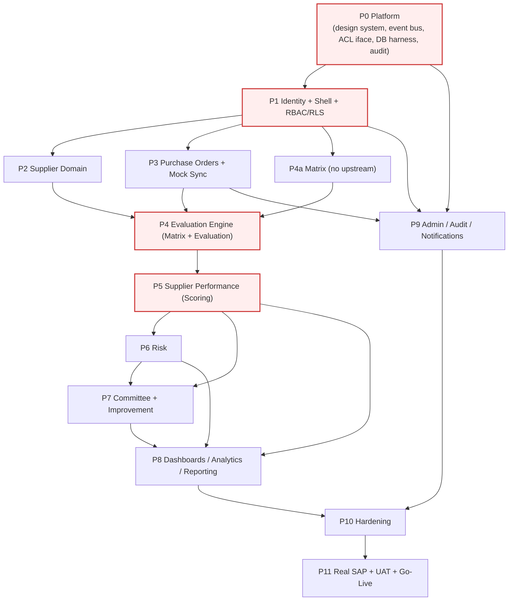
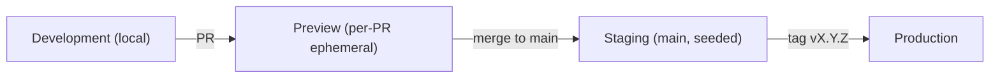

# UM6P — Supplier Performance Management Platform (SPM)
## Engineering Master Plan · v1.0

> **Audience:** software engineers, tech leads, TPM. This is the execution playbook from first commit to production.
> **Source of truth (immutable inputs — this plan executes, never redesigns them):** [Domain Model](./DOMAIN_MODEL.md) · [Architecture Blueprint](./ARCHITECTURE_BLUEPRINT.md) · [Roadmap](./ROADMAP.md) · [Business Analysis](./BUSINESS_ANALYSIS.md) · [Product Backlog](./PRODUCT_BACKLOG.md) · [Functional Design](./FUNCTIONAL_DESIGN.md) · [UX & Functional Specs](./ux/README.md).
> **Prime directive:** enable many developers to build **simultaneously without conflicts**. The mechanism is DDD vertical slices as ownership boundaries + contract-first integration (domain events + typed public barrels) + a shared platform layer built first.
> **Constraints:** no code, no SQL, no API definitions here — this is the sequence, structure, and prompt plan Claude Code will follow.

---

## Contents
1. [Repository Strategy](#1-repository-strategy)
2. [Development Phases](#2-development-phases)
3. [Sprint Planning](#3-sprint-planning)
4. [Dependency Graph](#4-dependency-graph)
5. [Database Build Order](#5-database-build-order)
6. [API Build Order](#6-api-build-order)
7. [Frontend Build Order](#7-frontend-build-order)
8. [Testing Strategy](#8-testing-strategy)
9. [CI/CD Strategy](#9-cicd-strategy)
10. [Release Strategy](#10-release-strategy)
11. [Engineering Risks](#11-engineering-risks)
12. [Claude Code Development Plan](#12-claude-code-development-plan)

---

## 0. How Parallel Work Stays Conflict-Free (the operating principle)

Before the sections: the single idea that makes everything else work.

1. **Build the Platform layer first (Phase 0).** Everything shared — design system, `DataTable`/chart/form primitives, Supabase clients, auth/RBAC guards, the in-process event bus, error/result types, the SAP `SapAdapter` interface + mock. Once stable, domains build against it without touching it.
2. **One domain = one owner = one folder.** Per the blueprint, each bounded context is a `features/<domain>/` slice (`components/actions/services/repositories/schemas/types/hooks`). Teams own folders; folder-level `CODEOWNERS` prevents cross-editing.
3. **Contract-first between domains.** Domains integrate only via (a) published **domain events** (§7 Domain Model) and (b) each domain's `index.ts` **public barrel**. A consuming domain codes against the *contract*, using a stub if the producer isn't done. ESLint `no-restricted-imports` forbids reaching past a barrel — the compiler enforces the boundary.
4. **Vertical slices, feature-flagged.** Each unit of work is a thin end-to-end slice (DB → repo → service → action → UI) behind a flag, merged to trunk continuously even when incomplete.
5. **Mock-first for external deps.** SAP is consumed only through the ACL; the mock adapter means every downstream domain proceeds before live SAP exists.

Result: after Phase 0, Supplier / PO / Matrix / Evaluation / Risk / Committee teams work in parallel lanes that only ever meet at event contracts and barrels.

---

## 1. Repository Strategy

### 1.1 Repo shape — **single repository, single deployable** (modular monolith)
- **Decision:** one Git repository containing the one Next.js 15 app (per the Architecture Blueprint's modular-monolith decision ADR-01). **Not** multi-repo, and **not** a multi-package build system on day one.
- **Why:** the product is one deployable unit at UM6P's scale; a single repo gives atomic cross-cutting changes, one CI pipeline, one versioning story, and trivial refactors — without the coordination tax of polyrepo or the tooling tax of a workspace monorepo we don't yet need.
- **Internal modularity, not physical packages:** boundaries are enforced by folder structure + ESLint import rules + barrels (see §0), giving ~90% of monorepo isolation at ~10% of the cost. **Escape hatch:** if a shared library (e.g., the design system or the ACL) later needs independent versioning, promote it to a `packages/*` workspace — the folder structure already isolates it, so extraction is mechanical.

### 1.2 Module organization (from the Blueprint — do not deviate)
```
app/         routing only            features/<domain>/   bounded-context slices
components/  shared UI (ui, data-table, charts, feedback)
lib/         supabase, auth, validation, errors, logger, utils, events
services/    sap (ACL), mail, storage
database/    migrations, policies, functions, views, seed
```
Domains: `authentication, administration, suppliers, purchase-orders, evaluation-matrix, evaluations, performance, risk, improvement, governance(committee), notifications, reporting, audit`.

### 1.3 Shared libraries ("the Platform" — Phase 0 owns these)
| Library | Contents | Consumers |
|---|---|---|
| `components/ui` + `data-table` + `charts` + `feedback` | Design system per UX Foundations | all UI |
| `lib/supabase` | server/client/service-role clients | all repositories |
| `lib/auth` | session, RBAC guards, permission + scope checks | all actions/UI |
| `lib/validation` | Zod helpers, RHF resolver | all forms/actions |
| `lib/errors` | `AppError`, `Result<T>`, error mapping | all services/actions |
| `lib/events` | in-process domain-event bus (publish/subscribe, transactional) | all domains |
| `lib/logger` | structured logging | all |
| `services/sap` | `SapAdapter` interface + mock + mappers | integration + PO/supplier |

**Rule:** the Platform is a **published contract**; changes to it require review by the platform owner and a changeset note, because everyone depends on it.

### 1.4 Naming & versioning
- **Naming:** exactly the Blueprint §12 conventions (kebab folders, PascalCase components, `*.service.ts`, `*.repository.ts`, `*.schema.ts`, snake_case DB, `resource.action[.scope]` permissions, PascalCase past-tense events). Enforced by lint where possible, by review otherwise.
- **App versioning:** SemVer on the deployable; release tags `vMAJOR.MINOR.PATCH`. **Conventional Commits** drive changelog + version bump.
- **Migrations:** forward-ordered, timestamp-prefixed, each reversible and reviewed; never edited once merged.
- **Matrix content** versions live *in the domain* (per Domain Model P9), independent of app SemVer.
- **Design-system versioning:** track breaking token/component changes in a `CHANGELOG` section; visual-regression snapshots gate changes.

### 1.5 Branch strategy — **trunk-based with short-lived branches**
- `main` is always releasable & protected (required CI + ≥1 review + CODEOWNERS).
- Branch naming: `type/domain-short-desc` (`feat/evaluations-scoring`, `fix/suppliers-scope`).
- Short-lived branches (< ~2 days); rebase, squash-merge.
- **Feature flags** hide incomplete slices so trunk merges continuously (avoids long-lived divergent branches — the #1 source of conflicts).
- **CODEOWNERS** per `features/<domain>` and per Platform library → PRs auto-route to the owning team; cross-domain PRs need both owners.
- Environment branches are *deployment targets*, not long-lived dev branches: `main → staging → production` promotion via tags (see §9).

---

## 2. Development Phases

Engineering decomposition of the **same** program in [ROADMAP.md](./ROADMAP.md) and Functional Design Horizon 1 — re-cut to the module granularity requested, mapped to Domain Model bounded contexts (C1–C12). No scope change; only sequencing detail for engineers.

| Phase | Module | Bounded contexts | Goal (engineering) | Roadmap alignment |
|---|---|---|---|---|
| **P0** | **Foundation / Platform** | shared + C11 + C12(iface) | Repo, CI/CD, design system, DB harness, RLS helpers, event bus, SAP ACL interface + mock, audit skeleton | Roadmap P0 |
| **P1** | **Authentication & Identity** | C9 (Identity), C11 | Entra SSO, JIT users, roles/permissions, RLS baseline **proven**, app shell + nav | Roadmap P1 |
| **P2** | **Supplier Domain** | C1 (+ reference data) | Supplier aggregate, list/360° read side, classification/standing scaffold | Roadmap P2 |
| **P3** | **Purchase Orders** | C2, C12 (mock sync) | PO aggregate, mock SAP sync, completion detection + eligibility, list/detail | Roadmap P2 |
| **P4** | **Evaluation Engine** | C4 (Matrix) + C3 (Evaluation) | Matrix builder + versioning; auto-generation, assignment, form, submit/validate lifecycle | Roadmap P3–P4 |
| **P5** | **Supplier Performance** | C1/C3 (scoring), C8 (read models) | Scoring service, SPI/confidence/coverage, supplier history, performance tab, home/exec KPIs | Roadmap P5 |
| **P6** | **Risk** | C5 | SupplierRisk aggregate, SRI, domains, risk events, performance-linked signals, risk views | Roadmap (folds into P5–P7) |
| **P7** | **Committee & Improvement** | C7 + C6 | Improvement plan lifecycle; committee meetings, decisions, action register, governance loop | Roadmap P4–P7 |
| **P8** | **Dashboards, Analytics & Reporting** | C8 | Role dashboards, cross-filter analytics, timeline, reports/exports | Roadmap P6 |
| **P9** | **Administration, Audit & Notifications** | C9, C11, C10 | Admin screens, audit explorer, notification center + delivery, settings (configurable rules) | Roadmap P7 |
| **P10** | **Hardening** | all | Security review (RLS/secrets), performance, a11y, load test | Roadmap P7 |
| **P11** | **Real SAP + UAT + Go-Live** | C12 | Swap mock→OData adapter behind same interface, reconcile, UAT, cutover | Roadmap P8 |

**Parallelization after P1:** P2 (Supplier) and P3 (PO) run in parallel lanes; P4 starts once Matrix (C4) + PO events (`POCompleted`) contracts exist (Matrix builds in parallel from the start since it has no upstream). P6 Risk consumes performance events; P7 consumes evaluation/performance events; P8/P9 consume everyone's read models & events. Notifications (C10) shell (bell) lands in P1; full center in P9.

---

## 3. Sprint Planning

Two-week sprints, aligned to Roadmap sprint numbers. Each sprint: **Tasks → Dependencies → Deliverables → Definition of Done (DoD)**. The **global DoD** (inherited by every sprint) is below; sprint DoD lists only additions.

**Global DoD (every increment):** typecheck + lint (incl. boundary rule) clean · unit/integration tests pass · migrations reversible & reviewed · **RLS isolation test for every touched table** · four UX states present (loading/empty/error/success) · AA accessibility · FR/EN copy · responsive per UX Foundations · feature-flagged · deployed to staging · demoed.

### Sprint 1 — P0 Foundation
- **Tasks:** repo + Next.js/TS/Tailwind/shadcn init; ESLint (no-any, no-restricted-imports boundaries) + Prettier + Husky; CI (typecheck/lint/test/build) + preview deploys; Supabase projects; migration harness + type generation; design tokens (light/dark) + app shell primitives; DDD folder skeleton + empty barrels; `lib/errors`, `lib/events` (event bus), `lib/logger`; SAP `SapAdapter` interface + mock + fixtures; `audit` skeleton (record model + write helper).
- **Dependencies:** none.
- **Deliverables:** booting app on staging; `/health`; CI green; platform contracts published.
- **DoD (+):** a developer clones and runs in < 15 min; boundary lint fails on a deliberate cross-import test.

### Sprint 2 — P1 Identity & Access
- **Tasks:** Entra SSO via Supabase OIDC; `/auth/callback`; cookie session + middleware guard; JIT user provisioning; roles/permissions/user_roles + campus/department scope; RLS helper functions (`has_permission`, `campus_ids`, `is_global`); seed roles/permissions from Blueprint §11; audit triggers (`set_audit_fields`, `write_audit_log`).
- **Dependencies:** S1.
- **Deliverables:** real UM6P login → empty role-appropriate shell; **RLS isolation tests pass**.
- **DoD (+):** user A cannot read user B's scoped rows (proven test); sign-in + role change audited.

### Sprint 3 — P1 App Shell & Shared UI
- **Tasks:** AppShell (sidebar permission-filtered, topbar: search/campus/bell/theme/lang/user); `DataTable` (server sort/filter/paginate/export/columns); chart wrappers scaffold; `EmptyState/ErrorState/Skeleton/Toaster`; route groups + `loading.tsx`/`error.tsx`; 401/403/404; notification **bell** placeholder.
- **Dependencies:** S1–S2.
- **Deliverables:** navigable shell; shared components documented in a stories/catalog.
- **DoD (+):** DataTable passes keyboard + screen-reader checks; nav hides unpermitted items.

### Sprint 4 — P2 Supplier Domain + P3 Sync engine *(parallel lanes)*
- **Lane A (Supplier):** Supplier aggregate + repository; reference data (campus/department/commodity); Supplier list (Screen 3) + 360° header & General/POs tabs (Screen 4 read side).
- **Lane B (PO/Sync):** sync orchestration (runs, watermark, idempotent upsert, ordering); `/api/cron/sap-sync` + manual run; suppliers+POs ingested from mock.
- **Dependencies:** S1–S3; ACL mock (S1).
- **Deliverables:** mock sync populates suppliers/POs; supplier list & 360° read views.
- **DoD (+):** re-running sync creates no duplicates; scope enforced on lists.

### Sprint 5 — P3 Purchase Orders + completion
- **Tasks:** PO aggregate + items; PO list (Screen 5) + detail; requester/purchaser resolution (lazy JIT); eligibility engine; `POCompleted` event emission; reconciliation report.
- **Dependencies:** S4.
- **Deliverables:** completing a PO in mock emits `POCompleted` (logged); PO screens live.
- **DoD (+):** eligibility rules configurable; one-evaluation-per-PO invariant reserved (no dup possible).

### Sprint 6 — P4 Evaluation Matrix
- **Tasks:** EvaluationMatrix aggregate + versions/criteria/sub-criteria/(questions); Matrix Builder (Screen 8); weight = 100% guardrails; activation → new version, archive prior; seed default matrix.
- **Dependencies:** S3 (shell), reference data.
- **Deliverables:** create/weight/activate/version a matrix.
- **DoD (+):** activation blocked unless weights valid; active matrix immutable in place.

### Sprint 7 — P4 Evaluation generation & assignment
- **Tasks:** Evaluation aggregate + scores/comments/attachments; `POCompleted` handler → create evaluation w/ matrix snapshot + assign + due date; Notification bell + first notifications (assignment); Evaluation Workspace (Screen 6) queues.
- **Dependencies:** S5 (`POCompleted`), S6 (matrix), S2 (users).
- **Deliverables:** completed PO auto-creates an assigned, notified evaluation visible in the workspace.
- **DoD (+):** `EvaluationCreated`/`Assigned` events + audit; reassignment with reason.

### Sprint 8 — P4 Evaluation form, submit, validate, lifecycle
- **Tasks:** Evaluation Form (Screen 7): scoring, mandatory justification, N/A re-normalization, autosave draft, attachments; submit completeness gate; validation (approve/return); overdue sweep + escalation; full lifecycle state machine + audit.
- **Dependencies:** S7.
- **Deliverables:** golden path PO→assign→fill→submit→validate works end-to-end.
- **DoD (+):** submit impossible while incomplete; finalized = immutable (proven); overdue reminders fire.

### Sprint 9 — P5 Scoring & Supplier Performance
- **Tasks:** scoring service (weighted SPI, server-authoritative); time-weighting; confidence & coverage computation; `ScoreCalculated`/`SupplierRatingUpdated`; supplier performance read models & rollups; Supplier 360° Performance + History tabs; Home/Exec SPI KPIs.
- **Dependencies:** S8.
- **Deliverables:** validating an evaluation updates supplier standing, history, KPIs.
- **DoD (+):** score reproducible from stored scores; confidence reflects coverage.

### Sprint 10 — P6 Risk
- **Tasks:** SupplierRisk aggregate + domains + SRI; risk events; performance-linked auto-signals; inherent/residual + mitigations; rating cap rule; portfolio Risk view + 360° Risk tab (Screen 10).
- **Dependencies:** S9 (performance signals).
- **Deliverables:** risk portfolio + per-supplier risk; declining performance raises matching risk.
- **DoD (+):** residual ≤ inherent enforced; high SRI caps rating & can force Under Observation.

### Sprint 11 — P7 Improvement Plans
- **Tasks:** ImprovementPlan aggregate + actions; auto-trigger on low SPI + manual; stage lifecycle with verification + re-evaluation gates; Improvement Plans screens (Screen 9); lifecycle updates to supplier.
- **Dependencies:** S9 (SPI), S10 (risk link).
- **Deliverables:** low score → plan → verified closure → supplier restored.
- **DoD (+):** no effective closure without passed verification + linked re-evaluation.

### Sprint 12 — P7 Committee & Governance
- **Tasks:** Committee + CommitteeMeeting aggregates + decisions + action register; Committee Workspace (Screen 12); agenda auto-seed; decisions apply tier/lifecycle via events; Supplier Timeline (Screen 11).
- **Dependencies:** S9–S11 (standing, risk, plans).
- **Deliverables:** run a committee cycle; decisions move suppliers; timeline assembles.
- **DoD (+):** decision requires rationale; closing locks minutes; every governance action on timeline + audit.

### Sprint 13 — P8 Dashboards, Analytics & Reporting
- **Tasks:** role dashboards (Home compositions); Analytics (Screen 14) with cross-filter; Reports (Screen 13) + PDF/Excel export; committee pack; charts + table fallbacks.
- **Dependencies:** S9–S12 (read models).
- **Deliverables:** exec/buyer/dept/committee dashboards; standard reports export.
- **DoD (+):** dashboards fast over seeded multi-year data; rankings show confidence+spend.

### Sprint 14 — P9 Administration, Audit, Notifications
- **Tasks:** Users & Roles (Screen 16); SAP Sync admin (Screen 17); Audit Logs (Screen 18); Settings/configurable rules (Screen 19); Notification Center + preferences + email delivery (Screen 20); Admin hub (Screen 15).
- **Dependencies:** S2 (identity), S4 (sync), S1 (audit), all events (notifications).
- **Deliverables:** full admin + audit explorer + notification center; business rules configurable without release.
- **DoD (+):** setting changes take effect without deploy; audit append-only proven; notifications honor preferences.

### Sprint 15 — P10 Hardening
- **Tasks:** RLS coverage audit + service-role usage audit; secrets/CSP/headers; performance (indexes, rollups, N+1); a11y audit (AA); i18n pass; observability + alerting; load test.
- **Deliverables:** security & a11y sign-off; load targets met; runbooks.

### Sprint 16 — P11 Real SAP + UAT + Go-Live
- **Tasks:** implement OData adapter behind unchanged `SapAdapter`; field mapping validation; parallel run + reconciliation vs mock; UAT with Procurement; training; production cutover (go/no-go, rollback, hypercare).
- **Deliverables:** live SAP data flowing; production launch; hypercare stable.

---

## 4. Dependency Graph



**Critical path (longest dependency chain — protect these; they gate everything downstream):**
`P0 → P1 → (P2 ∥ P3) → P4 → P5 → P7 → P8 → P10 → P11`.

- **P0 and P1 are the master gates** — nothing real ships until the platform + identity/RLS exist; staff them heaviest and first.
- **P4 (Evaluation Engine) is the throughput bottleneck** — it needs both PO events and Matrix; start Matrix (P4a) in parallel immediately since it has no upstream, so it's never the blocker.
- **P5 (Performance) is the value keystone** — Risk, Committee, Dashboards all wait on scoring; it must not slip.
- **Off-critical-path lanes** (can float / absorb schedule risk): Matrix builder UI polish, Reporting/exports, Notification center depth, Admin screens — parallelizable and deferrable within their release.

---

## 5. Database Build Order

*(No SQL — implementation sequence of aggregates and why. Order = least-dependency-first + prove security early + respect FK/reference direction from the Domain Model §4.)*

| Order | Aggregate / structure | Why this position |
|---|---|---|
| 1 | **Identity & Access** (User, Role, Permission, user_roles + scope) + **RLS helper functions** | Nothing can be secured or scoped until identity exists; RLS is the backstop and must be provable before any business data (Principle P5). |
| 2 | **Audit** (append-only record) + audit/audit-field triggers | Every subsequent write must be auditable from day one; retrofitting audit is expensive and lossy. |
| 3 | **Reference data** (Campus, Department, Commodity) | Scoping dimensions + matrix/analytics keys; small, no dependencies, everything references them. |
| 4 | **Supplier** aggregate (+ classification/status/standing VOs, contacts, documents) | The central aggregate (P1); many aggregates reference it; standing computed later but structure first. |
| 5 | **Purchase Order** aggregate (+ items) | References Supplier + Users; the transactional evidence and evaluation trigger. |
| 6 | **Evaluation Matrix** aggregate (+ versions/criteria/sub-criteria/questions) | Must exist before evaluations can snapshot a version (P9); no upstream, so buildable in parallel from step 3. |
| 7 | **Evaluation** aggregate (+ scores/comments/attachments) | References PO, Supplier, Matrix version snapshot; the core sensor. |
| 8 | **Supplier Performance** read models/rollups (SPI/confidence/coverage projections) | Derived from finalized evaluations; needs evaluation data to exist. |
| 9 | **Supplier Risk** aggregate (+ risk events) | Consumes performance signals; references Supplier. |
| 10 | **Improvement Plan** aggregate (+ actions) | Triggered by performance/risk; references evaluation + supplier. |
| 11 | **Committee / Committee Meeting** aggregates (+ decisions, actions) | Consumes standing/risk/plans; produces supplier lifecycle changes. |
| 12 | **Notification** aggregate (+ preferences) | Consumes events from all above; needs event producers first. |
| 13 | **Reporting read models / projections** | Aggregate across everything; built last as consumers. |
| 14 | **SAP Sync** operational tables (runs, items, watermark) | Operational; can be built alongside PO (step 5) since the mock feeds them, but formalized here. |

**Guiding rules:** build a parent aggregate before its referencing children; enable + test RLS on each table as it's created (never "add security later"); reference data and Matrix have no upstream and are built early to unblock parallel work.

---

## 6. API Build Order

*(No API definitions — the sequence in which server actions / route handlers / integration entry points are implemented. Contract-first: publish the domain's barrel + event contracts before implementing, so consumers integrate against stubs.)*

| Order | Capability surface | Rationale |
|---|---|---|
| 1 | **Auth/session + RBAC/scope guards** | Every other action composes these; foundational. |
| 2 | **Reference & Supplier read** (list/detail queries, scope-aware) | First user-visible value; read-only, low risk, validates RLS end-to-end. |
| 3 | **PO read + Sync ingestion (mock)** | Populates data; establishes the ACL boundary and `POCompleted` event contract. |
| 4 | **Matrix commands** (create/version/activate) | Unblocks evaluation; no upstream. |
| 5 | **Evaluation lifecycle commands** (create-from-event, assign, save draft, submit, validate, reassign, reopen) | The core write surface; each command guarded, validated (Zod), audited, event-emitting. |
| 6 | **Scoring / performance recompute** (triggered by `EvaluationValidated`) | Turns evidence into standing; server-authoritative. |
| 7 | **Risk commands** (assess, add event, mitigate) + performance-signal subscriber | Consumes performance events. |
| 8 | **Improvement commands** (create, add action, advance stage, verify, close) | Consumes low-score events. |
| 9 | **Committee commands** (schedule, agenda, decision, action, close) | Consumes standing/risk; emits supplier changes. |
| 10 | **Notification generation + delivery** + preferences | Subscribes to all domain events. |
| 11 | **Reporting queries / export generation** | Read models over everything. |
| 12 | **Admin commands** (users/roles, settings, sync trigger, audit queries) | Operational; some (settings) unblock earlier config but the surfaces formalize here. |
| 13 | **Real SAP adapter** (replaces mock behind same interface) | Last — the mock carried everything; swap is isolated by the ACL. |

**Cross-cutting conventions (apply to every command from #1):** validate at boundary (Zod) → check permission + scope → invoke domain service → persist in one transaction → emit domain event(s) → return typed `Result`. Reads are scope-filtered by RLS; writes never trust the client.

---

## 7. Frontend Build Order

Order follows dependency and user value; each screen references its spec in [ux/](./ux/README.md).

| Order | Screen(s) | Why now |
|---|---|---|
| 1 | **Login (S1) + App Shell** (nav, topbar, theme, states) | Nothing is reachable without auth + shell; establishes the design system in anger. |
| 2 | **Home Dashboard (S2)** (skeleton, role-aware) | Landing surface; grows as data domains come online (progressive). |
| 3 | **Supplier List (S3) + Supplier 360° read (S4)** | First real business value; read-only; validates DataTable + scope + 360° layout. |
| 4 | **Purchase Orders (S5)** | Grounds evaluations; read-only; proves sync data. |
| 5 | **Matrix Builder (S8)** | **Must precede the Evaluation Form** — the form renders a matrix; build the producer first. |
| 6 | **Evaluation Workspace (S6) + Evaluation Form (S7)** | The transactional heart; the golden-path UI; highest engineering care (autosave, validation, a11y, mobile). |
| 7 | **Supplier 360° Performance/History tabs** | Once scoring exists, surface it where suppliers are managed. |
| 8 | **Improvement Plans (S9)** | Acts on low scores; needs performance. |
| 9 | **Supplier Risk (S10)** | Needs performance signals; portfolio + 360° tab. |
| 10 | **Supplier Timeline (S11)** | Consumes events from all prior domains; assembles the narrative. |
| 11 | **Committee Workspace (S12)** | Governance; consumes standing/risk/plans/timeline. |
| 12 | **Analytics (S14) + Reports (S13)** | Read models are richest now; strategic surfaces + exports. |
| 13 | **Admin cluster (S15 hub, S16 Users&Roles, S17 SAP Sync, S18 Audit, S19 Settings)** | Operational; some (Sync admin) needed earlier in dev but productionized here. |
| 14 | **Notification Center (S20)** (bell shipped in step 1) | Full center + preferences last, once all event producers exist. |

**Principle:** build **producers before consumers** (Matrix before Form; Performance before Risk/Committee; events before Timeline/Notifications), and **read screens before write screens** within a domain so the data model is validated before the harder transactional UI.

---

## 8. Testing Strategy

Test pyramid weighted toward the money-and-trust logic (services + RLS), per the Blueprint.

| Layer | Scope | What we test | Tooling intent | Gate |
|---|---|---|---|---|
| **Unit** | Domain services (pure) | Scoring (weighted SPI, N/A re-normalization, time-weighting), assignment, confidence/coverage, lifecycle transitions, risk aggregation, matrix weight validation | Vitest, in-memory fakes | PR |
| **Domain / invariant** | Aggregates & events | Invariants hold (immutability of finalized evaluations, weights=100%, residual≤inherent, one-eval-per-PO); **every business action emits the right event** (P8); aggregates only change via root (P10) | Contract/property tests | PR |
| **Integration** | Repositories + RLS + ACL | **RLS isolation** (user A cannot read B's scoped rows — first-class, per touched table), scope filters, ACL mappers (SAP DTO→domain), idempotent sync (no duplicates) | Test DB | PR/merge |
| **E2E** | Golden paths (Playwright) | Login → assigned evaluation → fill/justify → submit → validate → supplier standing updates → dashboard reflects; overdue escalation; committee decision moves supplier | Playwright | merge/nightly |
| **UAT** | Business acceptance | Per-phase with Procurement against acceptance criteria (BA §32 + per-screen ACs); FR-first, real-ish data via mock | Manual + checklist | phase exit |
| **Regression** | Whole suite | Full unit/domain/integration + E2E smoke on every merge; **visual regression** on design system; **contract tests** between domain barrels/events | CI | every merge |

**Standards:** RLS isolation and immutability are non-negotiable, tested per touched table/aggregate. Coverage target: domain/services ≥ 90%, overall meaningful ≥ 80% (quality over vanity number). Fixtures come from the mock SAP adapter so tests run without SAP. Contract tests pin the event/barrel contracts so a producer change that breaks a consumer fails CI.

---

## 9. CI/CD Strategy

Four environments, promotion by tag; every gate automated.



| Env | Trigger | Purpose | Data | Gates before entry |
|---|---|---|---|---|
| **Development** | local | Build features | mock SAP + seed | pre-commit: lint + typecheck (Husky) |
| **Preview** | every PR | Review a slice in isolation | ephemeral seed | CI: typecheck, lint(+boundary rule), unit, domain, integration, build, **migration dry-run** |
| **Staging** | merge to `main` | Integration + UAT + demos | staging seed / mock or sandbox SAP | above + E2E smoke + a11y checks; migrations applied forward |
| **Production** | release tag | Live | real (SAP live from P11) | full regression + security scan + manual go/no-go; migrations gated + reversible; smoke after deploy |

**Pipeline principles:** trunk-based + preview-per-PR (fast feedback, isolated review); **migrations are forward-only, reversible, reviewed, and dry-run in CI**; secrets in the platform secret store (never in repo); `service_role` key server-only; feature flags decouple deploy from release; observability (structured logs, error tracking, sync/notification alerting, uptime) wired from Staging. Rollback = redeploy previous tag + reverse migration if needed; hypercare window post-go-live.

---

## 10. Release Strategy

Maps to Backlog MoSCoW and Roadmap phases; **mock-first, SAP-last** de-risks the one uncontrolled dependency.

| Release | Contents | Phases | Backlog | Outcome |
|---|---|---|---|---|
| **MVP** | Auth+RBAC, App shell, Supplier domain, PO + **mock** sync, Matrix, Evaluation lifecycle (auto-gen→assign→fill→submit→validate), Scoring + supplier history, basic Home/Exec KPIs, Admin(core)+Audit, Notifications(assignment/reminder/overdue) | P0–P5, part P9 | All **Must** (E1–E4, E6, E8 core, E11, E12) | Standardized, auto-generated, justified, weighted, immutable evaluations feeding supplier standing — end to end on mock data |
| **Release 1** | Validation workflow, Risk domain, Improvement plans, Committee & governance, Timeline, Buyer/Ops dashboards, Reporting + exports | P6, P7, part P8 | **Should** (E5, E7, E9 breadth, E10) | The full supplier-management operating model live (still mock SAP) |
| **Release 2** | Analytics depth + portfolio, **Real SAP integration**, reconciliation, UAT, training, **production go-live**, hardening complete | P8, P10, P11 | remaining Should/Could + go-live | Production system of record on live SAP data |
| **Release 3 (Future)** | Supplier Portal, Power BI, Teams, AI summaries, predictive risk, ESG, supplier audits, contract management, multi-entity | Functional Design Horizon 2–3 | **Won't-now** (E13 +) | Maturity L4–L5 (Integrated → Intelligent) |

Each release is production-quality and demoable to the steering committee; go-live is deliberately at Release 2 because MVP/R1 prove the whole product against the mock ACL first.

---

## 11. Engineering Risks

| # | Risk | Category | Impact | Mitigation | Owner | Early trigger/signal |
|---|---|---|---|---|---|---|
| E-R1 | Long-lived branches / cross-domain edits cause merge conflicts | Tech debt/process | High | Trunk-based + short branches + feature flags + CODEOWNERS + barrels/boundary lint | Tech Lead | PRs open > 2 days; boundary-lint failures |
| E-R2 | RLS gap or `service_role` leak to client | Security | High | RLS default-deny + isolation tests per table; service-role server-only; security review gate (P10); secret scanning | Security/Platform | any table without an isolation test |
| E-R3 | Real SAP mapping differs from mock; late surprises | Migration/integration | High | ACL isolates change; validate mapping in parallel-run (S15–16); reconciliation report; keep mock for CI | Integration Lead | reconciliation drift > tolerance |
| E-R4 | Dashboards/analytics slow over multi-year history | Performance/scaling | Med-High | Rollup tables + read models + composite/partial indexes; load test in P10; pagination | Perf owner | p95 dashboard load > 2s on seeded data |
| E-R5 | Historical-data backfill for legacy POs | Migration | Med | Scope explicitly (S15); idempotent import; treat as one-off migration job behind flag | Integration Lead | UAT requests historical trends |
| E-R6 | Platform/shared-library changes ripple & break domains | Tech debt | Med | Platform = reviewed contract + changesets + contract tests; version design-system changes with visual regression | Platform owner | unexpected consumer test failures |
| E-R7 | Scoring/confidence logic duplicated or drifts | Correctness/tech debt | Med | Single scoring service (P7 no-dup); domain tests pin formula; reproducibility test | Evaluation owner | any second implementation of a rule |
| E-R8 | Multi-campus/entity retrofitted late | Scaling | Med | Scope dimension designed in from P1 (campus on data + access); entity added as scope later per Domain Model P15/§14 | Architect | requests for cross-entity reporting |
| E-R9 | Notification/email deliverability (Graph throttling) | Reliability | Low-Med | Queue + retry + status; in-app as fallback channel; delivery tests | Notifications owner | failed-delivery rate rising |
| E-R10 | Test suite slows, teams skip it | Process | Med | Fast unit lane on PR; heavier lanes nightly; parallelize; keep E2E to golden paths | TPM | CI PR time > ~10 min |
| E-R11 | Config-as-data (Settings) lets an admin set inconsistent rules | Correctness | Med | Validation on settings (monotonic bands, weight sums); approval on policy settings; audit | Admin owner | invalid band/threshold saved |

---

## 12. Claude Code Development Plan

The ordered backlog of **small prompts** Claude Code executes. **Every prompt obeys these rules:**
- **≤ ~1 day** of engineering; **one coherent, feature-flagged vertical slice**; **independently testable** (ships with its tests); **preserves architecture** (correct domain folder, guards → service → repo → event, updates the domain barrel, no cross-barrel imports); references the relevant spec + Domain Model section; adds/keeps the four UX states + a11y + FR/EN where UI is involved.
- **Prompt template:** *"In `features/<domain>` (or Platform), build <capability>. Contracts: <events/barrel exports>. Acceptance: <what a test proves>. Preserve: <boundary/rule>. Reference: <doc §>."*

Notation per prompt: **ID · Feature · Builds · Independently testable by · Depends on**.

### Phase 0 — Platform
| ID | Feature | Builds | Testable by | Depends |
|---|---|---|---|---|
| 0.1 | Repo scaffold | Next.js 15 + TS strict + Tailwind + shadcn + ESLint(no-any)+Prettier+Husky | app boots, lint/typecheck pass | — |
| 0.2 | Boundary lint | `no-restricted-imports` domain rule + path aliases + empty barrels | deliberate cross-import fails CI | 0.1 |
| 0.3 | CI pipeline | GitHub Actions (typecheck/lint/test/build) + preview deploy | green pipeline on a trivial PR | 0.1 |
| 0.4 | Supabase clients | `lib/supabase` server/client/service-role; env contract | health query works | 0.1 |
| 0.5 | Migration harness | ordered migrations + type generation + seed runner | migrate up/down + types generate | 0.4 |
| 0.6 | Errors & Result | `lib/errors` (`AppError`, `Result<T>`, mapping) | unit tests on mapping | 0.1 |
| 0.7 | Event bus | `lib/events` transactional in-process publish/subscribe | publish→subscriber receives; rollback drops | 0.6 |
| 0.8 | Logger | `lib/logger` structured logging | log shape asserted | 0.1 |
| 0.9 | Design tokens + theme | tokens (light/dark), theme provider, `cn()` | theme toggle; contrast check | 0.1 |
| 0.10 | Audit skeleton | audit record model + `write_audit_log`/`set_audit_fields` triggers | write emits audit; fields stamped | 0.5 |
| 0.11 | SAP ACL interface + mock | `SapAdapter` + mock adapter + fixtures + mappers stub | mock returns deterministic data | 0.6 |

### Phase 1 — Identity & Shell
| ID | Feature | Builds | Testable by | Depends |
|---|---|---|---|---|
| 1.1 | Entra SSO | Supabase OIDC + `/auth/callback` + cookie session | login redirect → session set | 0.4 |
| 1.2 | Middleware guard | route protection + `returnTo` + sign-out | unauth → /sign-in; returnTo honored | 1.1 |
| 1.3 | JIT provisioning | create user + default role on first login | first login creates user row | 1.1,0.10 |
| 1.4 | RBAC model | roles/permissions/user_roles + scope; seed from Blueprint §11 | permission lookup correct | 0.5 |
| 1.5 | RLS helpers | `has_permission`,`campus_ids`,`is_global` + enable RLS on identity tables | **isolation test passes** | 1.4 |
| 1.6 | Login screen (S1) | brand card + Microsoft button + lang toggle + error banner | E2E login; a11y | 1.1,0.9 |
| 1.7 | App shell | sidebar (permission-filtered) + topbar + theme/lang/user + bell placeholder | nav hides unpermitted; keyboard nav | 1.4,0.9 |
| 1.8 | Shared DataTable | server sort/filter/paginate/export/columns/states | keyboard + SR + states | 0.9 |
| 1.9 | Feedback components | Empty/Error/Skeleton/Toaster; loading/error routes | states render; a11y | 0.9 |

### Phase 2–3 — Supplier & Purchase Orders (parallel lanes)
| ID | Feature | Builds | Testable by | Depends |
|---|---|---|---|---|
| 2.1 | Reference data | campus/department/commodity models + seed + RLS | isolation + reads | 1.5 |
| 2.2 | Supplier aggregate | Supplier model + repository + RLS + scope | isolation; scope filter | 2.1 |
| 2.3 | Supplier list (S3) | DataTable of suppliers + filters + saved views | scoped list; filters in URL | 2.2,1.8 |
| 2.4 | Supplier 360° shell (S4) | header (standing scaffold) + tabs (General/POs read) | tabs deep-link; header renders | 2.2 |
| 3.1 | PO aggregate | PO + items + repository + RLS | isolation; item reconcile | 2.2 |
| 3.2 | Sync orchestration | runs/watermark/idempotent upsert/ordering + `/api/cron/sap-sync` + manual | mock sync populates; no dupes | 0.11,3.1 |
| 3.3 | Requester/purchaser resolution | map SAP person → user (lazy JIT) | resolves on login; holds otherwise | 3.2,1.3 |
| 3.4 | Eligibility + completion | eligibility engine + `POCompleted` emission | eligible completed PO emits event | 3.2,0.7 |
| 3.5 | PO screens (S5) | list + detail + evaluation link/create | scoped; ineligible hides create | 3.1,1.8 |
| 3.6 | Reconciliation report | SAP-mock vs SPM counts + discrepancy flags | counts match; drift flagged | 3.2 |

### Phase 4 — Evaluation Engine
| ID | Feature | Builds | Testable by | Depends |
|---|---|---|---|---|
| 4.1 | Matrix aggregate | Matrix/version/criteria/sub-criteria/(question) + repo | weight-sum invariant | 2.1 |
| 4.2 | Matrix builder (S8) | tree editor + weight inputs + live totals | activation blocked if ≠100% | 4.1,1.8 |
| 4.3 | Matrix versioning | activate→new version, archive prior; default per category | old evals keep snapshot | 4.1 |
| 4.4 | Evaluation aggregate | Evaluation + scores/comments/attachments + repo + RLS | isolation; one-per-PO | 3.1,4.1 |
| 4.5 | Auto-generation | `POCompleted` handler → create + snapshot matrix + assign + due | event→evaluation created & assigned | 3.4,4.3,4.4 |
| 4.6 | Assignment + reassign | assignment service + reassign(reason) + events | reassign audited + notified | 4.5,1.3 |
| 4.7 | Notification bell + assignment notice | bell + `EvaluationAssigned`→notification | evaluator notified | 4.5,1.7 |
| 4.8 | Evaluation Workspace (S6) | queues (my/team/validate/all) + row actions | scoped queues; counts match | 4.4,1.8 |
| 4.9 | Evaluation Form (S7) — scoring | dimension nav + rating + mandatory justification + N/A re-normalize + autosave | submit blocked if incomplete; N/A re-weights | 4.4 |
| 4.10 | Form — attachments + submit | evidence upload + submit completeness gate + confirm | incomplete blocked; attach validated | 4.9 |
| 4.11 | Validation workflow | approve/return(comment) + finalize/lock | finalized immutable (proven) | 4.10 |
| 4.12 | Lifecycle sweep | overdue detection + reminders + escalation (cron) | overdue flagged + escalated | 4.5,4.7 |

### Phase 5 — Supplier Performance
| ID | Feature | Builds | Testable by | Depends |
|---|---|---|---|---|
| 5.1 | Scoring service | weighted SPI (server-authoritative) + N/A handling | reproducible from scores | 4.11 |
| 5.2 | Time-weighting + trend | recency-weighted rolling SPI + direction | trend correct on fixtures | 5.1 |
| 5.3 | Confidence + coverage | compute from volume/coverage/recency | confidence rises with coverage | 5.1 |
| 5.4 | Standing + rating | composite standing VO + `SupplierRatingUpdated` | standing updates on finalize | 5.2,5.3 |
| 5.5 | Performance read models | rollups/projections + supplier history | history immutable; rollup matches | 5.1 |
| 5.6 | 360° Performance/History tabs | trend + radar + dimension bars + coverage/confidence | reconciles to evaluations | 5.5,2.4 |
| 5.7 | Home + Exec KPIs | role KPI cards + portfolio SPI trend | scoped; drill-through | 5.5,1.7 |

### Phase 6 — Risk
| ID | Feature | Builds | Testable by | Depends |
|---|---|---|---|---|
| 6.1 | SupplierRisk aggregate | domains + likelihood×impact + SRI + repo | residual≤inherent enforced | 2.2 |
| 6.2 | Risk events + register | risk events + inherent/residual + mitigations | SRI recomputes on change | 6.1 |
| 6.3 | Performance-linked signals | subscriber: declining dimension → raise domain | signal raises matching risk | 5.4,6.2,0.7 |
| 6.4 | Rating cap rule | high SRI caps rating / forces Under Observation | cap applied on fixtures | 6.3,5.4 |
| 6.5 | Risk views (S10) | portfolio heat map + 360° risk tab | scoped; table fallback | 6.2,2.4 |
| 6.6 | Single-source/critical flags | flags + committee routing | flag raises SRI + routes | 6.2 |

### Phase 7 — Improvement & Committee
| ID | Feature | Builds | Testable by | Depends |
|---|---|---|---|---|
| 7.1 | ImprovementPlan aggregate | plan + actions + repo + lifecycle | stage guards enforced | 5.4 |
| 7.2 | Trigger + create (S9) | auto-flag on low SPI + manual create | low SPI creates plan | 7.1,5.4 |
| 7.3 | Stages + verification | response→verification→closure gates | no effective close w/o verify+re-eval | 7.2 |
| 7.4 | Re-evaluation link + lifecycle | link next eval + supplier lifecycle update | closure moves lifecycle | 7.3,4.5 |
| 7.5 | Committee aggregates | Committee + Meeting + decisions + actions | decision needs rationale | 5.4 |
| 7.6 | Committee Workspace (S12) | agenda auto-seed + dashboard + decisions + actions + close | closing locks minutes | 7.5,5.7,6.5 |
| 7.7 | Decision application | decision → tier/lifecycle via events + timeline | promote/demote/block applied | 7.6,0.7 |
| 7.8 | Supplier Timeline (S11) | event projection + filters + deep links | all event types appear | 7.7,5.4,6.3 |

### Phase 8 — Dashboards, Analytics, Reporting
| ID | Feature | Builds | Testable by | Depends |
|---|---|---|---|---|
| 8.1 | Analytics canvas (S14) | dashboard selector + global cross-filter + KPI/chart grid | cross-filter + URL persist | 5.7,6.5,7.6 |
| 8.2 | Role dashboards | exec/buyer/dept/committee compositions | scoped widgets | 8.1 |
| 8.3 | Drill-through | chart segment → filtered table → 360° | drill preserves filters | 8.1 |
| 8.4 | Reports catalog + runner (S13) | parameterized reports + preview | required params enforced | 5.5 |
| 8.5 | Exports | PDF/Excel + stamped headers + committee pack | export matches preview | 8.4 |

### Phase 9 — Administration, Audit, Notifications
| ID | Feature | Builds | Testable by | Depends |
|---|---|---|---|---|
| 9.1 | Admin hub (S15) | health cards + tiles | permission-gated tiles | 1.7 |
| 9.2 | Users & Roles (S16) | user list + assign roles/scope + role/permission editor | last-admin protected; audited | 1.4 |
| 9.3 | SAP Sync admin (S17) | run history + run-now + reconciliation + diagnostics/replay | concurrent run blocked | 3.2,3.6 |
| 9.4 | Audit Logs (S18) | filterable append-only log + diff view + export | no edit/delete affordance | 0.10 |
| 9.5 | Settings (S19) | configurable rules (thresholds/bands/window/cadence/eligibility/validation) + approval | change effective w/o deploy; bands monotonic | 1.4 |
| 9.6 | Notification Center (S20) + delivery | center + preferences + email(Graph) delivery + retry | honors preferences; retries | 4.7,all events |

### Phase 10 — Hardening
| ID | Feature | Builds | Testable by | Depends |
|---|---|---|---|---|
| 10.1 | RLS + secret audit | coverage review + service-role usage + CSP/headers | no table without isolation test | all |
| 10.2 | Performance | index/rollup tuning + N+1 elimination + load test | p95 < 2s on seeded data | 8.x |
| 10.3 | Accessibility + i18n | AA audit + keyboard/SR pass + FR/EN completeness | axe clean; both languages | all UI |
| 10.4 | Observability | logs + error tracking + sync/notification alerting + uptime | alert fires on induced failure | 9.3,9.6 |

### Phase 11 — Real SAP + UAT + Go-Live
| ID | Feature | Builds | Testable by | Depends |
|---|---|---|---|---|
| 11.1 | OData adapter | real `SapAdapter` behind unchanged interface | mapping tests vs sandbox | 0.11 |
| 11.2 | Parallel run + reconcile | real sync in staging + reconciliation vs mock | drift < tolerance | 11.1,9.3 |
| 11.3 | Historical backfill (if scoped) | idempotent one-off import (flagged) | no dupes; counts reconcile | 11.2 |
| 11.4 | UAT fixes | defect burn-down vs acceptance criteria | ACs pass with Procurement | all |
| 11.5 | Go-live cutover | go/no-go checklist + rollback + smoke + hypercare | production smoke passes | 11.2,10.x |

**Execution notes for Claude Code:** take prompts in dependency order; when a prompt's upstream isn't merged, integrate against the published event/barrel contract with a stub and mark the seam; never edit another domain's internals; each PR must leave trunk green and the slice flag-guarded; update the relevant spec cross-reference and the domain barrel in the same PR.

---

## Document Control
| Field | Value |
|---|---|
| Version | 1.0 (Engineering Master Plan) |
| Executes (does not modify) | Domain Model, Architecture Blueprint, Roadmap, Business Analysis, Product Backlog, Functional Design, UX & Functional Specs |
| Audience | Engineering, Tech Leads, TPM |
| Cadence | Sprint-groomed; prompt backlog (§12) is the live execution list |
| Owner | Chief Software Architect / Engineering Manager |

*End of Engineering Master Plan v1.0 — from first commit to production, conflict-free by construction.*
