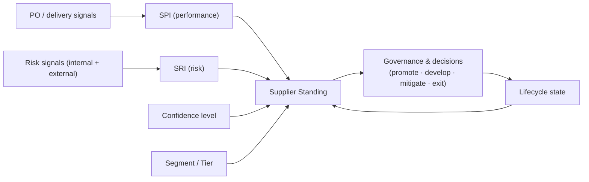
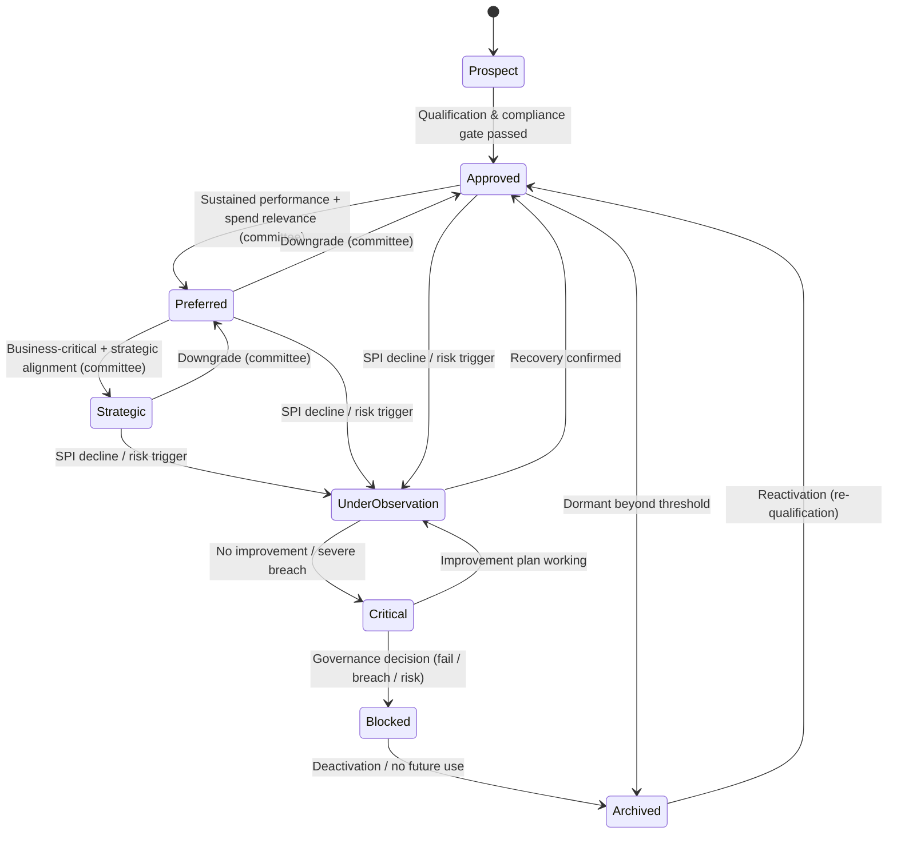
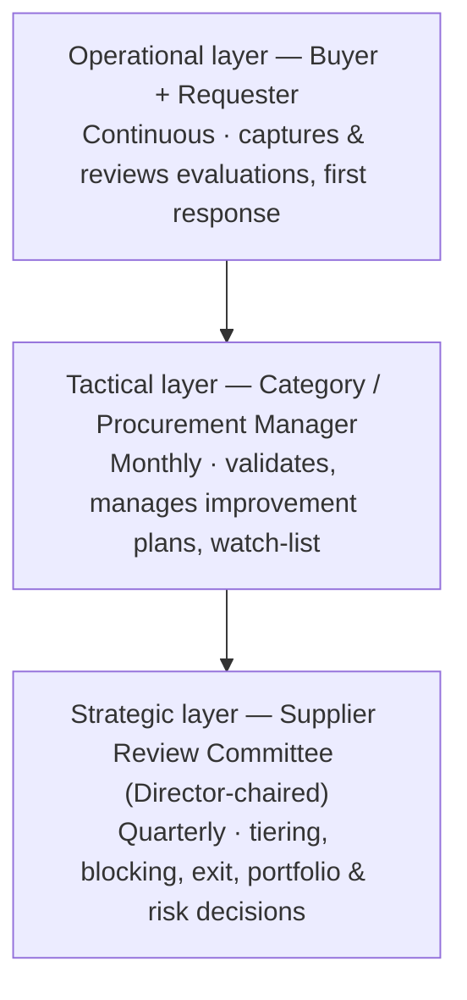
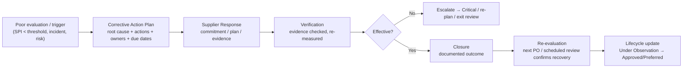
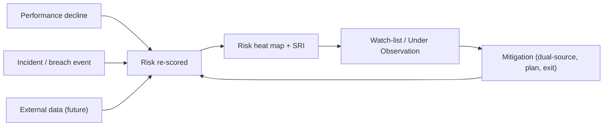
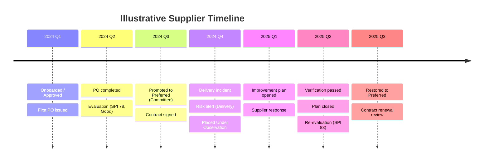
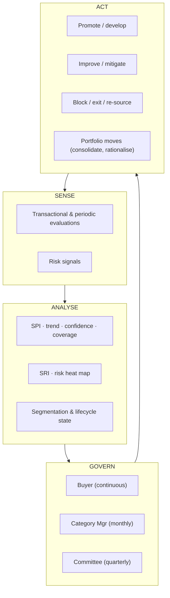

# UM6P — Supplier Performance Management Platform (SPM)
## Functional Design Document — The Supplier Performance Management Operating Model · v1.0

> **Document class:** Functional Vision / Target Operating Model (business, not technical)
> **Positioning:** This document **extends** — it does not repeat — the [Business Analysis Document](./BUSINESS_ANALYSIS.md) and [Product Backlog](./PRODUCT_BACKLOG.md). Those define *requirements*; this defines the **operating model** and **functional vision** UM6P Procurement will run for the next decade.
> **Benchmark ambition:** functional parity of intent with SAP Ariba Supplier Lifecycle & Performance (SLP), Ivalua, Jaggaer and Coupa — adapted to UM6P's SAP-driven, requester-centred reality.
> **Scope discipline:** no code, no SQL, no implementation. Pure procurement operating-model design.
> **Validation convention:** unconfirmed UM6P policies are flagged **[UM6P VALIDATION REQUIRED]** with a recommended default.

---

## 0. The Paradigm Shift — from Evaluations to Supplier Management

The Business Analysis correctly modelled the mechanical chain:

> **Purchase Order → Automatic Evaluation → Weighted Score → History**

That chain is the *sensor layer*. It is necessary but not sufficient. **Procurement does not manage evaluations — it manages suppliers.** An evaluation is a single reading; a supplier is a living relationship with a lifecycle, a segment, a risk profile, a spend footprint, contracts, contacts, and a governance history.

This document therefore inverts the centre of gravity:

| From (evaluation-centric) | To (supplier-centric) |
|---|---|
| The form is the object | The **supplier** is the object; the evaluation is one input |
| Score a transaction | **Manage a relationship over its lifecycle** |
| Backward-looking record | **Forward-looking governance & risk steering** |
| Procurement reacts | Procurement **governs on a cadence** |
| Data is stored | Data **drives decisions** (promote, develop, mitigate, exit) |

Everything below is organised around **one coherent model** with five composite indicators that recur across all chapters:

| Indicator | Meaning | Range | Where it lives |
|---|---|---|---|
| **Segment / Tier** | Strategic importance & relationship posture | Strategic → Transactional | Classification (Ch.2) |
| **Lifecycle State** | Where the supplier is in its life with UM6P | Prospect → Archived | Lifecycle (Ch.1) |
| **SPI — Supplier Performance Index** | Time-weighted weighted-score, 0–100 | 0–100 + band | Methodology (Ch.4) |
| **SRI — Supplier Risk Index** | Aggregated multi-domain risk, 0–100 (higher = worse) | 0–100 + heat level | Risk (Ch.8) |
| **Confidence Level** | How trustworthy the SPI is (coverage, volume, recency) | Low / Medium / High | Methodology (Ch.4) |

Together these form the **Supplier Standing** shown on the 360° header (Ch.5) and reviewed by the Committee (Ch.6). This is the spine of the operating model.



---

## Table of Contents
1. [Supplier Lifecycle](#1-supplier-lifecycle)
2. [Supplier Classification Model](#2-supplier-classification-model)
3. [Supplier Performance Governance](#3-supplier-performance-governance)
4. [Supplier Performance Methodology](#4-supplier-performance-methodology)
5. [Supplier 360° View](#5-supplier-360-view)
6. [Supplier Review Committee](#6-supplier-review-committee)
7. [Supplier Improvement Process](#7-supplier-improvement-process)
8. [Supplier Risk Management](#8-supplier-risk-management)
9. [Supplier KPIs](#9-supplier-kpis)
10. [Procurement Dashboards](#10-procurement-dashboards)
11. [Supplier Timeline](#11-supplier-timeline)
12. [Supplier Portfolio Management](#12-supplier-portfolio-management)
13. [Business KPIs](#13-business-kpis)
14. [Future Roadmap](#14-future-roadmap)
- [Appendix — Target Operating Model & Maturity](#appendix--target-operating-model--maturity)

---

## 1. Supplier Lifecycle

A supplier is not a static record; it moves through **states** governed by explicit **entry and exit conditions**. Unlike the *evaluation* lifecycle (already defined in the BA), this is the *relationship* lifecycle — the object Procurement actually manages.

**Design principle:** the lifecycle blends three forces — **onboarding gates** (compliance), **relationship promotion** (value & committee decision), and **performance/risk intervention** (protective). Movement is never automatic where judgement matters: promotions and blocking are **committee-governed** (Ch.6); interventions can be **system-triggered** but confirmed by governance.



### Stage definitions with entry / exit conditions

| Stage | Meaning | Entry conditions | Exit conditions |
|---|---|---|---|
| **Prospect** | Identified but not yet usable | Created/synced from SAP or sourcing; not yet qualified | Passes qualification & compliance → Approved; or discarded → Archived |
| **Approved** | Cleared for business; default active tier | Qualification + compliance documents valid; at least usable master data | Promotion → Preferred; decline → Under Observation; dormancy → Archived |
| **Preferred** | Proven, prioritised for relevant categories | Sustained SPI ≥ *Good* over N evaluations + meaningful spend/coverage + committee endorsement | Promotion → Strategic; decline → Under Observation; downgrade → Approved |
| **Strategic** | Business-critical partner, jointly managed | Preferred + business criticality (single/critical source, high spend, innovation) + committee decision + (ideally) contract | Downgrade → Preferred; decline/risk → Under Observation |
| **Under Observation** | Watch-listed; performance or risk concern | SPI drop below threshold, negative trend, risk escalation, or major incident | Recovery → previous tier; deterioration → Critical |
| **Critical** | Serious, unresolved performance/risk failure | Sustained failure under observation, severe breach, or critical-risk trigger | Improvement works → Under Observation; decision → Blocked |
| **Blocked** | Barred from new business (temporarily/permanently) | Governance decision: repeated failure, compliance/HSE/ethics breach, unacceptable risk | Remediation & re-qualification → Approved; or → Archived |
| **Archived** | Inactive; retained for history/audit | Dormant beyond threshold, obsolete, or post-block deactivation | Reactivation via re-qualification → Approved |

**Why this matters:** the lifecycle turns scores into *status with consequences*. A declining SPI does not merely record a low number — it **moves the supplier onto a watch-list**, triggers governance, and constrains sourcing behaviour (a Blocked supplier cannot receive new business). This is the difference between *evaluation* and *management*.

> **[UM6P VALIDATION REQUIRED]:** promotion thresholds (N evaluations, spend relevance), dormancy window, and whether blocking requires Director-level or Committee-level authority.

---

## 2. Supplier Classification Model

Segmentation answers: *"How much management attention, and what sourcing behaviour, does this supplier deserve?"* UM6P cannot manage all suppliers equally — attention must follow value and risk. This model rests on two industry-standard lenses layered together:

- **Kraljic matrix** (supply risk × spend/profit impact) → *strategic posture*.
- **ABC / Pareto** (spend concentration) → *effort allocation* (the ~20% of suppliers driving ~80% of spend/risk get the governance).

### 2.1 Classification dimensions
A supplier carries **independent, non-conflicting** classifications so it is never mis-summarised by a single label:

1. **Relationship tier** (management posture): Strategic · Preferred · Approved · Occasional/Transactional
2. **Performance flag** (from SPI): Under Observation · Critical *(overlays the tier)*
3. **Risk flag** (from SRI): High Risk *(overlays the tier)*
4. **Status** (usability): Active · Blocked · Archived

### 2.2 Category catalogue & how Procurement uses each

| Category | Definition | Typical entry criteria | How Procurement uses it | Governance cadence |
|---|---|---|---|---|
| **Strategic** | Business-critical, hard to replace, high impact | High spend/criticality + Kraljic "strategic/bottleneck" + committee | Joint business planning, innovation, executive relationship, protect continuity | Quarterly QBR + annual strategic review |
| **Preferred** | Proven performers, first choice in category | Strong SPI + relevant spend + committee endorsement | Direct-award/short-list bias, volume consolidation, develop toward strategic | Semi-annual review |
| **Approved** | Compliant, usable, unremarkable | Passed qualification; adequate SPI | Standard competitive sourcing; the working base | Annual + event-based |
| **Occasional / Transactional** | Low spend, infrequent, tail | Small/one-off purchases | Minimise effort; automate; candidate for rationalisation/aggregation | Event-based only |
| **Under Observation** | Performance/risk concern (overlay) | SPI decline / risk trigger | Restrict new critical work; require improvement plan; increase scrutiny | Monthly until cleared |
| **Critical** | Severe unresolved failure (overlay) | Sustained failure/breach | Contain exposure, find alternatives, prepare exit | Monthly / ad-hoc |
| **High Risk** | Elevated SRI regardless of performance (overlay) | Risk framework (Ch.8) | Mitigation plans, dual-sourcing, closer monitoring | Risk-cadence |
| **Blocked** | Barred from new business | Governance decision | Excluded from sourcing; existing commitments managed to closure | On event |

**Why separate tier from performance/risk flags?** A *Strategic* supplier can simultaneously be *Under Observation* and *High Risk* — that combination is exactly what leadership must see (a critical partner in trouble), and it would be hidden by a single label. Segmentation drives **effort**, performance drives **intervention**, risk drives **mitigation** — three different management responses.

> **[UM6P VALIDATION REQUIRED]:** whether UM6P wants a formal Kraljic quadrant tag per commodity, and the spend thresholds separating Strategic/Preferred/Approved/Transactional.

---

## 3. Supplier Performance Governance

Governance is the discipline that converts data into decisions with clear authority and separation of duties. Without it, scores are opinions; with it, they are the basis of institutional action.

### 3.1 Three governance tiers



### 3.2 Governance questions answered

| Question | Answer |
|---|---|
| **Who reviews results?** | Buyers review continuously (their suppliers); Category/Procurement Managers review monthly (their portfolio, watch-list); the Supplier Review Committee reviews quarterly (strategic/critical suppliers & portfolio). |
| **How often?** | Cadence scales with tier & risk: Strategic = quarterly; Preferred = semi-annual; Approved = annual + event; Under Observation/Critical = monthly. |
| **Who validates evaluations?** | Department Manager or Procurement validator per BA policy; validation is a control, not a re-scoring. **[UM6P VALIDATION REQUIRED]** |
| **Who decides corrective actions?** | Category/Procurement Manager proposes; owner is the buyer; Committee endorses for Strategic/Critical suppliers. |
| **Who can override a score?** | **No one edits a finalized evaluation** (immutable, per BA). Governance may **annotate, contest, or discount** an evaluation (e.g., flag as biased/unrepresentative) with a recorded reason — the original remains; a governance note adjusts how it counts. Override of the *aggregate posture* (tier, standing) is a **committee decision**, fully audited. |
| **Who decides tier changes, blocking, exit?** | The Supplier Review Committee, chaired by the Director of Procurement. |

**Score-override philosophy (important):** we deliberately separate *evidence* from *interpretation*. The evaluation (evidence) is immutable. Governance controls *interpretation* — it can down-weight an outlier, contextualise, or override the resulting **status**, always with a reason and audit trail. This preserves both data integrity and managerial judgement — the failure mode of naïve systems (managers quietly editing scores) is designed out.

### 3.3 Governance RACI (illustrative)

| Activity | Buyer | Requester | Category/Proc. Mgr | Quality/HSE | Committee/Director |
|---|:--:|:--:|:--:|:--:|:--:|
| Capture evaluation | I | **R** | I | C | I |
| Validate evaluation | I | I | **A/R** | C | I |
| Maintain watch-list | R | I | **A** | C | I |
| Launch improvement plan | **R** | C | **A** | C | I |
| Decide tier promotion/demotion | C | I | R | I | **A** |
| Decide block / exit | C | I | R | C | **A** |
| Override/contest interpretation | C | I | R | C | **A** |

*(R=Responsible, A=Accountable, C=Consulted, I=Informed)*

---

## 4. Supplier Performance Methodology

The methodology defines *how a defensible, comparable, trustworthy performance signal is produced* — the analytical core.

### 4.1 Performance dimensions (balanced scorecard)
The eight dimensions from the BA (Quality/Conformity, Delivery, Communication & Relationship, Technical, Commercial, Flexibility, Administrative Compliance, HSE) act as a **balanced scorecard**: no single lens dominates, and both hard (delivery, quality) and relationship (communication, flexibility) factors are captured. Compliance and HSE act as **guardrails** — chronic failure there can cap the overall rating regardless of other strengths. **[UM6P VALIDATION REQUIRED]: guardrail/cap rule.**

### 4.2 Weight philosophy
- Weights encode **UM6P's priorities per category** — for lab equipment, Quality & Technical dominate; for works, HSE & Delivery; for services, Communication & Flexibility.
- Weights are **governance-owned** (Director-approved), **total 100%** at each level, and **versioned** — so priorities can evolve without corrupting history.
- **Why category-specific weights:** a single global weighting is always wrong for someone; category weighting makes the score *fair and relevant* to how that supplier is actually used.

### 4.3 Scoring philosophy
- Sub-criterion scored **1–5**, justified (mandatory) → rolled up to a **0–100 SPI** with performance bands (Excellent ≥85 / Good 70–84 / Acceptable 55–69 / Poor 40–54 / Critical <40) — consistent with the BA.
- **Two evaluation types combine:** *transactional* (event-based, per completed PO — objective, frequent) and *periodic* (relationship review for Preferred/Strategic — holistic, less frequent). The SPI blends them. **Why:** transactional data is granular but narrow; periodic reviews capture relationship and strategic factors a single PO can't.

### 4.4 Evaluation frequency (cadence by tier)
| Tier | Transactional | Periodic |
|---|---|---|
| Strategic | Every eligible PO | Quarterly business review |
| Preferred | Every eligible PO | Semi-annual |
| Approved | Every eligible PO | Annual |
| Occasional | Sampled eligible POs | None |
| Under Observation / Critical | Every PO | Monthly |

### 4.5 Performance trends
- **Rolling SPI** (e.g., 6- and 12-month) plus **direction** (improving / stable / declining) and **momentum** (rate of change).
- **Why trend over snapshot:** a supplier at 72 rising is managed very differently from a supplier at 72 falling. Trend is the leading indicator that feeds the watch-list and lifecycle transitions.

### 4.6 Supplier rating
A published **letter/band rating** (e.g., A/B/C/D or the SPI band) that is the *communicated* verdict — simple enough for a committee slide, backed by the full SPI breakdown. Rating = f(SPI, trend, risk cap, confidence).

### 4.7 Historical calculations
- **Time-weighting (recency):** recent evaluations weigh more than old ones (e.g., exponential decay) so the SPI reflects *current* capability, not ancient history — **without ever altering** the immutable records.
- All history is preserved; the SPI is a *reproducible calculation over* history, versioned by matrix.

### 4.8 Confidence level
A distinctive, best-practice safeguard: **how much should we trust this SPI?**
- Driven by **volume** (number of evaluations), **coverage** (share of eligible spend/POs evaluated), **recency** (how fresh), and **diversity** (multiple requesters/dimensions, reducing single-evaluator bias).
- Expressed **Low / Medium / High** and shown next to every SPI.
- **Why:** a "score" of 90 from one evaluation is not the same fact as 90 from thirty. Confidence stops leadership from over-reacting to thin data and flags where more evaluation coverage is needed before making high-stakes decisions (blocking, strategic promotion).

### 4.9 Evaluation coverage
- **Coverage = evaluated eligible POs (or spend) ÷ total eligible.** Reported per supplier, category, department and buyer.
- Low coverage automatically **lowers confidence** and appears as a process KPI (Ch.9/13). **Why:** coverage is the guarantee that the SPI represents reality rather than a self-selected sample of complaints.

---

## 5. Supplier 360° View

The single screen where Procurement *manages the supplier*. It aggregates every signal into one navigable profile — the antithesis of today's scattered Excel files. Each section exists to answer a specific management question.

```
┌─────────────────────────────────────────────────────────────────────────┐
│ HEADER · Name · Segment/Tier · Rating · SPI (band) · SRI (heat) ·         │
│          Confidence · Lifecycle state · Status · Category · Owner buyer   │
├───────────────┬───────────────────────────────────────────────────────────┤
│ NAV           │ SECTION CONTENT                                           │
│ • General     │                                                          │
│ • Performance │                                                          │
│ • History     │                                                          │
│ • POs         │                                                          │
│ • Evaluations │                                                          │
│ • Contracts   │                                                          │
│ • Risk        │                                                          │
│ • Improvement │                                                          │
│ • Committee   │                                                          │
│ • Timeline    │                                                          │
│ • KPIs        │                                                          │
│ • Contacts    │                                                          │
│ • Documents   │                                                          │
└───────────────┴───────────────────────────────────────────────────────────┘
```

| Section | What it shows | Why it exists (management question) |
|---|---|---|
| **Header — Supplier Standing** | Tier, Rating, SPI, SRI, Confidence, lifecycle state, status | "At a glance, how do we stand with this supplier?" — the executive summary. |
| **General Information** | Legal identity, category/commodity, campus/department footprint, key data (from SAP) | "Who exactly is this supplier and what do they supply us?" |
| **Performance** | SPI, per-dimension radar, trend, band, transactional vs periodic split, confidence | "How well do they perform, where, and is it improving?" |
| **History** | Chronological, immutable list of all finalized evaluations & scores | "What is the evidence base behind the rating?" |
| **Purchase Orders** | POs (open/completed), spend, coverage, requester/buyer split | "What & how much are we buying, and is it being evaluated?" |
| **Evaluations** | Live status of pending/overdue/completed evaluations | "What performance signals are in flight?" |
| **Contracts** | Linked contracts/agreements, validity, renewal dates *(deepens in future phase)* | "What are we committed to, and when do we renegotiate?" |
| **Risk** | SRI, risk-domain heat map, active risks, mitigations | "What could go wrong and what are we doing about it?" |
| **Improvement Plans** | Active/closed plans, actions, owners, status, outcomes | "Are we fixing the problems, and is it working?" |
| **Committee Decisions** | Log of governance decisions (tiering, blocking, actions) with rationale | "What has leadership decided about this supplier and why?" |
| **Timeline** | Unified chronological event stream (Ch.11) | "Tell me the whole story of this relationship in order." |
| **KPIs** | Supplier-specific KPIs (Ch.9) with targets & trends | "How does this supplier measure against expectations?" |
| **Contacts** | Supplier & internal contacts (relationship owners, key users) | "Who do I talk to — on both sides?" |
| **Documents** | Certificates, evidence, meeting minutes, correspondence | "Where is the supporting evidence and paperwork?" |

**Why a 360° view is the product's centrepiece:** it operationalises the paradigm shift. A buyer preparing a renewal, a manager handling a complaint, a committee reviewing a strategic partner all open the *same* profile and see the *same* truth — end of fragmentation, end of "it depends who you ask."

---

## 6. Supplier Review Committee

The governance heartbeat — the recurring forum where supplier performance becomes supplier *decisions*. This is what distinguishes an SPM *program* from an SPM *tool*.

### 6.1 Charter
- **Purpose:** review supplier performance & risk, decide tiering, corrective actions, blocking and exit, and steer the supplier portfolio.
- **Chair:** Director of Procurement.
- **Cadence:** **quarterly** for Strategic/Critical/High-Risk suppliers and portfolio; ad-hoc for urgent escalations. Tactical (category) reviews run monthly and feed the quarterly committee. **[UM6P VALIDATION REQUIRED]**
- **Scope:** by exception & importance — the committee does not review all suppliers, it reviews the ones that matter (strategic, watch-listed, high-risk, and portfolio-level themes).

### 6.2 Participants
| Role | Contribution |
|---|---|
| Director of Procurement (Chair) | Decisions, strategy, arbitration |
| Category / Procurement Managers | Portfolio insight, recommendations |
| Buyers (relevant) | Ground truth on their suppliers |
| Quality & HSE | Compliance/conformity perspective |
| Department Manager (invited) | Business impact / requester voice |
| Risk/Compliance (as needed) | Risk & audit perspective |
| Procurement Administrator | Prepares the pack, records minutes & actions |

### 6.3 Standard agenda
1. Review of previous actions (closure status).
2. Portfolio dashboard: coverage, SPI distribution, risk heat map, movements between tiers.
3. Strategic & Preferred suppliers: QBR outcomes, trends, opportunities.
4. Watch-list: Under Observation / Critical — improvement-plan status.
5. High-Risk suppliers: mitigation review.
6. Decisions: promotions/demotions, blocks/exits, new improvement plans, sourcing implications.
7. AOB / escalations.

### 6.4 KPIs reviewed
Portfolio SPI & trend, evaluation coverage, overdue evaluations, risk distribution, top/bottom suppliers, improvement-plan completion, strategic & preferred supplier performance, spend concentration — see Ch.9 & 13.

### 6.5 Decisions (decision types)
Promote / demote tier · launch / close improvement plan · place Under Observation / escalate to Critical · **block** / **exit / archive** · mandate dual-sourcing · approve strategic development action · contest/discount an evaluation (with reason).

### 6.6 Outputs
- **Minutes** (decisions + rationale) — captured against each supplier's *Committee Decisions* section and *Timeline*.
- **Action register** — each action with owner, due date, status.
- **Updated standings** — tier/lifecycle changes reflected on the 360° view.

### 6.7 Meeting history & action tracking
Every meeting is retained (agenda, pack, minutes, decisions); every action is tracked to closure and visible on dashboards (Committee Dashboard, Ch.10). **Why:** closed-loop governance — decisions without tracked actions are theatre. The committee's own effectiveness becomes measurable (action-closure rate, Ch.13).

---

## 7. Supplier Improvement Process

The structured mechanism that turns a bad signal into a managed recovery — modelled on established **corrective-action (CAPA / 8D)** discipline. It is the operational answer to "so what?" after a poor score.



### Responsibilities (RACI)

| Step | Buyer | Requester | Category/Proc. Mgr | Quality/HSE | Supplier | Committee |
|---|:--:|:--:|:--:|:--:|:--:|:--:|
| Trigger detection | I | I | **A** | C | I | I |
| Root-cause & plan | **R** | C | A | C | C | I |
| Supplier response | C | I | A | I | **R** | I |
| Verification | R | C | A | **C/R** | C | I |
| Closure decision | C | I | **A** | C | I | I* |
| Re-evaluation | I | **R** | A | C | I | I |

*Committee accountable for Critical/Strategic cases.*

**Controls:** timeboxed steps (SLA per stage), escalation on breach, mandatory evidence at verification, and **no self-closure** — an improvement plan closes only on verified re-measurement. **Why:** the classic failure is "action noted, never verified." Designing verification and re-evaluation as mandatory gates makes improvement *real and provable*, and it feeds the *Improvement-Plan Completion* KPI.

> **[UM6P VALIDATION REQUIRED]:** SLA durations per step, and whether suppliers respond via email (now) or the future Supplier Portal.

---

## 8. Supplier Risk Management

Performance tells you how a supplier *has done*; risk tells you how they *might fail*. A mature SPM manages both, because a high-performing single-source supplier can still be an existential exposure.

### 8.1 Risk domains

| Risk domain | What it captures | Example signals |
|---|---|---|
| **Operational** | Capacity, continuity, dependency on the supplier | Missed deliveries, capacity constraints, key-person dependency |
| **Financial** | Supplier's financial health & viability | Late-payment disputes, insolvency signals, over-reliance on UM6P |
| **Quality** | Conformity & defect exposure | Rising defect/non-conformity rate, failed inspections |
| **Delivery** | Timeliness & reliability of supply | Chronic lateness, incomplete deliveries |
| **Compliance** | Legal/contractual/regulatory conformity | Expired certificates/insurance, contract breaches |
| **ESG** | Environmental, social, governance & ethics | Environmental incidents, labour/ethics concerns |
| **Country / Geopolitical** | Location-driven exposure | Political instability, logistics/customs, currency |
| **Single-Source** | No qualified alternative exists | Sole supplier for a critical item |
| **Critical-Supplier** | Aggregate business-criticality exposure | Strategic supplier whose failure halts operations |

### 8.2 Risk scoring & the SRI
- Each domain scored on **likelihood × impact**; domains aggregate (weighted) into the **Supplier Risk Index (SRI, 0–100)** with a heat level (Low/Medium/High/Critical).
- **Inherent vs residual:** raw exposure vs exposure after mitigations — so the committee sees whether controls are actually working.
- **Risk-adjusted standing:** a high SRI can **cap** the supplier's rating and force a lifecycle move to Under Observation even with a good SPI. **Why:** a great score at extreme risk is not a green light.

### 8.3 How risks evolve
Risk is dynamic and is refreshed from three streams:
1. **Performance-linked signals** (internal): declining SPI dimensions auto-raise the matching risk (e.g., falling Delivery scores → Delivery risk).
2. **Event signals:** incidents, compliance lapses, disputes logged on the timeline.
3. **External signals** *(future, Ch.14):* financial-health feeds, country risk, ESG data.
- **Early-warning indicators** move suppliers onto the watch-list *before* failure; the risk **heat map** and **register** track evolution over time.



**Why single-source & critical-supplier are called out separately:** these are the exposures that cause the most damage yet are invisible to a performance-only model. Explicitly flagging them drives **dual-sourcing strategy and business-continuity planning** — core procurement risk practice.

> **[UM6P VALIDATION REQUIRED]:** risk-domain weights, SRI thresholds, and which external risk feeds (if any) UM6P will license.

---

## 9. Supplier KPIs

The supplier-level measurement catalogue. Each KPI has a clear purpose and owner; together they feed the dashboards (Ch.10) and committee (Ch.6). *(Program-level success metrics are in Ch.13 — this chapter is about measuring **suppliers**.)*

| KPI | Definition | Purpose / decision it informs |
|---|---|---|
| **Average Supplier Score (SPI)** | Time-weighted overall performance | Core performance verdict |
| **Evaluation Coverage** | Evaluated eligible POs/spend ÷ total eligible | Trust in the SPI; process health |
| **Late / Overdue Evaluations** | Count/% past due | Governance discipline; coverage risk |
| **Supplier Ranking** | Ordinal position within category/portfolio | Sourcing & consolidation choices |
| **Average Quality** | Mean of Quality/Conformity dimension | Quality steering; defect exposure |
| **Average Delivery** | Mean of Delivery dimension | Reliability & continuity |
| **Supplier Trend** | Direction & momentum of SPI | Leading indicator for intervention |
| **Department Satisfaction** | Aggregated requester sentiment/scores per department | Internal-customer view; adoption |
| **Buyer Performance** | Coverage & timeliness of a buyer's suppliers | Accountability of the buyer function |
| **Category Performance** | Aggregate SPI/risk per commodity | Category strategy |
| **Improvement-Plan Completion** | % plans closed effectively on time | Effectiveness of the recovery process |
| **Risk Distribution (SRI)** | Spread of suppliers across risk heat levels | Portfolio risk posture |
| **Top Suppliers** | Highest SPI (with confidence & spend) | Preferred/strategic candidates |
| **Bottom Suppliers** | Lowest SPI / worst trend | Improvement, blocking, exit candidates |
| **Strategic Supplier Performance** | SPI & trend of Strategic tier | Protect the crown jewels |
| **Preferred Supplier Performance** | SPI & trend of Preferred tier | Develop toward strategic; validate preference |

**Design note — always pair score with confidence & spend.** A "top/bottom" list without confidence or spend context misleads (a bottom supplier we barely use is not a priority). Every ranking KPI is contextualised. **Why:** prevents the classic dashboard trap of acting on statistically meaningless extremes.

---

## 10. Procurement Dashboards

Dashboards are **decision surfaces**, each purpose-built for its audience. This chapter defines the *strategic* SPM analytics layer that sits above the operational screens in the BA.

| Dashboard | Purpose | Primary users | Key widgets | Headline KPIs | Drill-down |
|---|---|---|---|---|---|
| **Executive** | Steer the supplier portfolio & program | Director, senior leadership | Portfolio SPI distribution, tier & risk heat maps, top/bottom, coverage gauge, trend, program KPIs | Avg SPI, coverage, risk distribution, strategic/preferred performance, improvement completion | → category → supplier 360° |
| **Buyer** | Manage *my* suppliers day-to-day | Buyers/Acheteurs | My supplier list with SPI/SRI/trend, my coverage, my open improvement plans, upcoming reviews | My-portfolio SPI, my coverage, overdue in my scope | → supplier 360° → evaluation |
| **Supplier** | Deep single-supplier decision surface | Buyer, Manager, Committee | The 360° view (Ch.5) rendered as an interactive dashboard | SPI, SRI, confidence, trend, KPIs | → history, risk, plans, timeline |
| **Department** | Internal-customer performance view | Department Managers | Suppliers used by the department, satisfaction, coverage, overdue evaluations owned by dept | Dept satisfaction, dept coverage | → requester → evaluation |
| **Committee** | Run & track governance | Director, Committee | Quarterly pack: movements, watch-list, risk, action register with closure status, decisions log | Action-closure rate, watch-list size, risk trend | → supplier 360° → decision |

**Cross-cutting rules:** every dashboard is **scope-aware** (role/department/campus), **filterable** (period, category, campus, tier, band, risk), **drill-down to the 360°**, and shows **confidence & coverage** alongside scores so numbers are never read naked. **Why five distinct dashboards:** a Director steering a portfolio and a buyer chasing one overdue evaluation need different altitudes of the same truth — one dashboard for all would serve none well.

> **Note:** the "Supplier Dashboard" here is *internal* (Procurement looking at a supplier). A *supplier-facing* dashboard is a future-phase capability (Ch.14).

---

## 11. Supplier Timeline

A single, chronological narrative of the entire relationship — the supplier's "medical record." Everything that happens to or with a supplier lands as a timestamped event on **one stream**.



**Event types on the timeline:** PO issued/completed · evaluation finalized · rating/tier change · risk alert · improvement plan (opened/updated/closed) · committee review & decision · contract event (sign/renew/expire) · incident/complaint · document added · status change (block/archive/reactivate).

**Why one timeline matters:** it is the antidote to institutional amnesia. When a buyer changes role, a new committee member joins, or an auditor asks "what happened with this supplier?", the answer is one scrollable, immutable story instead of a hunt across mailboxes and spreadsheets. It also makes the *narrative* for committee reviews self-assembling. Events are **filterable by type** and each links to its source record.

---

## 12. Supplier Portfolio Management

Zooming out from the single supplier to **managing the base as a portfolio** — the strategic-procurement discipline of allocating attention, consolidating spend, controlling the tail, and rationalising the base.

| Portfolio lens | What Procurement does with it | Best-practice rationale |
|---|---|---|
| **All suppliers** | Baseline: total base size, spend-under-management, coverage | Know the universe you govern |
| **Commodity / category** | Compare & manage suppliers within a category; category strategy | Category management; benchmark within like-for-like |
| **Strategic suppliers** | Protect, develop, invest relationship time; continuity plans | Value concentration — most impact per supplier |
| **Preferred suppliers** | Consolidate volume, bias awards, develop toward strategic | Reward & reinforce good performance |
| **Blocked suppliers** | Exclude from sourcing; manage existing commitments to closure | Risk containment; policy enforcement |
| **Low-performing suppliers** | Improvement plans, re-sourcing, exit pipeline | Cut the drag on quality/delivery |
| **New suppliers** | Onboarding funnel, qualification status, early-life monitoring | Control who enters the base |
| **Dormant suppliers** | Review for archive/reactivation; clean the base | **Supplier-base rationalisation** — fewer, better-managed suppliers |

**Portfolio-level moves the platform must enable:**
- **Spend concentration analysis** (ABC/Pareto) — are we over-fragmented?
- **Tail-spend management** — automate/aggregate the long tail of transactional suppliers.
- **Rationalisation** — reduce redundant suppliers per category; consolidate to Preferred.
- **Coverage steering** — direct evaluation effort where spend/risk is highest.

**Why portfolio management is the strategic payoff:** individual supplier management prevents problems; portfolio management *creates value* — leverage in negotiation, fewer/better suppliers, spend consolidated with proven performers, and risk deliberately diversified. This is where UM6P moves from *administering purchases* to *strategic procurement*.

> **[UM6P VALIDATION REQUIRED]:** dormancy threshold, target supplier-base size per category, and tail-spend policy.

---

## 13. Business KPIs

Where Ch.9 measures *suppliers*, this chapter measures **the success of the SPM program itself** — the transformation scorecard leadership uses to judge whether the investment is paying off. Grouped into five families.

### 13.1 Platform KPIs (is it being used?)
| KPI | Why it matters |
|---|---|
| Active-user adoption (by role) | Adoption is the precondition for every other benefit |
| Evaluation completion rate & cycle time | The engine's throughput |
| Login/usage frequency of dashboards | Are decisions actually data-informed? |
| Data freshness (SAP sync health) | Trust in the whole system |

### 13.2 Supplier KPIs (are suppliers better?)
| KPI | Why it matters |
|---|---|
| Portfolio average SPI & trend | Are our suppliers improving overall? |
| Strategic/Preferred performance | Are our most important relationships healthy? |
| Risk distribution & trend (SRI) | Are we more or less exposed over time? |
| Improvement-plan effectiveness | Does intervention actually work? |

### 13.3 Operational KPIs (is the process healthy?)
| KPI | Why it matters |
|---|---|
| Evaluation coverage (spend & count) | Representativeness of all our data |
| Overdue rate & escalations | Governance discipline |
| Confidence-level distribution | How trustworthy is our aggregate picture? |
| Buyer & department performance | Accountability across the function |

### 13.4 Strategic KPIs (is value created?)
| KPI | Why it matters |
|---|---|
| Spend-under-management via SPM | Reach of managed procurement |
| Supplier-base rationalisation (count trend) | Fewer, better-managed suppliers |
| Spend consolidated with Preferred/Strategic | Leverage & relationship payoff |
| Risk reduction (high-risk supplier count/trend) | Continuity & resilience |
| Single-source exposure reduction | Structural risk removed |

### 13.5 Management / Governance KPIs (is it governed?)
| KPI | Why it matters |
|---|---|
| Committee cadence adherence | Governance is actually happening |
| Action-register closure rate | Decisions turn into outcomes |
| Tier-movement activity (promotions/demotions/blocks) | The model is live, not static |
| Time-to-intervention (trigger → improvement plan) | Responsiveness of the operating model |

**Why separate program KPIs from supplier KPIs:** a portfolio can look healthy while the *program* is failing (low adoption, poor coverage) — and vice versa. Leadership must see both to know whether good numbers are real and whether the investment is delivering. This is the transformation dashboard a Big-Four program office would report to the steering committee.

---

## 14. Future Roadmap

Designed as **maturity horizons**, each raising UM6P's SPM maturity (see Appendix). Sequencing reflects value vs. dependency — deliver the operating model first, then intelligence, then ecosystem breadth.

### Horizon 1 — Now (this program)
The operating model in this document: supplier lifecycle, segmentation, SPI/SRI/confidence, 360° view, governance & committee, improvement process, risk framework, dashboards, portfolio management.

### Horizon 2 — Next (extend & connect)
| Capability | What it adds | Why |
|---|---|---|
| **Supplier Portal** | Suppliers view scores, acknowledge, respond to improvement plans, submit documents | Two-way SRM; faster, collaborative improvement; supplier accountability |
| **Power BI integration** | Advanced, self-service analytics & executive reporting over SPM data | Deeper insight, board-level reporting, ad-hoc analysis |
| **Microsoft Teams integration** | Notifications, approvals, committee prep in the flow of work | Adoption — meet users where they already work |
| **Contract Management link** | Connect performance to contracts, renewals, SLAs, obligations | Close the loop: performance drives renewal/renegotiation decisions |

### Horizon 3 — Later (intelligence & breadth)
| Capability | What it adds | Why |
|---|---|---|
| **AI-generated evaluation summaries** | Auto-summarise justifications, detect themes/sentiment, flag inconsistencies | Turn free-text into insight; reduce evaluator effort; surface bias |
| **Predictive supplier risk** | Forecast failure/decline from internal + external signals | Move from reactive to *anticipatory* risk management |
| **Benchmarking** | Compare suppliers/categories against peers or market baselines | Objective performance context; sharper negotiation |
| **Supplier Development Plans** | Proactive joint development beyond corrective action | Grow strategic suppliers; create value, not just fix problems |
| **Supplier Audits** | Structured on-site/desk audits (quality, HSE, ESG) integrated with scoring | Deeper assurance for critical/high-risk suppliers |
| **ESG Management** | Dedicated ESG scoring, evidence & reporting | Regulatory direction & UM6P's sustainability mandate |

**Why this order:** intelligence (AI, predictive) is only as good as the disciplined data and governance beneath it — so the operating model comes first. The portal and Teams/Power BI maximise adoption and reach of what already works. ESG and audits deepen assurance where the portfolio view says it's most needed. **This is a 10-year capability path, not a feature wish-list.**

---

## Appendix — Target Operating Model & Maturity

### A.1 Operating model on a page


### A.2 SPM maturity model (where UM6P is heading)
| Level | Name | Characteristic | Enabled by |
|---|---|---|---|
| 1 | **Ad-hoc** | Excel, inconsistent, reactive *(today)* | — |
| 2 | **Standardised** | Automatic evaluations, weighted scores, history | BA + Architecture |
| 3 | **Managed** | Lifecycle, segmentation, governance, risk, 360°, committee | **This document (Horizon 1)** |
| 4 | **Integrated** | Portal, contracts, Power BI, Teams, portfolio value | Horizon 2 |
| 5 | **Intelligent** | Predictive risk, AI insight, benchmarking, ESG, development | Horizon 3 |

### A.3 Golden thread
Every capability in this document traces back to one purpose: **enable UM6P Procurement to manage suppliers — not evaluations — as strategic assets, on a governed cadence, with defensible data.** Evaluations are how we *sense*; this operating model is how we *manage*.

---

## Document Control
| Field | Value |
|---|---|
| Version | 1.0 (Functional Vision — for review) |
| Extends | [BUSINESS_ANALYSIS.md](./BUSINESS_ANALYSIS.md), [PRODUCT_BACKLOG.md](./PRODUCT_BACKLOG.md) |
| Aligns with | [ARCHITECTURE_BLUEPRINT.md](./ARCHITECTURE_BLUEPRINT.md), [ROADMAP.md](./ROADMAP.md) |
| Audience | Director of Procurement, Procurement leadership, program steering committee |
| Approver | **Director of Procurement (Directeur des Achats)** |
| Open items | All **[UM6P VALIDATION REQUIRED]** flags to be resolved in the operating-model workshop |

*End of Functional Design Document v1.0 — the Supplier Performance Management Operating Model.*
