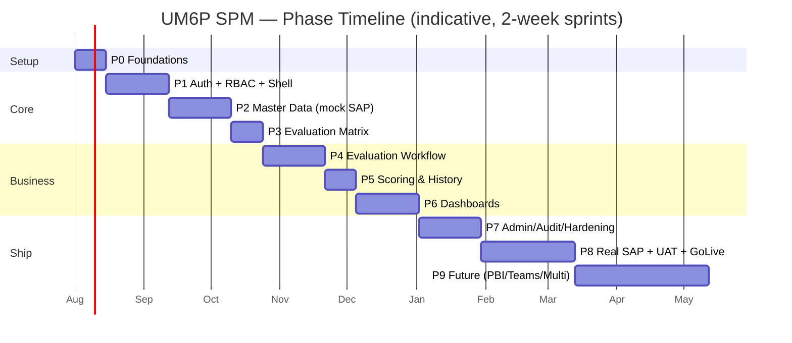

# UM6P SPM — Development Roadmap & Sprint Plan
## Companion to [ARCHITECTURE_BLUEPRINT.md](./ARCHITECTURE_BLUEPRINT.md) · v1.0

> **Cadence:** 2-week sprints. **Definition of Done (global):** typecheck + lint clean, unit/integration tests pass, migrations reversible, RLS proven for touched tables, four UX states present, accessible (AA), demoed to Procurement, deployed to staging.
> Estimates are engineering-relative (a small team of 2–4). Dates depend on team size and **[UM6P INPUT REQUIRED]** items in the blueprint.

---

## Phase Map (at a glance)

---

## Phase 0 — Foundations *(Sprint 1)*
**Goal:** a running, deployable empty shell with all rails in place. No business features.

**Sprint 1 backlog**
- Initialize repo, Next.js 15 + TS strict, Tailwind, shadcn/ui, ESLint (incl. `no-explicit-any`, `no-restricted-imports` for domain boundaries), Prettier, Husky + lint-staged.
- CI/CD: GitHub Actions (typecheck, lint, test, build) + preview deploys; staging environment.
- Supabase project (dev/staging), `database/` migration harness, `database.types.ts` generation script.
- Entra ID **app registration** (redirect URIs, scopes) — coordinate with DSI. *[UM6P INPUT]*
- Design tokens (light/dark), theme provider, base layout primitives, `cn()` util, `lib/` skeleton.
- DDD folder skeleton for all 9 domains (empty `index.ts` barrels) + ESLint boundary rule.
- **Mock SAP adapter** + `SapAdapter` interface + fixture data.
- `.env.example`, `README.md`, `CLAUDE.md`, ADR log.

**Exit criteria:** CI green; `/health` deployed to staging; a developer clones and runs in <15 min; theme toggle works.

---

## Phase 1 — Authentication + RBAC + App Shell *(Sprints 2–3)*
**Goal:** users sign in with UM6P accounts; access is governed and provably isolated; the shell is navigable.

**Sprint 2 — Identity & Access**
- Entra SSO via Supabase OIDC; `/auth/callback`; httpOnly cookie sessions; middleware route guard.
- `users` JIT provisioning from Entra claims; sign-in/out; `last_login_at`.
- Schema: `roles`, `permissions`, `role_permissions`, `user_roles`, `campuses`; seed default roles/permissions (from blueprint §10–11).
- RLS helper functions (`auth.has_permission`, `auth.campus_ids`, `auth.is_global`); enable RLS default-deny on identity tables.
- **Integration tests proving isolation** (user A cannot read user B's scoped rows).
- `audit_logs` table + `write_audit_log` trigger + `set_audit_fields` trigger (foundation used by all later domains).

**Sprint 3 — App Shell & Shared UI**
- AppShell: sidebar (permission-filtered nav from `config/nav`), topbar (search, campus switcher, notifications bell placeholder, theme, user menu), breadcrumbs, PageHeader.
- Shared components: `DataTable` (TanStack Table, server-side sort/filter/paginate/export), chart wrappers scaffold, `EmptyState`, `ErrorState`, skeletons, toaster.
- Route groups `(auth)`/`(app)`; `loading.tsx`/`error.tsx` conventions; 401/403/404 pages.
- Access-denied UX; permission-aware buttons/links.

**Exit criteria:** a real UM6P user logs in via Entra, lands on a role-appropriate empty shell; RLS isolation tests pass; audit records login and role changes.

---

## Phase 2 — Master Data via SAP (mock) *(Sprints 4–5)*
**Goal:** suppliers, POs, and personnel flow in through the ACL and are browsable.

**Sprint 4 — Sync engine + Suppliers**
- Sync orchestration: `sap_sync_runs`/`sap_sync_items`, delta watermark, idempotent upsert, ordering (suppliers → personnel → POs).
- Cron route `/api/cron/sap-sync` (+ manual "Run sync now" for admins, permission `purchase_orders.sync`).
- `suppliers`, `supplier_categories` tables + RLS; Supplier list (DataTable) + detail page; block/unblock (`suppliers.manage`).
- Sync health admin panel (last run, counts, failures).

**Sprint 5 — Purchase Orders + personnel resolution**
- `purchase_orders` (+ optional `purchase_order_lines`) tables + RLS; PO list + detail; requester/purchaser resolution to `users` (lazy JIT).
- `POCompleted` detection (status transition + eligibility rules from `app_settings`) — emit event (consumed in Phase 4).
- Reconciliation report (SAP-mock vs SPM counts); scoped views (`purchase_orders.read` own vs all).

**Exit criteria:** running the mock sync populates suppliers/POs/users; lists & details work with correct scoping; completing a PO in the mock raises `POCompleted` (logged, not yet acted on).

---

## Phase 3 — Evaluation Matrix *(Sprint 6)*
**Goal:** Procurement can define and version the weighted scoring model.

**Sprint 6 backlog**
- `evaluation_matrices`, `evaluation_criteria` tables + RLS (`matrix.manage`).
- Matrix builder UI: dimensions, criteria, `WeightSlider`, scale config; per-category matrices.
- Guardrails: weights must total 100 (`enforce_matrix_weights` trigger + UI validation); activation lifecycle (DRAFT → ACTIVE → ARCHIVED); one active default per category.
- Versioning: activating a new version archives the prior; existing evaluations keep their snapshot.
- Seed a default matrix for demo/UAT. *[UM6P INPUT: signed-off criteria & weights]*

**Exit criteria:** a director creates, weights (=100 enforced), and activates a matrix; versioning preserved.

---

## Phase 4 — Evaluation Workflow *(Sprints 7–8)*
**Goal:** the core automation — completed PO becomes an assigned, fillable, validated evaluation, with notifications.

**Sprint 7 — Auto-generation & assignment**
- `evaluations`, `evaluation_responses` tables + RLS (owner vs scope vs all).
- Event handler: `POCompleted` → select active matrix (by category) → assign evaluator (PO requester) → create `evaluation` (PENDING, snapshot `matrix_version`, `due_date`).
- Assignment service with fallbacks (unresolved requester → hold + resolve on login; manager override).
- Notifications domain: `notifications` table, in-app bell, Outlook/Graph mail sender (queue + retry + status). *[UM6P INPUT: Graph vs SMTP]*
- `EvaluationCreated` → notify evaluator.

**Sprint 8 — Fill, submit, validate, lifecycle**
- `EvaluationForm` (RHF + Zod, shared schema): score per criterion, comments, save draft (IN_PROGRESS), submit (SUBMITTED).
- `StatusStepper`; optimistic UI; four states.
- Validation step (`evaluations.validate`) → VALIDATED/REJECTED; reassign (`evaluations.reassign`); reopen (`evaluations.reopen`).
- Lifecycle sweep cron `/api/cron/evaluation-lifecycle`: mark OVERDUE, send reminders, escalate to manager.
- Full audit on every transition; emit `EvaluationSubmitted` / `EvaluationValidated`.

**Exit criteria:** golden path works end-to-end (PO completes → evaluator notified → fills → submits → validated), overdue reminders fire, all transitions audited.

---

## Phase 5 — Scoring & Supplier History *(Sprint 9)*
**Goal:** turn validated evaluations into scores and durable supplier performance history.

**Sprint 9 backlog**
- `scoring.service.computeWeightedScore` (Σ score×weight normalized); store denormalized `weighted_score` + `by_dimension`, reproducible from responses.
- `SupplierScoreUpdated` on `EvaluationValidated`; `supplier_scores` rollup table + refresh job; live `v_supplier_performance` view.
- Supplier scorecard: overall score, per-dimension `SupplierRadar`, trend over time, evaluation list.
- Indexes/materialized views for performance.

**Exit criteria:** validating an evaluation updates the supplier's score & history; scorecard renders trend + dimensions; numbers reconcile to raw responses.

---

## Phase 6 — Dashboards & Analytics *(Sprints 10–11)*
**Goal:** Procurement decision-making surfaces.

**Sprint 10 — Procurement dashboard**
- KPI cards (evaluations pending/overdue/completed, avg supplier score, completion rate); trends; ranking bars (top/bottom suppliers); by-category and by-campus breakdowns.
- Personal "My evaluations" work queue (evaluator home) with the partial-index-backed fast query.

**Sprint 11 — Executive & exports**
- Executive dashboard (`dashboards.view.executive`): portfolio health, risk suppliers, period comparisons.
- Filters (period, campus, category, supplier); saved views; CSV/Excel export; print/PDF scorecard.
- Empty/loading/error states for every widget; streaming with Suspense.

**Exit criteria:** dashboards are fast over seeded multi-year data; exports work; scoping correct per role.

---

## Phase 7 — Administration, Audit & Hardening *(Sprints 12–13)*
**Goal:** operable, secure, accessible, performant.

**Sprint 12 — Admin & Audit**
- User admin (list, roles, campus scope), role/permission management (`admin.roles.manage`), `app_settings` UI (sync cadence, eligibility, due window, validation toggle).
- Audit explorer (`audit.read`): filter by actor/entity/action/date; immutable, exportable.
- Sync administration (history, replay failed items, manual run).

**Sprint 13 — Hardening**
- Security review: RLS coverage audit, service-role usage audit, secrets review, CSP/headers, dependency scan; **penetration-test checklist**.
- Performance: query/index review, N+1 elimination, rollup/materialized-view tuning, load test dashboards.
- Accessibility audit (AA) + keyboard/screen-reader pass; i18n FR/EN copy pass.
- Observability: structured logs, error tracking, sync/notification alerting, uptime.

**Exit criteria:** security & a11y sign-off; load targets met; runbooks written.

---

## Phase 8 — Real SAP Integration + UAT + Go-Live *(Sprints 14–16)*
**Goal:** connect live SAP behind the same ACL and launch to production.

**Sprint 14 — Real adapter**
- Implement `odata.adapter.ts` (or middleware/file adapter per **[UM6P INPUT]**) against the *unchanged* `SapAdapter` interface; secrets in vault; network path (VPN/private link) validated.
- Field mapping validation vs real SAP; edge cases (statuses, missing emails, currencies).

**Sprint 15 — Parallel run & reconciliation**
- Run real sync in staging against production-like SAP; reconcile counts/values vs expectations; fix mapping drift; tune cadence/back-pressure.
- Data migration/backfill plan for historical POs if in scope.

**Sprint 16 — UAT, training, cutover**
- UAT with Procurement (pilot campus/category); defect burn-down; sign-off.
- Training materials + sessions (evaluators, managers, admins); FR-first docs.
- Production cutover: go/no-go checklist, rollback plan, hypercare window; official launch.

**Exit criteria:** live SAP data flowing; Procurement using SPM as the system of record; hypercare stable.

---

## Phase 9 — Future Enhancements *(post-launch backlog)*
- **Power BI** embedded analytics over read models/views (RLS-respecting).
- **Microsoft Teams** notifications & adaptive cards for evaluations/reminders.
- **Multi-campus activation** (campus switcher live across all campuses; per-campus governance).
- **Supplier self-service portal** (suppliers view their scores/feedback) — separate auth boundary.
- Advanced analytics: predictive risk scoring, benchmarking, contract linkage.
- Mobile-optimized evaluation completion / PWA.

---

## Cross-Cutting Workstreams (run every phase)
| Workstream | Ongoing activity |
|---|---|
| **Security** | RLS per new table + isolation test; audit new write paths; secrets discipline. |
| **Testing** | Unit (services), integration (repos+RLS), E2E golden path kept green. |
| **Docs/ADR** | Every significant decision → ADR; keep blueprint versioned. |
| **UX** | Four states on every surface; a11y; FR-first copy. |
| **Stakeholder demo** | End-of-sprint demo to Direction des Achats; capture feedback into backlog. |
| **DevOps** | Migrations reversible; staging parity; alerting on sync/notification/errors. |

---

## Milestones & Governance Gates
| Gate | After | Sign-off by |
|---|---|---|
| **G1 — Secure foundation** | Phase 1 | IT/DSI + Security |
| **G2 — Data trust** | Phase 2 | Procurement + Integration |
| **G3 — Business model locked** | Phase 3 | Direction des Achats |
| **G4 — Automation works** | Phase 4–5 | Procurement |
| **G5 — Decision-ready** | Phase 6 | Direction des Achats + Executives |
| **G6 — Production-ready** | Phase 7 | Security + IT/DSI |
| **G7 — Go-Live** | Phase 8 | Steering committee |

---
*This roadmap is a living plan. Scope per phase is fixed at its start; new asks land in the backlog and are scheduled at the next planning boundary.*
