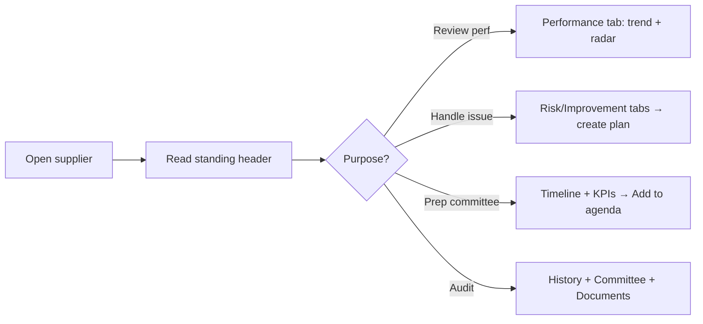

# Functional Specs & UX Blueprint — Part 1 · Core Screens

> Screens **1–5**: Login · Home Dashboard · Supplier Dashboard · Supplier 360° · Purchase Orders.
> Follows the [Part 0 — UX Foundations](./00_UX_FOUNDATIONS.md) template (F17). Global patterns (states F10, validation F11, permissions F12, responsive F14, accessibility F15, vocab F16) are inherited; only deviations are stated.

---

# Screen 1 — Login

**1. Purpose.** Authenticate UM6P staff via Microsoft Entra ID SSO and land them on a role-appropriate home. No local passwords.

**2. Target Users.** All actors (any authenticated UM6P user).

**3. Route & Entry Points.** `/sign-in` (public). Arrived at by: unauthenticated access to any protected route (redirect with `?returnTo=`), session expiry, explicit sign-out.

**4. Permissions.** Public. Post-auth, role/scope resolved from Entra + `user_roles`. First-ever login → JIT provisioning + default `EVALUATOR` role.

**5. Wireframe.**
```
┌──────────────────────────────────────────────────────────┐
│                                                            │
│              [ UM6P logo ]                                 │
│              Supplier Performance Management               │
│                                                            │
│        ┌──────────────────────────────────────┐           │
│        │  Sign in to continue                  │           │
│        │  [  ▮ Sign in with Microsoft  ]       │           │
│        │  Use your UM6P account.               │           │
│        │  ─────────────────────────────────    │           │
│        │  [ FR | EN ]   Need help? Contact IT   │           │
│        └──────────────────────────────────────┘           │
│              © UM6P · Privacy · v1.0                        │
└──────────────────────────────────────────────────────────┘
   (split-panel on ≥lg: left brand imagery, right card)
```

**6. Component Hierarchy.**
```
<AuthLayout>
├─ <BrandPanel> (logo, product name, tagline, imagery)
└─ <SignInCard>
   ├─ <MicrosoftSignInButton>
   ├─ <LangToggle>
   ├─ <HelpLink>
   └─ <AuthErrorBanner?>
<AppFooter minimal>
```

**7. Layout & Regions.** Centered card (single action). No data tables/charts.

**8. Field Definitions.** None (delegated to Entra). Only the SSO button.

**9. Actions.**
| Action | Trigger | Permission | Confirm? | Result |
|---|---|---|---|---|
| Sign in with Microsoft | Click | Public | No | Redirect to Entra → callback → session → `returnTo` or `/` |
| Toggle language | Click FR/EN | Public | No | UI language switches |

**10. Validation & Error Messages.** Auth failures shown in `AuthErrorBanner`: access denied (« Accès refusé. Contactez l'administrateur. »), tenant/consent error, network error (Retry). No credential fields to validate.

**11. States.** Loading = button spinner "Redirecting…". Error = banner + retry. No empty state. Already-authenticated visiting `/sign-in` → redirect to `/`.

**12. Business Rules.** SSO only (C-2, AS-4). JIT provisioning on first login (creates `users` row, default role). Session via httpOnly cookies. `returnTo` must be an internal path (open-redirect guard).

**13. Notifications.** None on this screen. (Sign-in event → audit log.)

**14. User Flow.**
```mermaid
flowchart LR
A[Visit protected URL] --> B{Session?}
B -- No --> C[/sign-in]
C --> D[Click Microsoft]
D --> E[Entra auth + MFA]
E --> F[/auth/callback]
F --> G{First login?}
G -- Yes --> H[Provision user + default role]
G -- No --> I[Load roles]
H --> I --> J[Redirect returnTo or Home]
B -- Yes --> J
```

**15. Navigation Flow.** Success → Home (Screen 2). Failure → stay with error.

**16. Responsive.** ≥lg split-panel; ≤md single centered card, brand panel hidden.

**17. Accessibility.** Card is a labeled `main` landmark; SSO button descriptive (« Se connecter avec Microsoft »); error banner `role="alert"`; language toggle sets `lang`.

**18. Acceptance Criteria.**
- **AC1.** Given an unauthenticated user opening any protected URL, they are redirected to `/sign-in` with `returnTo` preserved and returned there after login.
- **AC2.** Given a first-time valid UM6P user, a `users` record and default role are created and they land on Home.
- **AC3.** Given an Entra denial, a plain-language error with retry is shown; no technical detail leaks.
- **AC4.** Given an authenticated user, visiting `/sign-in` redirects to Home.
- **AC5.** Sign-in and provisioning are recorded in the audit log.

---

# Screen 2 — Home Dashboard

**1. Purpose.** A role-adaptive landing page: the user's most important supplier-performance information and next actions, at a glance. Not one dashboard — a **role-aware composition** of widgets.

**2. Target Users.** All roles (content varies): Evaluator sees "my work"; Manager/Director see governance/portfolio; Purchaser sees "my suppliers"; Admin sees ops health.

**3. Route & Entry Points.** `/` (default post-login; Home nav item; logo click).

**4. Permissions.** View: all authenticated. Widgets are permission-gated (F12) — a widget the user can't see is omitted, not empty. Scope = role + department + campus.

**5. Wireframe.**
```
Breadcrumb: Home
H1: Bonjour, {prénom} · [Campus ▾][Period ▾]
┌ KPI ROW (role-based, 4 cards) ─────────────────────────────┐
│ [My pending 6] [Overdue 2] [Avg SPI 78 ▲] [Coverage 88% ▲] │
└────────────────────────────────────────────────────────────┘
┌ 2/3 column ───────────────────────┐ ┌ 1/3 column ─────────┐
│ "My Evaluations" table (Evaluator)│ │ Notifications feed  │
│  or "Watch-list" (Manager)         │ │ (recent 5)          │
│  or "My Suppliers" (Purchaser)     │ ├─────────────────────┤
├───────────────────────────────────┤ │ Quick actions       │
│ Portfolio SPI trend (chart)        │ │ • Open matrix       │
│  (Manager/Director) OR             │ │ • Run report        │
│ Recently completed (Evaluator)     │ │ • …                 │
└───────────────────────────────────┘ └─────────────────────┘
```

**6. Component Hierarchy.**
```
<Page Home>
├─ <PageHeader> (Greeting, CampusSwitcher, PeriodFilter)
├─ <KpiRow> (KpiCard × up to 4, role-based)
├─ <TwoThirdsColumn>
│  ├─ <PrimaryWorklistWidget> (DataTable, role-based content)
│  └─ <TrendOrActivityWidget> (TrendLine | activity list)
└─ <OneThirdColumn>
   ├─ <NotificationsFeed>
   └─ <QuickActions>
```

**7. Layout & Regions.** KPI row (F6) + master worklist table (F5) + secondary chart/activity + right rail (notifications feed + quick actions). Widget set resolved by role config.

**8. Field Definitions (KPI/widget config).**
| Widget | Metric | Source | Notes |
|---|---|---|---|
| My Pending | count of my `PENDING/IN_PROGRESS` | evaluations (own) | Evaluator/Purchaser |
| Overdue | count `OVERDUE` in scope | evaluations | color danger if >0 |
| Avg SPI | scope avg SPI + delta | supplier scores | Manager/Director |
| Coverage | evaluated ÷ eligible + delta | POs/evaluations | Manager/Admin |
| Watch-list size | UNDER_OBSERVATION+CRITICAL | suppliers | Manager/Director |
| Sync health | last run status | sap_sync_runs | Admin |

**9. Actions.**
| Action | Trigger | Permission | Result |
|---|---|---|---|
| Open evaluation | Row click | evaluations.read.own | → Evaluation Form (S7) |
| Open supplier | Row/link click | suppliers.read | → Supplier 360° (S4) |
| Change period/campus | Filter | View | Recompute widgets (URL-persisted) |
| Quick action | Click | per action perm | Navigate to target screen |
| Mark notification read | Click | View | Update feed |

**10. Validation & Error Messages.** None (read-only). Per-widget error uses inline `ErrorState` + retry (page stays usable if one widget fails, F10).

**11. States.** Loading = KPI + table + chart skeletons (stream independently). Empty (new user) = welcome `EmptyState` per role ("No evaluations assigned yet — completed POs will appear here."). Error = per-widget.

**12. Business Rules.** Widget composition is role-driven (F12). All metrics respect scope + selected period/campus. SPI/coverage/confidence semantics per Functional Design.

**13. Notifications.** Consumes notification feed (F13); no triggers.

**14. User Flow.** Login → Home → user scans KPIs → opens top pending item or drills a KPI → acts.

**15. Navigation Flow.** KPI drill → filtered Analytics/Workspace; worklist row → detail screen; quick action → target.

**16. Responsive.** KPI 4→2→1; two-column → stacked (worklist first, right rail below) ≤md.

**17. Accessibility.** Greeting is `h1`; each widget is a labeled `region`; KPI deltas have text equivalents ("up 4% vs last quarter"), not color-only.

**18. Acceptance Criteria.**
- **AC1.** Given an Evaluator, the home shows *My pending/overdue* KPIs and a *My Evaluations* worklist scoped to them; no governance widgets appear.
- **AC2.** Given a Director, portfolio SPI/coverage/watch-list widgets appear, scoped to campus/period.
- **AC3.** Changing Period/Campus recomputes all widgets and updates the URL.
- **AC4.** A failing widget shows retry without breaking the page.
- **AC5.** Every KPI is clickable and drills to its detailed source with matching filters.

---

# Screen 3 — Supplier Dashboard (Supplier List)

**1. Purpose.** The searchable, filterable master list of all suppliers with performance/risk/tier at a glance — the entry point to supplier management and portfolio work.

**2. Target Users.** Purchaser, Manager, Director, Admin, Quality/HSE, Viewer, Auditor (scoped).

**3. Route & Entry Points.** `/suppliers`. From: nav, global search, KPI drill (e.g., "bottom suppliers"), Portfolio segments.

**4. Permissions.** View: `suppliers.read`. Manage (block/edit meta): `suppliers.manage`. Scope: role + department + campus (Purchaser sees own suppliers; Manager/Director broader).

**5. Wireframe.**
```
Breadcrumb: Home › Suppliers
H1: Suppliers                         [Export][Columns][+ Add? (admin)]
┌ FilterBar: [Search…] [Tier▾][Band▾][Risk▾][Status▾][Category▾][Campus▾] (chips) [Clear] ┐
└──────────────────────────────────────────────────────────────────────────────────────┘
┌ DataTable ──────────────────────────────────────────────────────────────────┐
│ ☐ Supplier ▲ | Tier | SPI | Trend | Risk | Confidence | Coverage | Cat | ⋮   │
│ ☐ ACME Labs  | STRAT| 84● | ▲    | MED  | HIGH       | 92%      | Lab | ⋮   │
│ ☐ BuildCo    | APPR | 47● | ▼    | HIGH | LOW        | 40%      | Wrk | ⋮   │
│ ...                                                                          │
│ [Bulk: Export | Add to committee agenda]        [1–50 of 312]  ‹ 1 2 3 ›     │
└──────────────────────────────────────────────────────────────────────────────┘
```

**6. Component Hierarchy.**
```
<Page Suppliers>
├─ <PageHeader> (Title, ExportBtn, ColumnsBtn, AddSupplierBtn?)
├─ <FilterBar> (SearchInput, FilterChips…, ClearAll)
└─ <DataTable Suppliers>
   ├─ <BulkActionBar?>
   ├─ Columns: SelectCol, SupplierNameLink, TierBadge, ScoreBadge, TrendIcon,
   │           RiskBadge, ConfidencePill, CoverageMeter, CategoryTag, RowMenu
   └─ <Pagination>
```

**7. Layout & Regions.** FilterBar (F8) + DataTable (F5). Optional saved views ("My suppliers", "Watch-list", "High risk", "Strategic").

**8. Field Definitions (columns).**
| Column | Type | Source | Sortable | Notes |
|---|---|---|---|---|
| Supplier | link | supplier.name | ✓ | → Supplier 360° |
| Tier | TierBadge | segment | ✓ | STRATEGIC… |
| SPI | ScoreBadge | supplier score | ✓ | band-colored, tabular |
| Trend | icon | rolling SPI | ✓ | ▲/▬/▼ + `aria-label` |
| Risk | RiskBadge | SRI level | ✓ | |
| Confidence | ConfidencePill | confidence | ✓ | Low/Med/High |
| Coverage | meter+% | evaluated/eligible | ✓ | |
| Category | tag | commodity | ✓ | |
| Status | Badge | ACTIVE/BLOCKED/ARCHIVED | ✓ | hidden by default |
| ⋮ | menu | — | — | View, Add to agenda, Block (perm) |

**9. Actions.**
| Action | Trigger | Permission | Confirm? | Result |
|---|---|---|---|---|
| Open supplier | Row click / name | suppliers.read | No | → S4 |
| Filter/search | FilterBar | View | No | Server filter, URL-persist |
| Sort | Header | View | No | Server sort |
| Export | Button | View | No | CSV/Excel of current filter |
| Toggle columns | Button | View | No | Persist per user |
| Add to committee agenda | Row/bulk menu | committee.access | No | Adds to next agenda (S12) |
| Block supplier | Row menu | suppliers.manage | **Yes + reason** | Status→BLOCKED, audited, notify |
| Add supplier | Header | suppliers.manage | No | Manual create (rare; SAP is source) |

**10. Validation & Error Messages.** Block requires a reason (min length, F11). Filtered-empty message + Clear filters. Export of 0 rows disabled with tooltip.

**11. States.** Loading = 8 skeleton rows. Empty (no suppliers synced) = "No suppliers yet — run SAP synchronization." (link if Admin). Filtered-empty distinct. Error = inline retry.

**12. Business Rules.** SAP is source of truth (RULE-14); manual add is exceptional. Scope enforced (RULE-12). SPI/trend/confidence/coverage per Functional Design. Blocked suppliers visibly flagged and excluded from sourcing lists elsewhere.

**13. Notifications.** Block → notifies relationship owner + manager (F13). No others.

**14. User Flow.** Open list → filter to segment (e.g., High risk) → sort by SPI asc → open worst supplier → act.

**15. Navigation Flow.** Row → S4; bulk "Add to agenda" → S12; block confirm → stays with toast.

**16. Responsive.** md hides Category/Confidence (low priority); ≤sm rows collapse to stacked cards (Supplier, SPI, Risk, Tier + View).

**17. Accessibility.** Trend/risk/band never color-only (icon + text); sort state announced; row menu keyboard-reachable.

**18. Acceptance Criteria.**
- **AC1.** A Purchaser sees only suppliers in their scope; a Director sees campus-wide.
- **AC2.** Sorting by SPI ascending surfaces worst performers with confidence & coverage visible.
- **AC3.** Blocking requires a reason, updates status, writes audit, notifies owner, and the supplier is thereafter excluded from sourcing pick-lists.
- **AC4.** Filters and sort serialize to the URL and restore on back-navigation.
- **AC5.** Export reflects the exact current filter and column set.

---

# Screen 4 — Supplier 360°

**1. Purpose.** The single, complete profile where a supplier is *managed* — the product's centrepiece (Functional Design Ch.5). Aggregates standing, performance, POs, evaluations, contracts, risk, improvement plans, committee decisions, timeline, KPIs, contacts, documents.

**2. Target Users.** Purchaser (owner), Manager, Director, Committee, Quality/HSE, Auditor (read), Viewer.

**3. Route & Entry Points.** `/suppliers/:id` (tabs as `/suppliers/:id/{section}`). From: list, search, timeline links, committee, notifications, PO/evaluation links.

**4. Permissions.** View: `suppliers.read` (+ scope). Actions vary: Block/edit meta `suppliers.manage`; create improvement plan `evaluations.read.all`+manager; add committee note `committee.access`; export report `dashboards.view`. Auditor/Viewer read-only.

**5. Wireframe.**
```
Breadcrumb: Home › Suppliers › ACME Labs
┌ HEADER (Supplier Standing) ───────────────────────────────────────────────┐
│ ACME Labs   [STRATEGIC]  Rating A   SPI 84 ● Good  Risk MED  Conf HIGH      │
│ Lifecycle: PREFERRED→…  Owner: S.Amine   Campus: Benguerir  [Actions ▾]     │
└────────────────────────────────────────────────────────────────────────────┘
[ General | Performance | History | POs | Evaluations | Contracts | Risk |
  Improvement | Committee | Timeline | KPIs | Contacts | Documents ]
┌ Tab content (e.g., Performance) ──────────────────────────────────────────┐
│ [SPI trend line]         [8-dimension radar]        [band + confidence]     │
│ [per-dimension bars]     [coverage meter]           [transactional/periodic]│
└────────────────────────────────────────────────────────────────────────────┘
```

**6. Component Hierarchy.**
```
<Page Supplier360>
├─ <SupplierHeader> (Name, TierBadge, RatingBadge, ScoreBadge, RiskBadge,
│                    ConfidencePill, LifecycleStepper, OwnerAvatar, ActionsMenu)
├─ <Tabs>
│  ├─ GeneralPanel (info cards, from SAP, read-only)
│  ├─ PerformancePanel (TrendLine, SupplierRadar, dimension bars, coverage, confidence)
│  ├─ HistoryPanel (DataTable of finalized evaluations, immutable)
│  ├─ POsPanel (DataTable of POs + spend summary)
│  ├─ EvaluationsPanel (DataTable of live evaluations by status)
│  ├─ ContractsPanel (list; future-deepened)
│  ├─ RiskPanel (SRI, RiskHeatMap, risk register, mitigations)
│  ├─ ImprovementPanel (plans list + status)
│  ├─ CommitteePanel (decisions log)
│  ├─ TimelinePanel (embedded Timeline, Screen 11)
│  ├─ KpisPanel (supplier KPI cards)
│  ├─ ContactsPanel (supplier + internal contacts)
│  └─ DocumentsPanel (AttachmentList + upload)
└─ <ActionsMenu> (Block, Create improvement plan, Add to agenda, Export report, Add note)
```

**7. Layout & Regions.** Sticky **SupplierHeader** (standing) + **Tabs**. Each tab = cards/tables/charts per F5/F6. Header stays visible while scrolling tabs.

**8. Field Definitions (per tab, key items).**
| Tab | Key content | Source | Editable? |
|---|---|---|---|
| General | Legal name, ID, category, campus/dept footprint, contact, status | SAP | Read-only (meta editable w/ `suppliers.manage`) |
| Performance | SPI, band, trend, radar (8 dims), coverage, confidence, txn/periodic split | computed | Read-only |
| History | Finalized evaluations: PO, date, score, band, evaluator, matrix version | evaluations | Immutable (RULE-8) |
| POs | PO#, date, amount, status, requester, evaluated? | SAP | Read-only |
| Evaluations | Live evals: status, due, evaluator, actions | evaluations | Reassign (perm) |
| Contracts | Contract#, type, validity, renewal date | (future) | Future phase |
| Risk | SRI, domain heat map, active risks, mitigations, inherent/residual | risk model | Add/mitigate (perm) |
| Improvement | Plan#, trigger, status, owner, due, outcome | plans | Create/manage (perm) |
| Committee | Decision, date, rationale, decided-by | committee | Add note (perm) |
| Timeline | All events chronologically | aggregate | Read-only |
| KPIs | Supplier KPI cards (Ch.9) | computed | Read-only |
| Contacts | Name, role, email, phone (supplier + internal owner) | mixed | Edit internal (perm) |
| Documents | File, type, uploaded-by, date | storage | Upload/delete (perm) |

**9. Actions.**
| Action | Trigger | Permission | Confirm? | Result |
|---|---|---|---|---|
| Block / Unblock | Actions menu | suppliers.manage | Yes + reason | Status change, audit, notify, lifecycle move |
| Create improvement plan | Actions / Improvement tab | manager | No | → Improvement Plan create (S9) |
| Add to committee agenda | Actions menu | committee.access | No | Queued for next committee (S12) |
| Export supplier report | Actions menu | dashboards.view | No | PDF/Excel scorecard (S13) |
| Add committee note/decision | Committee tab | committee.access | No | Appended + timeline event + audit |
| Reassign evaluation | Evaluations tab row | evaluations.reassign | Yes + reason | Reassign (S6) |
| Upload document | Documents tab | suppliers.manage | No | Attach (type/size validated) |
| Edit internal contact | Contacts tab | suppliers.manage | No | Update |

**10. Validation & Error Messages.** Block/decision/reassign need mandatory reason (F11). Upload validates type/size. Contracts/Contacts edits validate email/date formats. Historical evaluations reject any edit attempt (« Les évaluations finalisées sont immuables. »).

**11. States.** Header loads first (skeleton standing). Each tab lazy-loads with its own skeleton/empty/error. Empty examples: "No improvement plans", "No committee decisions yet", "No documents". History empty = "No finalized evaluations yet."

**12. Business Rules.** Standing = Tier + SPI + SRI + Confidence + Lifecycle (Functional Design). History immutable (RULE-8, RULE-16). Blocking follows lifecycle rules (Ch.1). Time-weighted SPI; confidence from coverage/volume/recency. Scope enforced.

**13. Notifications.** Block, improvement-plan creation, committee decision, reassignment → notify per F13/BA §25 and append timeline events.

**14. User Flow.**


**15. Navigation Flow.** Tabs deep-link (`/suppliers/:id/risk`). Cross-links: PO→PO detail (S5), evaluation→S7, plan→S9, timeline event→source. Actions open S9/S12/S13.

**16. Responsive.** Header wraps standing chips to two rows ≤md; Tabs become a scrollable tab-strip then a select `▾` on ≤sm; charts stack; tables collapse to cards.

**17. Accessibility.** Sticky header is a labeled region; tab pattern via Radix (`role="tablist"`, arrow-key nav, `aria-selected`); radar/trend provide table fallback; standing chips have text labels not color-only.

**18. Acceptance Criteria.**
- **AC1.** The header shows Tier, Rating, SPI+band, SRI+level, Confidence, and lifecycle state, computed per the operating model.
- **AC2.** History lists only finalized evaluations and rejects any edit (immutability proven).
- **AC3.** Each tab lazy-loads with its own loading/empty/error and deep-links via URL.
- **AC4.** Blocking from here requires a reason, moves the lifecycle, writes audit, notifies, and adds a timeline event.
- **AC5.** A high SRI visibly caps/annotates the rating even when SPI is good.
- **AC6.** All actions are permission-gated and scope-enforced; Auditor/Viewer see read-only.

---

# Screen 5 — Purchase Orders

**1. Purpose.** Browse SAP-synced POs, understand which are completed/eligible/evaluated, and trace the transaction that grounds each evaluation. Read-only toward SAP.

**2. Target Users.** Purchaser (own), Manager/Director/Admin (broader), Requester (own), Auditor.

**3. Route & Entry Points.** `/purchase-orders` (list), `/purchase-orders/:id` (detail). From: nav, Supplier 360° POs tab, evaluation links, search.

**4. Permissions.** View: `purchase_orders.read` (own) / `purchase_orders.read.all`. Manual sync trigger elsewhere (`purchase_orders.sync`). Manual evaluation creation `evaluations.create`. Scope enforced.

**5. Wireframe (list).**
```
Breadcrumb: Home › Purchase Orders
H1: Purchase Orders                                   [Export][Columns]
┌ FilterBar: [Search PO#/supplier] [Status▾][Eligible▾][Evaluated▾][Category▾][Period][Campus] ┐
└───────────────────────────────────────────────────────────────────────────────────────────────┘
┌ DataTable ───────────────────────────────────────────────────────────────────┐
│ PO# ▲ | Supplier | Amount | Status | Completed | Requester | Eval? | ⋮        │
│ 4500.| ACME Labs| 120,000| COMPLETED| 2026-05-10| Y.Bennani | ✓VALID | ⋮      │
│ 4501.| BuildCo  |  8,000 | COMPLETED| 2026-05-12| N.Idrissi | — (ineligible)  │
│ ...                                                            [1–50 of …]    │
└────────────────────────────────────────────────────────────────────────────────┘
```
**Detail (`/:id`):** header (PO#, supplier link, status, amount, dates) + tabs/sections: **Overview** (requester, purchaser, department, commodity, currency), **Lines** (line items), **Evaluation** (linked evaluation status + link or "Create evaluation" if eligible & missing), **Timeline/Audit** (sync + status changes).

**6. Component Hierarchy.**
```
<Page PurchaseOrders>            <Page PODetail>
├─ PageHeader                    ├─ POHeader (PO#, SupplierLink, StatusBadge, Amount, Dates)
├─ FilterBar                     ├─ Tabs: Overview | Lines(DataTable) | Evaluation | Audit
└─ DataTable POs                 └─ EvaluationLinkCard / CreateEvaluationAction
   └─ Columns + RowMenu
```

**7. Layout & Regions.** List = FilterBar + DataTable. Detail = header + tabbed sections; Evaluation section is the key link between PO and performance.

**8. Field Definitions (list columns + detail fields).**
| Field | Type | Source | Notes |
|---|---|---|---|
| PO# | link | SAP | → detail |
| Supplier | link | SAP | → S4 |
| Amount | number(currency) | SAP | right-aligned, MAD |
| Status | Badge | SAP | OPEN…CANCELLED |
| Completed date | date | SAP | |
| Requester | text/avatar | SAP→users | evaluator |
| Purchaser | text/avatar | SAP→users | |
| Department / Commodity | tag | SAP | filters |
| Eligible? | boolean chip | rule engine | why-not tooltip |
| Evaluated? | status chip | evaluations | none/pending/validated + link |
| Lines (detail) | table | SAP | material, qty, unit price, amount |

**9. Actions.**
| Action | Trigger | Permission | Confirm? | Result |
|---|---|---|---|---|
| Open PO | Row click | purchase_orders.read | No | → detail |
| Open supplier / evaluation | Link | resp. perms | No | → S4 / S7 |
| Create evaluation (manual) | Detail, eligible+missing | evaluations.create | Yes | Creates & assigns (audited) |
| Export | Button | View | No | CSV/Excel |
| Filter/sort/columns | Toolbar | View | No | URL-persist |

**10. Validation & Error Messages.** Manual create only when eligible & no existing evaluation (else button hidden with tooltip « Évaluation déjà existante » / « PO non éligible »). No editing of SAP fields (read-only; any attempt blocked with explanation).

**11. States.** Loading = skeleton rows. Empty = "No purchase orders yet — sync from SAP" (Admin link). Filtered-empty distinct. Error = inline retry. Detail: Evaluation section empty = context-aware ("Not eligible: below minimum amount" or "Eligible — evaluation will be generated automatically").

**12. Business Rules.** Read-only from SAP (RULE-14, SAP-7). Eligibility engine decides evaluation need (FR-9). One evaluation per PO (RULE-2). Completed-PO detection drives auto-generation (FR-8/10). Scope enforced.

**13. Notifications.** Manual evaluation creation → notifies assigned evaluator (F13). No others from this screen.

**14. User Flow.** Filter to Completed + Not-evaluated → open a PO → see it's eligible but ungenerated → create evaluation (or verify auto-generation) → follow link to evaluation.

**15. Navigation Flow.** List→detail; detail→supplier (S4), →evaluation (S7); create→S7.

**16. Responsive.** md hides Purchaser/Department; ≤sm rows→stacked cards (PO#, Supplier, Amount, Status, Eval?); detail tabs→select.

**17. Accessibility.** Eligible/Evaluated chips have text + tooltip (not color-only); amount columns marked as numeric; detail sections are labeled regions.

**18. Acceptance Criteria.**
- **AC1.** A Purchaser sees only their POs; broader roles see wider scope; no SAP field is editable.
- **AC2.** Filtering to Completed + Not-evaluated + Eligible reveals coverage gaps.
- **AC3.** For an eligible PO lacking an evaluation, an authorized user can create one; it is assigned to the requester and audited; ineligible/duplicate cases hide the action with explanation.
- **AC4.** Each PO links to its supplier and its evaluation; each evaluation traces back to exactly one PO.
- **AC5.** Empty and error states guide the user (sync link for admins).

---
*End of Part 1. Continue: [Part 2 — Evaluation Screens](./02_screens_evaluation.md).*
