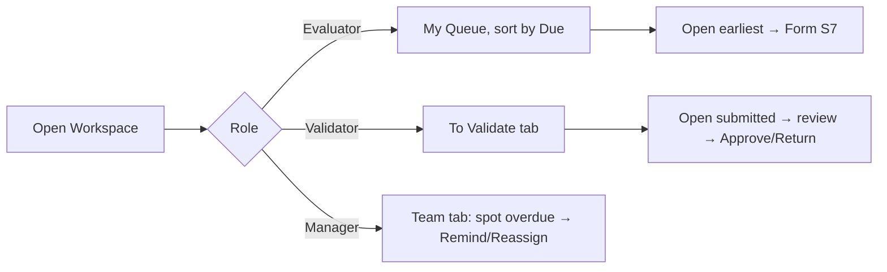
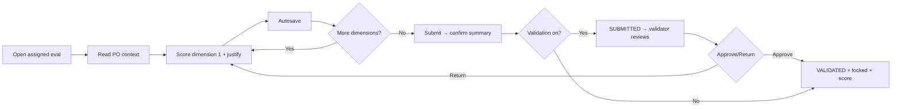
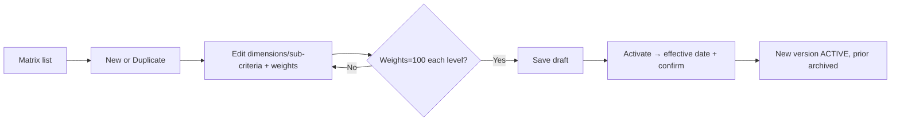

# Functional Specs & UX Blueprint — Part 2 · Evaluation Screens

> Screens **6–8**: Evaluation Workspace · Evaluation Form · Evaluation Matrix Builder.
> Inherits [Part 0 — UX Foundations](./00_UX_FOUNDATIONS.md). Only deviations stated.

---

# Screen 6 — Evaluation Workspace

**1. Purpose.** The operational cockpit for evaluations across their lifecycle: the evaluator's task queue and managers' oversight of assignment, progress, overdue and validation. This is where evaluation *work* is triaged (the Form, S7, is where a single one is filled).

**2. Target Users.** Evaluator/Requester (own queue), Purchaser/Manager/Director (oversight in scope), Validator (validation queue), Admin.

**3. Route & Entry Points.** `/evaluations` (tabs: `?view=my|team|validation|all`). From: nav, Home worklist, notifications, Supplier 360° Evaluations tab, PO detail.

**4. Permissions.** View own: `evaluations.read.own`. View all/scope: `evaluations.read.all`. Validate: `evaluations.validate`. Reassign: `evaluations.reassign`. Reopen: `evaluations.reopen`. Create: `evaluations.create`. Scope = role + department + campus.

**5. Wireframe.**
```
Breadcrumb: Home › Evaluations
H1: Evaluations                                   [Export][Columns]
[ Tabs: My Queue (6) | Team (24) | To Validate (3) | All ]   ← permission-gated
┌ FilterBar: [Search supplier/PO] [Status▾][Due▾][Supplier▾][Category▾][Campus▾][Evaluator▾] ┐
└──────────────────────────────────────────────────────────────────────────────────────────┘
┌ DataTable ────────────────────────────────────────────────────────────────────┐
│ ☐ Supplier | PO# | Status | Due ▲ | Evaluator | Progress | Score | ⋮          │
│ ☐ ACME Labs| 4500| IN_PROG| 3d    | me        | 5/8      | —     | ⋮  [Open]   │
│ ☐ BuildCo  | 4489| OVERDUE| -2d ⚠ | me        | 0/8      | —     | ⋮           │
│ ☐ NovaTech | 4471| SUBMIT | —     | R.Alami   | 8/8      | 81    | ⋮  [Validate]│
│ [Bulk: Remind | Reassign]                             [1–50 of …]  ‹ 1 2 ›     │
└────────────────────────────────────────────────────────────────────────────────┘
```

**6. Component Hierarchy.**
```
<Page EvaluationWorkspace>
├─ PageHeader (Title, Export, Columns)
├─ <Tabs> (MyQueue | Team | ToValidate | All — filtered by permission)
├─ <FilterBar>
└─ <DataTable Evaluations>
   ├─ <BulkActionBar?> (Remind, Reassign)
   ├─ Columns: Select, SupplierLink, POLink, StatusBadge, DuePill, EvaluatorAvatar,
   │           ProgressMeter (n/8), ScoreBadge?, RowMenu, InlinePrimaryBtn(Open/Validate)
   └─ Pagination
<ReassignDialog> · <RemindDialog> · <ValidateDialog>
```

**7. Layout & Regions.** Tabs (queues) + FilterBar (F8) + DataTable (F5). Row-level primary action adapts to status (Open for own draft, Validate for validator, View otherwise). Saved views: "Due this week", "Overdue", "Awaiting my validation".

**8. Field Definitions (columns).**
| Column | Type | Source | Sortable | Notes |
|---|---|---|---|---|
| Supplier | link | evaluation.supplier | ✓ | → S4 |
| PO# | link | evaluation.po | ✓ | → S5 |
| Status | StatusBadge | evaluation.status | ✓ | F16 |
| Due | DueDatePill | due_date | ✓ (default asc) | overdue = danger + ⚠ |
| Evaluator | avatar+name | evaluator | ✓ | "me" highlight |
| Progress | meter | scored/total | ✓ | e.g. 5/8 |
| Score | ScoreBadge | weighted_score | ✓ | only when finalized |
| Matrix | text | matrix name+version | — | hidden default |
| ⋮ | menu | — | — | Open, Reassign, Remind, Reopen, View PO |

**9. Actions.**
| Action | Trigger | Permission | Confirm? | Result |
|---|---|---|---|---|
| Open / Fill | Row / Open btn | own or all | No | → Evaluation Form (S7) |
| Validate | Validate btn | evaluations.validate | Yes (approve/return dialog) | Finalize or return (S7 rules) |
| Reassign | Row/bulk menu | evaluations.reassign | Yes + reason | New evaluator, notify, audit |
| Remind | Row/bulk menu | manager | No | Sends reminder notification |
| Reopen | Row menu (finalized) | evaluations.reopen | Yes + reason | Exceptional; audited |
| Create evaluation | (from PO) | evaluations.create | Yes | Manual creation |
| Export/Filter/Sort | Toolbar | View | No | URL-persist |

**10. Validation & Error Messages.** Reassign/Reopen require reason (min length). Validate dialog: approve (optional comment) or return (comment **required**). Bulk actions confirm with count. Cannot validate own submission if segregation-of-duties enabled (« Vous ne pouvez pas valider votre propre évaluation. ») **[UM6P VALIDATION REQUIRED]**.

**11. States.** Loading = skeleton rows. Empty My Queue = "You're all caught up — no evaluations assigned." To-Validate empty = "Nothing awaiting your validation." Overdue tab empty = positive message. Filtered-empty distinct. Error = inline retry.

**12. Business Rules.** Queues are permission-derived. Due/overdue per configured window (FR-12, RULE-13). Reassign/reopen audited (RULE-11). Validation gate optional per policy (FR-30). Progress = applicable sub-criteria scored (N/A excluded).

**13. Notifications.** Remind → evaluator; Reassign → new (+old); Validate result → evaluator; Overdue auto-escalation (system) surfaces here. All per F13.

**14. User Flow.**


**15. Navigation Flow.** Open→S7; Validate→S7 review mode or inline dialog; Supplier/PO links→S4/S5.

**16. Responsive.** Tabs→select ≤sm; hide Matrix/Evaluator low-priority columns on md; rows→stacked cards (Supplier, PO, Status, Due, primary action) on ≤sm.

**17. Accessibility.** DueDatePill overdue conveyed by icon+text ("Overdue by 2 days") not color-only; tab counts announced; row primary button labeled contextually.

**18. Acceptance Criteria.**
- **AC1.** An Evaluator's *My Queue* shows only their evaluations, default-sorted by due date, overdue flagged.
- **AC2.** A Validator's *To Validate* queue lets them approve (finalize) or return (comment required) each submission.
- **AC3.** Reassign and Reopen require a reason and write an audit record; the new assignee is notified.
- **AC4.** Managers can bulk-remind and bulk-reassign with a confirmation count.
- **AC5.** If SoD is enabled, a user cannot validate an evaluation they authored.
- **AC6.** All queues respect scope; counts match filtered results.

---

# Screen 7 — Evaluation Form

**1. Purpose.** Capture a single, structured, justified, weighted supplier evaluation for one completed PO — the transactional core. Must be completable by a non-technical requester in ≤10 minutes (NFR-1).

**2. Target Users.** Evaluator/Requester (author). Validator (review mode). Quality/HSE (specialist dimension, if enabled). Others read-only.

**3. Route & Entry Points.** `/evaluations/:id`. From: Workspace, Home worklist, notification link, PO detail, Supplier 360°.

**4. Permissions.** Fill/submit (author): `evaluations.fill` + assigned to user. Validate: `evaluations.validate`. Read: scope-based. Finalized → read-only for all (RULE-8).

**5. Wireframe.**
```
Breadcrumb: Home › Evaluations › ACME Labs (PO 4500)
┌ Context bar ──────────────────────────────────────────────────────────────┐
│ ACME Labs → PO 4500 · 120,000 MAD · Lab equip · Completed 2026-05-10        │
│ Matrix: General v3 · Due in 3 days · Status: IN_PROGRESS · Autosaved 10:42  │
└──────────────────────────────────────────────────────────────────────────────┘
┌ Left: Dimension nav ─┐ ┌ Right: Scoring panel ────────────────────────────┐
│ ● Quality      5/5   │ │ D1 · Quality / Conformity            weight 30%   │
│ ○ Delivery     0/3   │ │  1.1 Conformity to spec   [1 2 3 4 (5) N/A]       │
│ ○ Communication      │ │      Justification* [__________________] 0/20     │
│ ○ Technical          │ │  1.2 Defect rate          [1 2 (3) 4 5 N/A]       │
│ ○ Commercial         │ │      Justification* [__________________]          │
│ ○ Flexibility        │ │  1.3 Documentation        [ … ]                   │
│ ○ Admin Compliance   │ │  [+ Attach evidence]                              │
│ ○ HSE                │ │                                                    │
│ ─────────────────    │ │  Dimension score: 4.4 / 5                          │
│ Overall (live): 82   │ └────────────────────────────────────────────────────┘
│ [Save draft][Submit] │
└──────────────────────┘
```

**6. Component Hierarchy.**
```
<Page EvaluationForm>
├─ <EvaluationContextBar> (SupplierLink, POLink, amount, commodity, matrix+version, due, status, autosave)
├─ <FormLayout>
│  ├─ <DimensionNav> (dimension list, progress per dim, live overall score, action buttons)
│  └─ <ScoringPanel> (per current dimension)
│     └─ <CriterionGroup>
│        └─ <SubCriterionRow>
│           ├─ <RatingScale 1–5 + N/A>
│           ├─ <CommentBox justification*> (min-length counter)
│           └─ <FileUpload evidence?>
├─ <FormActionBar> (Save draft, Submit) [sticky]
└─ Review mode: <ValidationDecisionPanel> (Approve / Return + comment)
<SubmitConfirmDialog> · <UnsavedChangesGuard>
```

**7. Layout & Regions.** Context bar (grounding) + two-pane form: dimension nav (progress + live overall SPI) and scoring panel (criteria of the selected dimension). Sticky action bar. Autosave indicator. Review mode adds a decision panel and renders scores read-only.

**8. Field Definitions.**
| Field | Label (FR/EN) | Type | Required | Default | Validation | Notes |
|---|---|---|---|---|---|---|
| Sub-criterion score | Note / Score | RatingScale 1–5 or N/A | Yes (unless N/A) | none | one of 1–5 or N/A | drives dimension score |
| Justification | Justification | Textarea | **Yes if scored** | empty | min length {n} (default 20) chars, ≤1000 | RULE-4; N/A row justification optional/required per config |
| Evidence | Pièce jointe | FileUpload | No | — | PDF/JPG/PNG, ≤{n} MB | optional per criterion |
| Overall comment | Commentaire général | Textarea | No | empty | ≤2000 | optional summary |
| (Review) Decision | Décision | Radio: Approve/Return | Yes (validator) | — | — | Return → comment required |
| (Review) Comment | Commentaire | Textarea | If Return | empty | min length | recorded + notified |

**9. Actions.**
| Action | Trigger | Permission | Confirm? | Result |
|---|---|---|---|---|
| Autosave draft | On change (debounced) + blur | author | No | Persist IN_PROGRESS silently |
| Save draft | Button | author | No | Persist + toast |
| Attach evidence | Per criterion | author | No | Upload (validated) |
| Mark N/A | RatingScale N/A | author | No | Exclude criterion, re-normalize weights |
| Submit | Button | author | **Yes** (summary dialog) | Validate completeness → SUBMITTED (or VALIDATED if no validation step) → compute score → lock if finalized |
| Approve (review) | Decision panel | validate | Yes | Finalize + lock + commit score + notify |
| Return (review) | Decision panel | validate | Yes (comment req.) | → IN_PROGRESS to author + notify |
| Reassign / Reopen | Menu | resp. perms | Yes + reason | (S6 rules) |

**10. Validation & Error Messages.**
- Submit blocked until **every applicable sub-criterion is scored AND justified** (RULE-5). On failed submit: form-level summary lists missing items (linked), dimension nav marks incomplete dimensions, focus moves to first missing field. Messages per F11 (required, min-length).
- N/A handling: marking N/A removes the score/justification requirement for that criterion and re-normalizes weights (RULE-9); at least one criterion per dimension must be scored (else « Au moins un critère doit être évalué par dimension. ») **[UM6P VALIDATION REQUIRED]**.
- Concurrency: if the evaluation was finalized/reassigned elsewhere, show conflict message and reload.
- Finalized: entire form read-only; edit attempts blocked (« Évaluation finalisée — lecture seule. »).

**11. States.** Loading = context bar + form skeleton. "Empty" n/a (always has matrix). Draft resume shows autosaved data + timestamp. Submitting = button spinner, form locked. Error saving = toast + retain entries + retry. Read-only (finalized/other user) = clear banner.

**12. Business Rules.** One matrix version snapshot at creation (RULE-7); form renders that version even if the live matrix changed. Live overall SPI computed client-side for feedback but **authoritatively recomputed server-side** on finalize (FR-34). Mandatory justification (RULE-4). Immutable on finalize (RULE-8). Specialist dimensions (if enabled) locked to Quality/HSE and must be complete before consolidation (RULE-15).

**13. Notifications.** Submit → validator (if step on) or "completed" confirmation; Approve/Return → author; finalize → supplier timeline event + score update. Per F13.

**14. User Flow.**


**15. Navigation Flow.** Submit success → back to Workspace (or next-in-queue prompt). Context links → S4/S5. Return → author reopens here.

**16. Responsive.** ≤md two-pane collapses: dimension nav becomes a horizontal stepper/accordion above the scoring panel; one dimension visible at a time; sticky action bar remains; RatingScale becomes large tap targets (≥44px). Autosave critical on mobile.

**17. Accessibility.** RatingScale is a labeled `radiogroup` (arrow-key selectable, values announced with labels "3 – Acceptable"); justification errors linked via `aria-describedby`; dimension completion announced (`aria-live`); progress and live score have text equivalents; focus-to-first-error on submit.

**18. Acceptance Criteria.**
- **AC1.** The form renders the matrix version snapshotted at creation; later matrix edits do not change it.
- **AC2.** Submission is impossible until every applicable sub-criterion has a score and a justification meeting min length; missing items are clearly indicated and focusable.
- **AC3.** Marking a criterion N/A removes its requirement and re-normalizes weights; the displayed dimension/overall score updates accordingly.
- **AC4.** Draft autosaves without user action and resumes exactly on reopen; an unsaved-changes guard prevents accidental loss.
- **AC5.** On finalize, the server recomputes the weighted score, the evaluation locks (immutable), the supplier score/history/timeline update, and the correct parties are notified.
- **AC6.** In review mode, Approve finalizes and Return (comment required) sends it back to the author; both are audited.
- **AC7.** A non-technical evaluator can complete a typical 8-dimension evaluation in ≤10 minutes; fully keyboard-operable and AA-accessible.

---

# Screen 8 — Evaluation Matrix Builder

**1. Purpose.** Let Procurement define, weight, version and activate the evaluation matrices that govern scoring — the configurable engine behind every evaluation (Functional Design Ch.4).

**2. Target Users.** Procurement Administrator (build), Director (approve/activate). Others read-only (`matrix.read`).

**3. Route & Entry Points.** `/matrix` (list of matrices), `/matrix/:id` (builder/editor). From: Governance nav, Settings, Supplier 360°/Form ("view matrix").

**4. Permissions.** Read: `matrix.read` (all users). Manage (create/edit/version): `matrix.manage`. Activate: `matrix.manage` (+ Director approval per governance). Scope: global config (not campus-scoped unless UM6P requires) **[UM6P VALIDATION REQUIRED]**.

**5. Wireframe (builder).**
```
Breadcrumb: Home › Evaluation Matrix › General v4 (DRAFT)
┌ Header ──────────────────────────────────────────────────────────────────┐
│ Matrix: General   Version 4 (DRAFT)   Category: All   Scale: 1–5           │
│ Weights total: 100% ✓         [Duplicate][Save draft][Activate ▸]          │
└──────────────────────────────────────────────────────────────────────────────┘
┌ Dimensions (weighted) ─────────────────────────────────────────────────────┐
│ ▸ Quality/Conformity ............ [ 30 %]  ⇅   [+ sub-criterion]            │
│    • Conformity to spec .......... [ 50 %]                                   │
│    • Defect rate ................. [ 30 %]                                   │
│    • Documentation ............... [ 20 %]   (sub total 100% ✓)             │
│ ▸ Delivery ...................... [ 25 %]  ⇅                                 │
│ ▸ … (8 dimensions)                                                          │
│ ─────────────────────────────────────────────                              │
│ Dimension weights total: 100% ✓   |  Sub-criteria per dimension: 100% each  │
└──────────────────────────────────────────────────────────────────────────────┘
```

**6. Component Hierarchy.**
```
<Page MatrixList>                <Page MatrixBuilder>
├─ PageHeader (+ New matrix)     ├─ <MatrixHeader> (name, version, category, scale, WeightTotalIndicator, actions)
└─ DataTable (matrices:          ├─ <DimensionList> (drag-reorder)
   name, version, category,      │  └─ <DimensionRow> (label, WeightInput, collapse, +sub, menu)
   status, effective, default)   │     └─ <SubCriterionRow> (label, description, WeightInput, N/A-allowed, menu)
                                 ├─ <WeightSummaryBar> (dimension total + per-dimension sub totals)
                                 └─ <ActivateDialog> (effective date, confirm, supersede note)
<DuplicateDialog> · <UnsavedChangesGuard>
```

**7. Layout & Regions.** List of matrices (F5) → builder. Builder = header (identity + scale + weight totals + actions) + editable dimension/sub-criterion tree with drag-reorder and live weight-sum indicators. Preview of the resulting evaluation form (optional "Preview" toggle).

**8. Field Definitions.**
| Field | Label (FR/EN) | Type | Required | Validation | Notes |
|---|---|---|---|---|---|
| Matrix name | Nom | Input | Yes | unique per category | |
| Category | Catégorie/Commodity | Select | No (=All) | existing category | commodity-specific matrix |
| Scale | Échelle | Select (1–5 default) | Yes | fixed set | applies to all criteria |
| Version | Version | auto | — | system | increments on activation |
| Dimension label | Dimension | Input | Yes | non-empty | 8 defaults provided |
| Dimension weight | Pondération | WeightInput (%) | Yes | 0–100; **sum = 100** | RULE-6 |
| Sub-criterion label | Sous-critère | Input | Yes | non-empty | |
| Sub-criterion description | Description | Textarea | No | ≤500 | shown as helper in form |
| Sub-criterion weight | Pondération | WeightInput (%) | Yes | 0–100; **sum=100 within dimension** | |
| Allow N/A | Autoriser N/A | Switch | No | — | per criterion |
| Effective from | Effet à partir de | DatePicker | Yes (on activate) | ≥ today | |

**9. Actions.**
| Action | Trigger | Permission | Confirm? | Result |
|---|---|---|---|---|
| New matrix | List header | matrix.manage | No | Create DRAFT |
| Duplicate | Header/list | matrix.manage | No | Copy as new DRAFT (base for a variant/version) |
| Add/edit/remove dimension or sub-criterion | Inline | matrix.manage | Remove=confirm | Edit DRAFT |
| Reorder | Drag ⇅ | matrix.manage | No | Change display order |
| Save draft | Button | matrix.manage | No | Persist DRAFT |
| Activate | Button | matrix.manage (+approval) | **Yes** | Validate weights=100 → set ACTIVE, archive prior version, set effective date |
| Archive | Menu | matrix.manage | Yes | Retire matrix |

**10. Validation & Error Messages.**
- **Activation blocked** unless dimension weights = 100% AND each dimension's sub-criteria = 100% (RULE-6). WeightSummaryBar shows live totals; offending groups highlighted with « La somme des pondérations doit être égale à 100 % (actuellement {x} %). »
- At least one dimension and one sub-criterion per dimension required.
- Name uniqueness per category; duplicate → F11 message.
- Editing an ACTIVE matrix is not allowed in place — must Duplicate to a new DRAFT/version (protects RULE-7).

**11. States.** Loading = builder skeleton. Empty (no matrices) = "No matrices yet — create your first evaluation matrix" (+ New). Draft with invalid weights = Activate disabled with tooltip. Error = inline retry.

**12. Business Rules.** Versioning: activating supersedes prior version; existing evaluations keep their snapshot (RULE-7, FR-20). One active default per category (FR-16..20). Scale fixed per matrix. Weights governance-owned; Director approval on activation (Ch.3). Commodity-specific matrices override default (FR-19).

**13. Notifications.** Activation → notify Procurement stakeholders (config change) + audit event; optional broadcast to evaluators of the affected category. Per F13.

**14. User Flow.**


**15. Navigation Flow.** List→builder; Activate→back to list with active version highlighted; "Preview" shows form rendering.

**16. Responsive.** Builder tree stacks; WeightInputs full-width; drag-reorder replaced by up/down buttons ≤md; WeightSummaryBar becomes sticky footer.

**17. Accessibility.** WeightInputs labeled with running total in `aria-live`; drag-reorder has keyboard alternative (move up/down, announced); tree uses proper `treegrid`/nested list semantics; activation consequence read to screen readers before confirm.

**18. Acceptance Criteria.**
- **AC1.** A matrix cannot be activated unless dimension weights total 100% and every dimension's sub-criteria total 100%; violations are clearly indicated.
- **AC2.** Activating creates a new version, sets it active from the effective date, and archives the prior version without altering existing evaluations.
- **AC3.** An ACTIVE matrix cannot be edited in place; Duplicate creates an editable draft.
- **AC4.** Commodity-specific matrices apply to their category; otherwise the default applies.
- **AC5.** Per-criterion "Allow N/A" and scale settings flow through to the Evaluation Form.
- **AC6.** Activation is permission-gated, requires confirmation, is audited, and notifies stakeholders.

---
*End of Part 2. Continue: [Part 3 — Supplier Management Screens](./03_screens_supplier_mgmt.md).*
