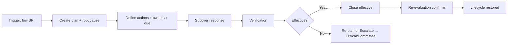
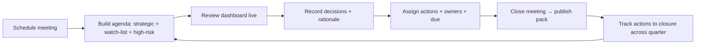

# Functional Specs & UX Blueprint — Part 3 · Supplier Management & Governance Screens

> Screens **9–12**: Improvement Plans · Supplier Risk · Supplier Timeline · Committee Workspace.
> Inherits [Part 0 — UX Foundations](./00_UX_FOUNDATIONS.md). Only deviations stated.

---

# Screen 9 — Improvement Plans

**1. Purpose.** Manage the corrective-action lifecycle that turns poor performance into verified recovery (Functional Design Ch.7): Poor evaluation → Corrective action → Supplier response → Verification → Closure → Re-evaluation.

**2. Target Users.** Purchaser (owner), Procurement Manager (accountable), Director/Committee (oversight), Quality/HSE (verification), Evaluator (re-evaluation). Supplier responds via email now / portal later.

**3. Route & Entry Points.** `/improvement-plans` (list), `/improvement-plans/:id` (detail). From: nav, Supplier 360° Improvement tab, auto-flag on low SPI, Committee decisions, notifications.

**4. Permissions.** View own/scope: `evaluations.read.own` / `.all`. Create/manage: Manager/Purchaser (manager-accountable). Verify closure: Manager (+ Quality/HSE consulted). Scope enforced.

**5. Wireframe (list + detail).**
```
Breadcrumb: Home › Improvement Plans
H1: Improvement Plans                                  [Export][+ New plan]
┌ FilterBar: [Search supplier] [Status▾][Owner▾][Due▾][Trigger▾][Campus▾] ┐
└──────────────────────────────────────────────────────────────────────────┘
┌ DataTable: Supplier | Trigger | Status | Owner | Opened | Due | Progress | ⋮ ┐
│ BuildCo | SPI 47 (Poor) | VERIFICATION | S.Amine | 04-01 | 06-01 | 3/4 ✓ | ⋮ │
└──────────────────────────────────────────────────────────────────────────────┘

Detail /:id
┌ Header: BuildCo · Plan #IP-231 · Status VERIFICATION · Owner · Due ─────────┐
│ [StatusStepper: Open ▸ Action ▸ Response ▸ Verification ▸ Closure ▸ Re-eval] │
└──────────────────────────────────────────────────────────────────────────────┘
┌ Trigger card ─────┐ ┌ Actions table ─────────────────────────────────────┐
│ Eval PO4489 SPI47 │ │ # | Action | Owner | Due | Status | Evidence        │
│ Root cause: …     │ │ 1 | Improve QC | Supplier | 05-15 | DONE | ✔        │
└───────────────────┘ │ 2 | …                                               │
                      └──────────────────────────────────────────────────────┘
[ Supplier response ] [ Verification notes ] [ Closure decision ] [ Re-evaluation link ]
```

**6. Component Hierarchy.**
```
<Page ImprovementPlans (list)>          <Page PlanDetail>
├─ PageHeader (+New plan)               ├─ <PlanHeader> (supplier, #, StatusBadge, owner, due)
├─ FilterBar                            ├─ <PlanStepper> (7 statuses, F16)
└─ DataTable                            ├─ <TriggerCard> (source evaluation link, SPI, root cause)
                                        ├─ <ActionsTable> (CRUD action items)
                                        ├─ <SupplierResponsePanel>
                                        ├─ <VerificationPanel> (evidence check, Quality/HSE)
                                        ├─ <ClosurePanel> (effective/ineffective decision + reason)
                                        └─ <ReEvaluationLink> (next eval outcome)
<NewPlanDialog> · <AddActionDialog> · <CloserDialog>
```

**7. Layout & Regions.** List (F5) + detail with **StatusStepper** header, trigger context, actions table (CRUD), and stage panels appearing per stage. Right rail optional: supplier contact + timeline snippet.

**8. Field Definitions.**
| Field | Label (FR/EN) | Type | Required | Validation | Notes |
|---|---|---|---|---|---|
| Supplier | Fournisseur | Select/link | Yes | existing | prefilled if from S4 |
| Trigger | Déclencheur | ref/text | Yes | eval id or manual reason | links source evaluation |
| Root cause | Cause racine | Textarea | Yes | min length | 5-why/8D style |
| Action — title | Action | Input | Yes | non-empty | |
| Action — owner | Responsable | Select | Yes | user or "Supplier" | |
| Action — due | Échéance | DatePicker | Yes | ≥ today | |
| Action — status | Statut | Select | Yes | OPEN/DONE | |
| Action — evidence | Preuve | FileUpload | No | type/size | |
| Supplier response | Réponse fournisseur | Textarea + attachments | Yes (stage) | min length | email-sourced now |
| Verification result | Vérification | Select: Pass/Fail + notes | Yes (stage) | notes required on Fail | Quality/HSE consulted |
| Closure decision | Clôture | Select: Effective/Ineffective | Yes (stage) | reason required | drives status |
| Target re-eval | Ré-évaluation | ref | No | next PO/scheduled | confirms recovery |

**9. Actions.**
| Action | Trigger | Permission | Confirm? | Result |
|---|---|---|---|---|
| New plan | Header / auto-flag / S4 | manager/purchaser | No | Create OPEN + notify owner+supplier owner |
| Add/edit action | Actions table | owner | Delete=confirm | Update plan |
| Advance stage | Stepper/panel | owner/manager | per stage | Move status (guards below) |
| Record supplier response | Panel | owner | No | Attach response, → Verification |
| Verify | Verification panel | manager (+Quality/HSE) | No | Pass→Closure; Fail→re-plan/Escalate |
| Close plan | Closure panel | manager | **Yes + reason** | CLOSED_EFFECTIVE/INEFFECTIVE, timeline+audit |
| Escalate | Menu | manager | Yes | → Critical / Committee agenda |
| Export | Button | View | No | Plan report |

**10. Validation & Error Messages.** Root cause & response min length. Cannot close as Effective unless verification = Pass and re-evaluation linked/acknowledged (« La clôture effective requiert une vérification réussie. ») — no self-closure. Fail verification requires notes. Escalation requires reason.

**11. States.** Loading = skeleton. Empty list = "No improvement plans — plans are created when suppliers underperform." Auto-flag empty = positive. Stage panels show "Not started" until reached. Error = inline retry.

**12. Business Rules.** Trigger on SPI < threshold (RULE-10) or manual. Verification + re-evaluation mandatory gates (Ch.7). Closure updates supplier lifecycle (UNDER_OBSERVATION→APPROVED on effective; →CRITICAL on repeated ineffective). Links immutably to triggering evaluation & supplier history (FR-42).

**13. Notifications.** Create→owner + supplier relationship owner; stage changes→owner; verification result→stakeholders; closure→manager/Director; escalation→Committee. Timeline events on every stage. Per F13.

**14. User Flow.**


**15. Navigation Flow.** List→detail; trigger→source evaluation (S7); escalate→Committee agenda (S12); re-eval→evaluation (S7); supplier→S4.

**16. Responsive.** Stepper→vertical ≤md; actions table→stacked cards; panels stack in stage order.

**17. Accessibility.** Stepper conveys current/complete via text + icon; stage transitions announced (`aria-live`); action due dates and overdue flagged textually.

**18. Acceptance Criteria.**
- **AC1.** A plan can be created automatically when SPI falls below the threshold or manually from a supplier, always linked to a trigger.
- **AC2.** The plan progresses through the seven statuses; verification failure blocks effective closure.
- **AC3.** A plan cannot be closed as effective without a passed verification and a linked/acknowledged re-evaluation (no self-closure).
- **AC4.** Closure updates the supplier's lifecycle state and writes timeline + audit records.
- **AC5.** Escalation routes the supplier to Critical and/or the committee agenda with a reason.
- **AC6.** All stage changes notify the right parties and are scope-enforced.

---

# Screen 10 — Supplier Risk

**1. Purpose.** Visualize and manage supplier risk across nine domains, aggregate into the SRI, and drive mitigation — the portfolio-level risk cockpit plus per-supplier risk (Functional Design Ch.8).

**2. Target Users.** Manager, Director, Committee, Quality/HSE, Risk/Compliance; Purchaser (own suppliers). Auditor/Viewer read-only.

**3. Route & Entry Points.** `/risk` (portfolio), and the **Risk tab** of Supplier 360° (per-supplier). From: nav, Home risk KPI, Committee, Supplier 360°.

**4. Permissions.** View: `suppliers.read.all` (portfolio) / `suppliers.read` (own). Manage risks/mitigations: Manager (+ Quality/HSE for their domains). Scope enforced.

**5. Wireframe (portfolio).**
```
Breadcrumb: Home › Risk
H1: Supplier Risk                              [Export][Period▾][Campus▾]
┌ KPI row: [High-risk suppliers 14] [Critical 3 ⚠] [Single-source 9] [Avg SRI 38] ┐
└──────────────────────────────────────────────────────────────────────────────────┘
┌ RiskHeatMap (Likelihood × Impact) ────┐ ┌ Risk by domain (stacked bar) ─────────┐
│         Impact →                       │ │ Operational ▇▇▇  Financial ▇          │
│  Likeli.  ░ ░ ▓ ▓ █                     │ │ Quality ▇▇  Delivery ▇▇▇  ESG ▇       │
│    ↑      ░ ▓ ▓ █ █                     │ │ Compliance ▇  Country ▇  Single ▇▇    │
└────────────────────────────────────────┘ └────────────────────────────────────────┘
┌ DataTable: Supplier | SRI | Top domain | Trend | Single-source | Mitigations | ⋮ ┐
└────────────────────────────────────────────────────────────────────────────────────┘
```
**Per-supplier (Risk tab):** SRI gauge + inherent/residual, domain heat map (9 domains), risk register (list), mitigations, early-warning indicators.

**6. Component Hierarchy.**
```
<Page RiskPortfolio>                     <SupplierRiskTab>
├─ PageHeader (Period, Campus, Export)   ├─ <SriGauge> (inherent vs residual)
├─ <RiskKpiRow>                          ├─ <DomainHeatMap> (9 domains × level)
├─ <RiskHeatMap>                         ├─ <RiskRegister> (DataTable of risks)
├─ <RiskByDomainChart>                   ├─ <MitigationsPanel>
└─ <DataTable HighRiskSuppliers>         └─ <EarlyWarningPanel>
<AddRiskDialog> · <AddMitigationDialog>
```

**7. Layout & Regions.** Portfolio = KPI row + heat map + domain distribution + high-risk table. Per-supplier = SRI gauge + domain heat map + register + mitigations + early warnings.

**8. Field Definitions (risk register).**
| Field | Label (FR/EN) | Type | Required | Validation | Notes |
|---|---|---|---|---|---|
| Domain | Domaine | Select (9 domains) | Yes | enum | Operational…Critical-supplier |
| Likelihood | Probabilité | Select 1–5 | Yes | 1–5 | |
| Impact | Impact | Select 1–5 | Yes | 1–5 | |
| Inherent level | Niveau inhérent | computed | — | — | L×I → level |
| Mitigation | Mitigation | Textarea | No | — | |
| Residual level | Niveau résiduel | computed/select | Yes if mitigated | ≤ inherent | after controls |
| Owner | Responsable | Select | Yes | user | |
| Review date | Date de revue | DatePicker | No | — | |
| Source | Source | tag | auto | perf/event/external | how risk arose |

**9. Actions.**
| Action | Trigger | Permission | Confirm? | Result |
|---|---|---|---|---|
| Add/edit risk | Register | manager (+domain owner) | Delete=confirm | Update SRI |
| Add mitigation | Mitigations | manager | No | Recompute residual |
| Flag single-source / critical | Menu | manager | Yes | Sets flag, raises SRI |
| Recompute SRI | auto/system | — | — | On perf decline/event |
| Export | Button | View | No | Risk report |
| Add to committee agenda | Menu | committee.access | No | → S12 |

**10. Validation & Error Messages.** Likelihood/impact required (1–5). Residual ≤ inherent (« Le risque résiduel ne peut pas dépasser le risque inhérent. »). Mitigation required to record residual reduction.

**11. States.** Loading = KPI/heatmap/table skeletons. Empty (per-supplier) = "No risks recorded — the system will flag risks from performance decline and events." Portfolio empty = positive. Error = per-widget retry.

**12. Business Rules.** SRI aggregates weighted domain scores; heat level per F16. Inherent vs residual (Ch.8). Performance-linked auto-signals raise matching domains (declining Delivery → Delivery risk). High SRI caps supplier rating & can force UNDER_OBSERVATION. Single-source/critical flagged explicitly. **[UM6P VALIDATION REQUIRED]: domain weights & thresholds.**

**13. Notifications.** New High/Critical risk → owner + manager (+Director if critical); single-source flag → committee; SRI threshold breach → watch-list. Timeline events. Per F13.

**14. User Flow.** Portfolio heat map → identify High/Critical cluster → open supplier Risk tab → review domains → add mitigation → residual drops → (if still high) add to committee agenda.

**15. Navigation Flow.** Portfolio table→S4 Risk tab; risk source→originating event/evaluation; agenda→S12.

**16. Responsive.** Heat map keeps aspect ratio, offers table fallback; KPI 4→2→1; register→stacked cards.

**17. Accessibility.** Heat map cells labeled ("High — Operational") not color-only; provides table fallback; gauge has text value; SRI trend textual.

**18. Acceptance Criteria.**
- **AC1.** Portfolio view shows SRI KPIs, a likelihood×impact heat map, domain distribution, and a high-risk supplier list, all scope- and period-aware.
- **AC2.** Per-supplier risk shows nine domains with inherent vs residual and an editable register.
- **AC3.** Declining performance in a dimension automatically raises the matching risk domain.
- **AC4.** Residual cannot exceed inherent; a mitigation is required to reduce residual.
- **AC5.** A high SRI visibly caps the supplier's rating and can move it to Under Observation.
- **AC6.** Single-source and critical-supplier exposures are explicitly flagged and routable to committee.

---

# Screen 11 — Supplier Timeline

**1. Purpose.** Present the complete chronological history of a supplier — the "medical record" that assembles POs, evaluations, risk alerts, improvement plans, committee decisions, contract and status events into one immutable, filterable stream (Functional Design Ch.11).

**2. Target Users.** All supplier-viewing roles; especially Committee, new relationship owners, Auditors.

**3. Route & Entry Points.** Primarily the **Timeline tab** of Supplier 360° (`/suppliers/:id/timeline`); also embeddable in committee prep and audit. Standalone read view for auditors.

**4. Permissions.** View: `suppliers.read` (+ scope). Read-only for everyone (timeline is derived, never edited). Some event types visible only to authorized roles (e.g., committee rationale to committee/audit) — event-level scoping.

**5. Wireframe.**
```
[ Filters: Event type ▾ (multi) · Period · Search ]      [Export]
┌ Timeline (reverse-chronological) ─────────────────────────────────────────┐
│ ● 2026-06-02  Committee decision — Promoted to Preferred  (by Director)    │
│ │             "Sustained SPI ≥80, key lab supplier." → decision            │
│ ● 2026-05-20  Evaluation finalized — PO 4500 · SPI 84 (Good)  → eval       │
│ ● 2026-05-10  PO completed — 4500 · 120,000 MAD               → PO         │
│ ● 2026-04-18  Risk alert — Delivery risk raised to HIGH       → risk       │
│ ● 2026-04-01  Improvement plan opened — IP-231                → plan       │
│ │ … load more …                                                            │
└──────────────────────────────────────────────────────────────────────────────┘
```

**6. Component Hierarchy.**
```
<TimelinePanel>
├─ <TimelineFilters> (EventTypeMultiSelect, PeriodFilter, Search)
├─ <Timeline>
│  └─ <TimelineEvent> (icon by type, timestamp, title, summary, actor, DeepLink)
├─ <LoadMore / infinite scroll>
└─ ExportButton
```

**7. Layout & Regions.** Filter row + vertical timeline. Each event: type icon, timestamp, title, one-line summary, actor, and a deep link to the source record. Grouped by day/month headers. Optional "compact" density.

**8. Field Definitions (event display; events are system-generated, read-only).**
| Field | Source | Notes |
|---|---|---|
| Type | event type enum | PO, Evaluation, Rating/Tier change, Risk alert, Improvement plan, Committee decision, Contract event, Incident, Document, Status change |
| Timestamp | event time | locale format |
| Title | event | concise |
| Summary | event | one line |
| Actor | user/system | avatar/name or "System" |
| Deep link | source id | → PO/eval/plan/risk/decision/document |

**9. Actions.**
| Action | Trigger | Permission | Result |
|---|---|---|---|
| Filter by type/period | Filters | View | Narrow stream (URL-persist) |
| Open source | Event link | source perm | → source record |
| Export timeline | Button | View | PDF/CSV (respects filters) |
| Load more | Scroll/button | View | Paginate older events |

**10. Validation & Error Messages.** None (read-only). Export of empty timeline disabled. Event-level permission: restricted events simply not shown to unauthorized viewers.

**11. States.** Loading = skeleton events. Empty = "No activity yet for this supplier." Filtered-empty = "No events of this type in the selected period." Error = inline retry.

**12. Business Rules.** Timeline is an **append-only projection** of domain events; immutable and complete (audit-grade). Ordering reverse-chronological. Event-type visibility respects role. Every significant action elsewhere (block, evaluation finalize, plan stage, committee decision, risk change) **must** emit a timeline event.

**13. Notifications.** None (timeline consumes events; it doesn't notify).

**14. User Flow.** Open supplier → Timeline → filter to "Committee decisions + Risk alerts" → read the narrative → click an event → jump to its source.

**15. Navigation Flow.** Event links → S5/S7/S9/S10/S12/Documents. Used as committee-prep narrative and audit evidence.

**16. Responsive.** Single column always; timestamps wrap under title ≤sm; filters collapse into a popover.

**17. Accessibility.** Ordered list semantics; each event has accessible name including type + date + title; icons decorative with text label; deep links descriptive.

**18. Acceptance Criteria.**
- **AC1.** The timeline shows all event types for a supplier in reverse-chronological order, each with a working deep link to its source.
- **AC2.** Filtering by event type and period narrows the stream and persists in the URL.
- **AC3.** Every qualifying action elsewhere (finalized evaluation, block, plan stage change, committee decision, risk change) appears as an event.
- **AC4.** The timeline is read-only and immutable; restricted event types are hidden from unauthorized viewers.
- **AC5.** Export reflects current filters and is audit-usable.

---

# Screen 12 — Committee Workspace

**1. Purpose.** Run and record the Supplier Review Committee (Functional Design Ch.6): prepare the quarterly agenda, review supplier standings & risk, capture decisions, and track resulting actions to closure — the governance heartbeat.

**2. Target Users.** Director (chair), Procurement Managers, invited Buyers/Quality/HSE/Department Managers, Administrator (secretary). Auditor read-only.

**3. Route & Entry Points.** `/committee` (meetings list), `/committee/:id` (meeting workspace). From: Governance nav, "Add to agenda" actions across the app, notifications.

**4. Permissions.** Access: `committee.access` (derived: Director/Manager/invited). Decide (record decisions): Director/chair. Manage agenda & minutes: chair + secretary (Admin). Read-only: Auditor, invited viewers. Scope: portfolio-wide (governance).

**5. Wireframe (meeting workspace).**
```
Breadcrumb: Home › Committee › Q2 2026 Review
┌ Header: Q2 2026 Supplier Review · 2026-06-15 · Chair: Director · [In progress] ┐
│ [Agenda][Dashboard][Decisions][Actions][Minutes]        [Export pack][Close]   │
└──────────────────────────────────────────────────────────────────────────────────┘
Agenda tab:
┌ 1. Previous actions review .......... [4 open / 6 closed]                     ┐
│ 2. Portfolio dashboard .............. [coverage 88% · SRI heat · movements]   │
│ 3. Strategic & Preferred ............ ACME Labs, NovaTech …                    │
│ 4. Watch-list ....................... BuildCo (Critical), …                   │
│ 5. High-risk ........................ 3 suppliers                             │
│ 6. Decisions ........................ (record below)                          │
│ 7. AOB                                                                        │
└──────────────────────────────────────────────────────────────────────────────┘
Decisions tab:
┌ Supplier | Decision | Rationale | Decided by | → Action ─────────────────────┐
│ BuildCo | Escalate to Critical | repeated ineffective plan | Director | IP+  │
│ ACME    | Promote to Strategic | strategic lab partner     | Director | —    │
└──────────────────────────────────────────────────────────────────────────────┘
```

**6. Component Hierarchy.**
```
<Page CommitteeMeetings (list)>       <Page CommitteeMeeting>
├─ PageHeader (+ New meeting)         ├─ <MeetingHeader> (title, date, chair, StatusBadge, actions)
└─ DataTable (meetings:               ├─ <Tabs>
   title, date, status, decisions,    │  ├─ AgendaPanel (agenda items, add supplier to agenda)
   actions open/closed)               │  ├─ DashboardPanel (committee dashboard widgets — S14/Ch.6 KPIs)
                                       │  ├─ DecisionsPanel (record decisions per supplier)
                                       │  ├─ ActionsPanel (action register w/ owners+due+status)
                                       │  └─ MinutesPanel (auto-assembled minutes + notes)
                                       └─ <ExportPackButton> · <CloseMeetingDialog>
<AddAgendaItemDialog> · <RecordDecisionDialog> · <AddActionDialog>
```

**7. Layout & Regions.** Meetings list (F5) → meeting workspace with tabs mirroring the standard agenda (Ch.6). Dashboard tab reuses committee widgets. Decisions and Actions are structured tables. Minutes auto-assemble from agenda + decisions + notes.

**8. Field Definitions.**
| Field | Label (FR/EN) | Type | Required | Validation | Notes |
|---|---|---|---|---|---|
| Meeting title | Titre | Input | Yes | non-empty | e.g., "Q2 2026 Review" |
| Date | Date | DatePicker | Yes | — | |
| Participants | Participants | MultiSelect (users) | Yes | ≥1 | chair required |
| Agenda item | Point | supplier ref / text | Yes | — | from "Add to agenda" |
| Decision type | Décision | Select | Yes | enum | promote/demote/observe/critical/block/exit/plan/dual-source/contest |
| Rationale | Motivation | Textarea | **Yes** | min length | recorded to supplier + audit |
| Decided by | Décidé par | auto (chair) | — | — | |
| Action title | Action | Input | Yes | non-empty | |
| Action owner | Responsable | Select | Yes | user | |
| Action due | Échéance | DatePicker | Yes | ≥ today | |
| Action status | Statut | Select | Yes | OPEN/DONE | tracked across meetings |
| Minutes notes | Notes | Textarea | No | — | appended to auto minutes |

**9. Actions.**
| Action | Trigger | Permission | Confirm? | Result |
|---|---|---|---|---|
| New meeting | List / schedule | chair/secretary | No | Create with agenda skeleton |
| Add supplier to agenda | Agenda / cross-app | committee.access | No | Adds item (+ context snapshot) |
| Record decision | Decisions | chair | **Yes + rationale** | Applies tier/lifecycle change, timeline event, audit; may spawn action/plan |
| Add/track action | Actions | chair/secretary | No | Action register entry |
| Close action | Actions | owner/secretary | Yes | Marks DONE, closure tracked |
| Close meeting | Header | chair | Yes | Locks minutes, publishes pack, notifies |
| Export pack | Header | committee.access | No | PDF pack (agenda+dashboard+decisions+actions+minutes) |

**10. Validation & Error Messages.** Decision requires rationale (min length) — no silent tier changes. Close meeting warns if open agenda items/undecided suppliers remain. Action due ≥ today. Chair required among participants.

**11. States.** Loading = skeletons per tab. Empty meetings list = "No committee meetings yet — schedule the first review." Empty agenda = "Add strategic, watch-list and high-risk suppliers to the agenda." Actions empty = "No open actions." Error = inline retry.

**12. Business Rules.** Cadence quarterly (+ ad-hoc) (Ch.6). Decisions are the **authoritative source** of tier/lifecycle changes and score-interpretation overrides (Ch.3) — always audited with rationale, always emit timeline events. Action register carries across meetings until closed (closed-loop governance). Minutes immutable once meeting closed. **[UM6P VALIDATION REQUIRED]: decision authority (chair vs quorum).**

**13. Notifications.** Meeting scheduled → participants; agenda published → participants; decisions → affected supplier owners; actions → owners; meeting closed → pack distributed; overdue actions → owners + chair. Per F13.

**14. User Flow.**


**15. Navigation Flow.** Meeting→supplier 360° (S4) per agenda item; decision→applies to supplier lifecycle & timeline; action→improvement plan (S9) if corrective; pack export→Reports (S13).

**16. Responsive.** Tabs→select ≤sm; decision/action tables→stacked cards; dashboard widgets 3→1 column. Designed for use on a laptop/projector in-meeting.

**17. Accessibility.** Tab pattern accessible; decision rationale required field clearly associated; action status changes announced; export pack is a tagged accessible PDF.

**18. Acceptance Criteria.**
- **AC1.** A meeting can be scheduled with participants and an agenda auto-seeded by strategic/watch-list/high-risk suppliers plus items added via "Add to agenda" across the app.
- **AC2.** Recording a decision requires a rationale, applies the corresponding tier/lifecycle change, emits a supplier timeline event, and writes an audit record.
- **AC3.** Actions are assigned with owner and due date and tracked to closure across meetings; overdue actions escalate.
- **AC4.** Closing a meeting locks immutable minutes and publishes a distributable pack; open items are surfaced before closing.
- **AC5.** All committee activity is permission-gated (decisions by chair), auditable, and reflected on the affected suppliers' 360° views.

---
*End of Part 3. Continue: [Part 4 — Analytics & Reporting](./04_screens_analytics.md).*
