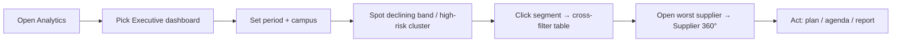

# Functional Specs & UX Blueprint — Part 4 · Analytics & Reporting Screens

> Screens **13–14**: Reports · Analytics.
> Inherits [Part 0 — UX Foundations](./00_UX_FOUNDATIONS.md). Only deviations stated.
> **Distinction:** *Analytics* (S14) = interactive, exploratory dashboards for insight. *Reports* (S13) = structured, parameterized, exportable/shareable documents (scorecards, coverage, audit) built for distribution and governance.

---

# Screen 13 — Reports

**1. Purpose.** Generate, preview and export the standard, parameterized reports Procurement needs for decisions, reviews and audit (Functional Design Ch.9/13; BA §27): supplier scorecards, performance history, coverage/completion, low-performer, improvement tracking, audit/traceability, period comparison, dimension analysis.

**2. Target Users.** Director, Managers, Purchasers (scoped), Quality/HSE, Auditor. Viewer (read/export).

**3. Route & Entry Points.** `/reports` (catalog), `/reports/:type` (report runner/preview). From: nav, Supplier 360° "Export report", Committee "Export pack", KPI drill.

**4. Permissions.** View catalog: `dashboards.view`. Executive reports: `dashboards.view.executive`. Audit report: `audit.read`. Reports auto-scope to role + department + campus (a Purchaser's coverage report covers only their suppliers).

**5. Wireframe.**
```
Breadcrumb: Home › Reports
H1: Reports
┌ Report catalog (cards) ────────────────────────────────────────────────────┐
│ [Supplier Scorecard]  [Performance History]  [Coverage & Completion]        │
│ [Low-Performer]       [Improvement Tracking]  [Audit / Traceability]        │
│ [Period Comparison]   [Dimension Analysis]                                  │
└──────────────────────────────────────────────────────────────────────────────┘
Runner /reports/coverage:
┌ Parameters ─────────────────────────────┐ ┌ Preview ─────────────────────────┐
│ Period [Q2 2026 ▾]  Campus [All ▾]       │ │ (live preview of the report as   │
│ Department [▾] Category [▾] Supplier [▾]  │ │  it will export: tables+charts)  │
│ Format ( PDF · Excel )                    │ │                                  │
│ [Generate]  [Schedule ▾]                  │ │                                  │
└───────────────────────────────────────────┘ └──────────────────────────────────┘
```

**6. Component Hierarchy.**
```
<Page Reports (catalog)>              <Page ReportRunner>
├─ PageHeader                         ├─ <ReportParamsPanel> (period, campus, dept, category, supplier, format)
└─ <ReportCatalog>                    ├─ <ReportPreview> (rendered report: header, tables F5, charts F6)
   └─ <ReportCard[]> (title, desc,    ├─ <GenerateButton> / <ExportMenu> (PDF/Excel)
      permission-gated)               └─ <ScheduleDialog?> (future: recurring email)
```

**7. Layout & Regions.** Catalog of report cards (permission-filtered) → runner with a parameters panel + live preview + export. Consistent report header (title, scope, period, generated-by, timestamp) on every export.

**8. Field Definitions (parameters — vary by report).**
| Param | Type | Required | Applies to | Notes |
|---|---|---|---|---|
| Period | DateRange/preset | Yes | all | quarter/YTD/12M/custom |
| Campus | Select | No (=scope) | all | within user scope |
| Department | Select | No | most | |
| Category/Commodity | Select | No | most | |
| Supplier | Combobox | Yes for Scorecard/History | scorecard, history | |
| Band/Risk threshold | Select | No | low-performer, risk | default from config |
| Compare periods | 2× period | Yes | period comparison | A vs B |
| Format | Radio PDF/Excel | Yes | all | |

**9. Actions.**
| Action | Trigger | Permission | Confirm? | Result |
|---|---|---|---|---|
| Open report | Card click | report perm | No | → runner |
| Set parameters | Panel | View | No | Update preview |
| Generate/Preview | Button | View | No | Render preview |
| Export PDF/Excel | Menu | View | No | Download (scope-respecting) |
| Schedule (future) | Dialog | manager | No | Recurring emailed report |
| Print | Button | View | No | Print-optimized layout |

**10. Validation & Error Messages.** Required params (e.g., Supplier for scorecard) enforced before Generate. Period comparison requires two distinct periods. Empty result → "No data for the selected parameters" (Generate disabled or preview shows empty). Export size guardrail with progress for large reports.

**11. States.** Loading = preview skeleton. Empty catalog (no permission) = only permitted reports show; if none, friendly message. Empty result = guided empty. Error = retry + "contact admin". Generating = progress indicator.

**12. Business Rules.** Reports are **read models** over finalized data (immutable inputs). Auto-scope by role/department/campus (RULE-12). Audit report requires `audit.read`. Every export stamped with scope + timestamp + generated-by for defensibility. Numbers reconcile to underlying evaluations (traceability).

**13. Notifications.** Scheduled reports (future) email recipients; large export ready → toast/notification. No supplier-facing distribution (internal only this phase).

**14. User Flow.** Catalog → pick "Coverage & Completion" → set Q2 + campus → Generate → review preview → export PDF for the committee.

**15. Navigation Flow.** Catalog→runner; scorecard rows→Supplier 360°; audit rows→Audit Logs (S18); export→download. Committee pack (S12) reuses report components.

**16. Responsive.** Params panel stacks above preview ≤md; preview scrolls within `overflow-x` container; export unaffected.

**17. Accessibility.** Every report chart has table fallback; exported PDFs are tagged/accessible; parameters are a labeled form; preview announces when regenerated.

**18. Acceptance Criteria.**
- **AC1.** The catalog shows only reports the user is permitted to run; the audit report requires `audit.read`; executive reports require the executive permission.
- **AC2.** Each report auto-scopes to the user's role/department/campus; a Purchaser's coverage report covers only their suppliers.
- **AC3.** Required parameters are enforced; period comparison needs two periods; empty results are handled gracefully.
- **AC4.** PDF/Excel exports match the preview, are stamped with scope/period/generated-by/timestamp, and reconcile to underlying data.
- **AC5.** Scorecard and history exports are usable in committee and audit contexts and link back to source records on screen.

---

# Screen 14 — Analytics

**1. Purpose.** Interactive, exploratory analytics across the supplier portfolio and program — the strategic decision surface (Functional Design Ch.9/10/13). Where Reports produce documents, Analytics enables slicing, drilling and discovery. This screen hosts the role-tailored strategic dashboards (Executive, Buyer, Department, Committee, and cross-cutting portfolio analytics).

**2. Target Users.** Director/leadership (Executive), Managers, Purchasers (Buyer), Department Managers, Committee, Quality/HSE. Viewer (read). Auditor (read).

**3. Route & Entry Points.** `/analytics` with dashboard selector (`?dashboard=executive|buyer|department|committee|portfolio`). From: nav, Home KPI drill-downs, Committee dashboard tab (embeds committee analytics).

**4. Permissions.** View: `dashboards.view`. Executive/portfolio: `dashboards.view.executive`. Buyer dashboard = own scope; Department = department scope; Committee = `committee.access`. All scope-aware.

**5. Wireframe (Executive).**
```
Breadcrumb: Home › Analytics
H1: Analytics   [Dashboard: Executive ▾]   [Period▾][Campus▾][Category▾][Tier▾]  [Export][Save view]
┌ KPI ROW ───────────────────────────────────────────────────────────────────┐
│ [Avg SPI 78 ▲2] [Coverage 88% ▲] [Overdue 4%] [High-risk 14] [Improve 71%]  │
└──────────────────────────────────────────────────────────────────────────────┘
┌ Portfolio SPI trend (line) ───────────┐ ┌ Band distribution (histogram) ───────┐
│                                        │ │ Excellent ▇ Good ▇▇▇ Accept ▇▇ Poor ▇ │
└────────────────────────────────────────┘ └────────────────────────────────────────┘
┌ Risk heat map ────────┐ ┌ Top 5 ─────────┐ ┌ Bottom 5 ──────┐ ┌ Tier mix (donut) ┐
│                       │ │ ACME 84        │ │ BuildCo 47     │ │ Strat/Pref/Appr  │
└───────────────────────┘ └────────────────┘ └────────────────┘ └───────────────────┘
┌ Suppliers table (drill) : Supplier | SPI | Trend | Risk | Coverage | Tier | ⋮ ┐
└──────────────────────────────────────────────────────────────────────────────────┘
```

**6. Component Hierarchy.**
```
<Page Analytics>
├─ PageHeader (DashboardSelector, Filters, Export, SaveView)
├─ <DashboardCanvas dashboard=…>
│  ├─ <KpiRow> (KpiCard[])
│  ├─ <ChartGrid> (TrendLine, ScoreDistribution, RiskHeatMap, RankingBar, Donut, SupplierRadar…)
│  └─ <DrillTable> (DataTable, filtered by canvas selections)
└─ <FilterBar> (global vocab F8)
```

**7. Layout & Regions.** Dashboard selector + global filters (cross-filter the whole canvas) + KPI row + chart grid + drill table. Clicking a chart segment cross-filters the canvas (e.g., click "Poor" band → table filters to Poor suppliers). Saved views per user.

**8. Field Definitions (metrics per dashboard — from Ch.9/13).**
| Dashboard | Core widgets / KPIs |
|---|---|
| Executive | Avg SPI + trend, coverage, overdue %, high-risk count, improvement completion, band distribution, risk heat map, top/bottom, tier mix; drill table |
| Buyer | My-portfolio SPI, my coverage, my overdue, my suppliers' trends, my open improvement plans |
| Department | Department satisfaction, dept coverage, dept overdue, suppliers used by dept |
| Committee | Portfolio movements, watch-list size, risk trend, action-closure rate, decisions log |
| Portfolio | Spend concentration (ABC/Pareto), tier mix, base size trend, dormant/new counts, single-source exposure |

**9. Actions.**
| Action | Trigger | Permission | Result |
|---|---|---|---|
| Switch dashboard | Selector | resp. perm | Load canvas |
| Filter (global) | FilterBar | View | Cross-filter all widgets (URL-persist) |
| Cross-filter | Click chart segment | View | Filter canvas + drill table |
| Drill to detail | KPI/row click | resp. perm | → Supplier 360° / filtered list / report |
| Save view | Button | View | Persist filter+layout preset |
| Export | Button | View | Export canvas data / snapshot to report (S13) |

**10. Validation & Error Messages.** None (read-only). Per-widget error isolated (F10). Empty period → "No data for the selected period/filters." Executive dashboard hidden without permission.

**11. States.** Loading = KPI + chart + table skeletons, streamed. Empty = guided per widget. Error = per-widget retry. Confidence & coverage shown alongside scores so numbers are never read naked (F6).

**12. Business Rules.** All metrics scope- and period-aware. Rankings always paired with confidence + spend (Ch.9 design note — no acting on statistically meaningless extremes). SPI/SRI/coverage/confidence per operating model. Data are read models; refresh cadence noted; "as of" timestamp shown.

**13. Notifications.** None (analytics consume data). Anomaly alerts (future, Ch.14) may notify.

**14. User Flow.**


**15. Navigation Flow.** Widget/table drill → S4 / filtered S3 / S13. Committee dashboard embeds into S12. Save view → reusable preset.

**16. Responsive.** Chart grid 4→2→1; charts keep aspect ratio with table fallback; drill table collapses to cards; filters into popover ≤md. Optimized for large-screen review + laptop.

**17. Accessibility.** Every chart has accessible title, legend, tooltip and **table fallback**; cross-filter state announced; KPI deltas textual; color-band meaning never sole encoding; keyboard-operable chart focus where feasible.

**18. Acceptance Criteria.**
- **AC1.** The dashboard selector offers only dashboards the user is permitted to view; the Executive/Portfolio dashboards require the executive permission.
- **AC2.** Global filters cross-filter every widget and the drill table, and persist in the URL.
- **AC3.** Clicking a chart segment cross-filters the canvas and drill table; drilling opens the matching supplier/list/report with filters intact.
- **AC4.** Every ranking widget shows confidence and spend context alongside the score.
- **AC5.** Each widget renders its own loading/empty/error state and every chart offers an accessible table fallback.
- **AC6.** All figures are scope- and period-aware and display an "as of" timestamp.

---
*End of Part 4. Continue: [Part 5 — Administration Screens](./05_screens_admin.md).*
